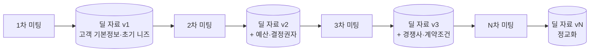
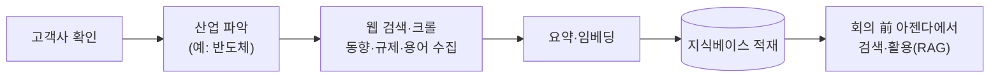

# [Week 2] 영업 회의록 에이전트

> 과제 목표 — 직접 만들고 싶은 Agent를 한 문장으로 정의하고, 그 Agent가 판단하고 행동하는 데 필요한 Context(무엇을 알아야 하는가)와 Tool(무엇을 할 수 있어야 하는가)을 정리함.
>
> Refs #3

---

## 지향점

- **"회의만 잘하면 업무는 끝난다."**
- 영업 담당자는 회의(사람이 하는 판단·관계)에 집중하고, 준비(아젠다)와 뒷정리(회의록·할 일·자료 축적)는 에이전트가 수행함.

---

## 0. 요약

- **대상:** 영업 회의를 회의 前 / 회의 後 두 시점으로 나누어 지원하는 에이전트.
  - 회의 前 — 고객정보·표준 질문 리스트·누적 딜 자료, 조직 지식 베이스(암묵지·솔루션·산업지식)를 근거로 이번 회의 아젠다를 작성함.
  - 회의 後 — 비정형 녹취/메모를 표준 회의록 양식으로 변환하고, 할 일(액션아이템·담당·기한)을 도출함.
- **배경:** 영업 회의에서는 결정과 약속이 오가나, 준비와 정리가 사람 손에 맡겨져 질문 누락·할 일 누락·책임 불명확이 반복됨.
- **핵심:** 이번 회의의 할 일이 다음 회의 아젠다로 연결되고, 딜 자료는 회의를 거듭할수록 누적·고도화됨(= 에이전트의 기억).
- **원칙:** 초기부터 복잡하게 구성하지 않음. 가장 단순한 직선 구조로 안정 작동시킨 뒤 단계적으로 확장함.

> 용어: Agent(에이전트)란 사람이 매번 지시하지 않아도 주어진 목표를 위해 스스로 정보를 참조하고(Context) 도구를 사용하여(Tool) 업무를 처리하는 프로그램을 말함. 질문에 답만 하는 챗봇과 구분됨.

---

## 1. 추진 배경 (문제 정의)

| 구분 | 내용 |
| --- | --- |
| 상황(Situation) | 영업 조직은 고객·딜 관련 회의를 반복적으로 수행하며, 그 자리에서 주요 결정과 "누가 언제까지 무엇을 한다"는 약속이 발생함. |
| 문제(Complication) | 회의 준비와 정리가 대부분 수작업임. 이에 따라 ①회의 전 확인해야 할 사항을 누락하고, ②회의 후 녹취/메모 정리 시간이 부족하여 할 일이 누락되며, ③지난 회의의 논의와 약속이 다음 회의에서 유실됨. |
| 시사점(So what) | 준비·정리·추적 등 반복적·규칙적 작업은 에이전트에 위임하기에 적합함. 담당자는 판단과 영업에 집중하고, 기록과 연속성 관리는 자동화함. |

- 첫 에이전트로 "영업 회의 지원(前/後)"을 선정함.
- 선정 사유: 입력과 출력이 명확하여 성과 확인이 용이하고, 영업 조직이 상시 직면하는 문제로 실효성이 분명함.

---

## 2. Agent 정의 (한 문장)

> 영업 회의를 전·후로 나누어, 회의 前에는 고객정보·질문 리스트·누적 딜 자료·조직 지식베이스를 근거로 아젠다를 작성하고, 회의 後에는 녹취/메모를 표준 회의록 양식으로 정리하고 액션아이템을 도출하며, 이번 회의의 할 일과 자료가 다음 회의로 연결·고도화되는 에이전트.

- 단순 전사가 아니라 "영업 조직을 위한" 회의 지원임.
- 딜 맥락과 지난 논의를 승계하여 "확인할 사항"과 "합의된 사항"이 유실되지 않도록 함.

---

## 3. Context 후보 2개

> 용어: Context(컨텍스트)란 에이전트가 판단하기 위해 제공받는 정보를 말함. "회의 준비를 하라"는 지시만이 아니라 고객 정보·지난 회의록·질문 목록·참고 자료를 함께 제공하는 것에 해당함. 우수한 에이전트는 정교한 프롬프트보다 적절한 Context에서 비롯됨.

### 3-1. 참조하는 지식의 4개 층

| 구분 | 지식 | 성격 | 확보 방식 |
| --- | --- | --- | --- |
| 상시·내부 | 영업 암묵지·솔루션 자료 | 조직 공통, 변동 적음 | 지식베이스에 사전 적재 |
| 상시·외부 | 산업 도메인 지식(고객사 산업별) | 고객사별 상이, 지속 갱신 | 수집 파이프라인으로 확보 |
| 딜별 | 딜 누적 히스토리 | 딜 종속, 회차별 누적 | 회의 後 산출물이 축적됨 |
| 회의 | 이번 회의 원본(녹취/메모) | 1회성 | 회의 시점 입력 |

> 참고: 위 자료는 모델을 재학습(fine-tune)하는 것이 아니라, 지식베이스에 저장한 뒤 필요 시 검색하여 참조하는 방식으로 활용함. 이를 RAG(검색증강생성)라 하며, 스터디에서 제공한 임베딩 API가 이 용도에 해당함.

과제 형식에 맞추어, 위 지식층을 회의 前 / 後 국면에 하나씩 묶어 Context 후보 2개로 정리함.

### ① (회의 前) 고객정보 · 표준 질문 리스트 · 딜 누적 자료 · 조직 지식베이스
- 구성: 고객 기본정보, 해당 고객·단계에서 확인할 표준 질문 리스트(예: 예산·결정권자·도입시기·경쟁사), 지난 회의까지 축적된 딜 누적 자료, 조직 지식베이스(암묵지·솔루션·산업지식).
- 필요 사유: 아젠다는 아래 산식으로 도출됨.

  > 질문 리스트(확인 대상) − 누적 자료(기확보 정보) = 이번에 확인할 사항

  여기에 지식베이스가 "해당 산업·해당 솔루션에 적합한 포인트"를 보강하여 업계 맞춤 아젠다가 됨. 중복 질문을 방지하고 미확보 항목만 정확히 짚기 위해 위 정보가 필요함.

### ② (회의 後) 회의 원본 · 회의록 표준 양식
- 구성: 이번 회의의 비정형 녹취 전사본 또는 메모, 조직의 회의록 표준 양식(참석자·안건·결정사항·할 일 등).
- 필요 사유: 정리 대상 원자료(녹취/메모)와, 그 내용을 매번 동일한 형식으로 변환할 틀(표준 양식)이 있어야 회의록이 일관되게 산출됨. 이 "비정형 → 표준 양식 변환"이 회의 後의 핵심 작업임.

---

## 4. Tool 후보 2개

> 용어: Tool(도구)이란 에이전트가 실제로 행동하는 수단임. 유의할 점은 다음과 같음.
> - 모델(LLM)은 판단을 담당하는 두뇌일 뿐, 파일 열람·검색·저장 등 행동은 스스로 수행하지 못함.
> - Tool은 그 행동을 담은 기능 단위이며, 통상 직접 작성한 함수 하나이고 그 내부에서 외부 API나 오픈소스 라이브러리를 부품으로 사용함.
> - "스킬(Skill)"은 프레임워크에 따라 Tool을 지칭하는 다른 명칭이며, "오픈소스"는 Tool 제작에 사용하는 재료일 뿐 Tool 자체는 아님.
>
> 모델이 언제 어떤 Tool을 사용할지 스스로 결정하는 과정이 이번 주(Week 2) 주제인 Tool Calling / Agent Loop임.

### ① 조회·검색 Tool
- 기능: 고객정보·질문 리스트·딜 누적 자료(회의 前)와 회의 원본(회의 後)을 불러오고, 지식베이스(암묵지·솔루션·산업지식)에서 관련 내용을 의미 기반 검색(RAG)함.
- 구현 예: 파일/DB에서 회의록·딜자료를 읽는 함수, 임베딩 API(제공된 Sionic) + 벡터 검색 라이브러리(오픈소스, 예: Chroma·FAISS), (후반) 산업지식용 웹 검색 API.
- 역할: 에이전트가 판단할 입력(맥락)을 확보함.

### ② 작성 Tool
- 기능: 회의 前에는 아젠다를, 회의 後에는 표준 양식 회의록 및 할 일 표(담당·기한)를 작성·저장함.
- 구현 예: 표준 템플릿에 내용을 채워 마크다운 문서로 저장하는 함수, 할 일을 담당·기한 컬럼 표로 구조화하여 출력.
- 역할: 판단 결과를 검토·활용 가능한 산출물로 남기며, 저장된 결과는 다음 회의의 누적 자료가 됨.

> 참고: 산업지식 수집 파이프라인(고객사 산업 자료의 웹 수집·요약·적재)은 별도 필요함. 다만 에이전트 본체와 분리된 백그라운드 인프라이자 개발 부담이 크므로, MVP가 아닌 후반 단계로 둠(§6).

---

## 5. 작동 논리

### 5-1. 회의 前 → 後 2단계 흐름

```
[회의 前] 사전 준비 (아젠다 빌더)
  입력: 고객정보 + 표준 질문 리스트 + 딜 누적 자료 + 지식베이스 검색(RAG)
        (질문 리스트 − 누적 자료 = 이번에 확인할 사항)
  출력: 이번 회의 아젠다 (안건 + 지난 미결과제 + 업계 맞춤 확인 포인트)

        … (실제 회의는 사람이 진행) …

[회의 後] 사후 처리 (회의록·액션아이템)
  입력: 비정형 녹취/메모 + (위에서 작성한 아젠다)
  변환: 흩어진 녹취/메모 → 표준 회의록 양식으로 정리
  출력: 회의록 + 액션아이템 표(담당·기한)
        └─▶ 할 일과 자료가 "다음 회의 前"으로 연결됨 (Memory 루프)
```


### 5-2. 회차별 누적 고도화

```
1차 미팅 ─▶ [딜 자료 v1]  (고객 기본정보, 초기 니즈)
2차 미팅 ─▶ [딜 자료 v2]  (v1 + 예산·결정권자 확인, 반복 미결과제 부각)
3차 미팅 ─▶ [딜 자료 v3]  (v2 + 경쟁사 상황, 계약 조건 등)
   ⋮
N차 미팅 ─▶ [딜 자료 vN]  (누적될수록 아젠다·회의록이 정교해짐)
```



- 에이전트가 매 회의를 "최초 회의"로 처리하지 않고 딜 히스토리 전체를 참조하여 준비·정리하므로, 후속 회차로 갈수록 아젠다는 좁혀지고 회의록의 맥락은 풍부해짐.
- 이는 스터디 Week 4의 Memory 개념 — 한 번에 참조 가능한 정보(Context Window)의 한계를 넘어 자료를 저장·고도화하며 재참조하는 구조 — 에 해당함.

### 5-3. 산업 도메인 지식 수집 (목표 개념)

```
고객사 확인 → 산업 파악(예: 반도체)
   → 웹 검색/크롤로 산업 동향·규제·용어 수집
   → 요약·임베딩 → 지식베이스 적재
   → 회의 前 아젠다에서 검색·활용(RAG)
```



- 효과: "해당 고객은 반도체 업계이므로 최근 이 이슈가 중요하며, 자사 솔루션의 이 기능이 적합하다"와 같은 업계 맞춤 준비가 가능해짐.

### 5-4. 핵심 지표 (KPI)

- 회의록·아젠다 등 문서뿐 아니라, "해당 딜을 어느 정도 파악했는가"를 수치로 제시함.

| KPI | 정의 | 성격 |
| --- | --- | --- |
| ① 니즈/정보 확보율 | (확보된 표준질문 항목 ÷ 전체 표준질문 항목) × 100% | 정량 — 딜 성숙도(자격) 점수. 1차 30% → N차 90%로 상승 |
| ② 핵심정보 완비도 | 필수 항목(예산·결정권자·도입시기 등) 확보 여부 | 정성 — 정보 품질·최신성 |
| ③ 액션아이템 이행률 | (완료된 액션아이템 ÷ 전체) × 100% | 정량 — 회의 후속조치의 실행 추적 |

- 위 KPI는 Week 8 평가(Evaluation) — "구현한 Agent가 실제로 정상 동작하는가" — 의 성공 기준으로 활용 가능함.
- 각 KPI의 구체적 기준(목표 %, 항목 정의 등)은 프로젝트 진행 과정에서 실측 데이터로 정립함.

### 5-5. 단계적 접근 사유

> 좋은 Agent는 가장 복잡한 Agent가 아니라, 필요한 Context와 Tool로 목표를 안정적으로 달성하는 가장 단순한 시스템임.

- 복잡한 구조는 구현과 오류 추적이 모두 어려움. 안정 작동하는 직선 구조를 우선 완성하여 검증한 뒤, 필요에 따라 기능을 단계적으로 추가함.

---

## 6. 구현 단계 및 확장 로드맵

| 단계 | 구현 대상 | 학습 요소 |
| --- | --- | --- |
| 1단계(MVP) | 회의 後 녹취/메모 → 표준 회의록·액션아이템 변환. 기억은 "직전 회의 1건 승계"로 단순화. 산업 자료는 수기로 소수 적재하여 시작. | 직선 그래프, Context·Tool 기본 |
| 2단계 | 회의 前 아젠다 빌더 + "질문 리스트 − 누적 자료" 공백 산출 로직 | 前/後 2단계, 규칙 기반 판단 |
| 3단계 | 암묵지·솔루션 지식베이스 연결(RAG) + 회차별 누적 고도화(딜 자료 v1→vN) | Memory(장기 기억)·RAG, Week 3~4 개념 |
| 4단계 | 산업 도메인 지식 수집 파이프라인(웹 수집 → 임베딩 → 적재) | 데이터 수집·처리 파이프라인 |
| 다음 프로젝트 | 견적·제안 작성 자동화 에이전트(접수 → 분류 → 금액 계산 → 검토 → 승인) | 라우터 분기, 코드/AI 노드 결합, 사람 개입(Human-in-the-loop) |

- 회의록 에이전트는 기초 훈련 단계이며, 이를 기반으로 견적·제안 자동화라는 확장 과제로 진행함.
