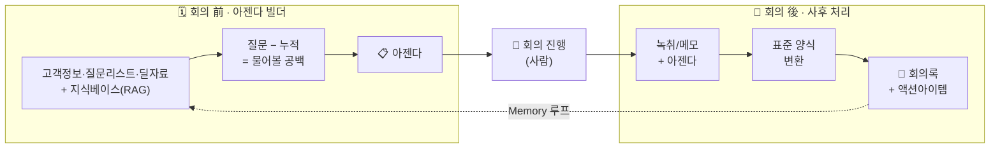
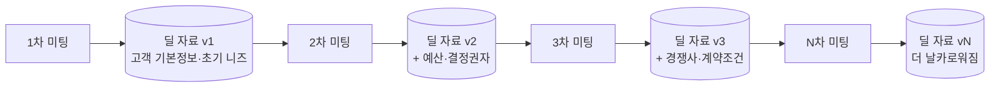
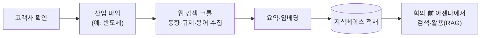

# [Week 2] 영업 회의록 에이전트

> **과제 목표** — 직접 만들고 싶은 Agent를 한 문장으로 정의하고, 그 Agent가 스스로 판단하고 행동하는 데 필요한 **Context(무엇을 알아야 하는가)** 와 **Tool(무엇을 할 수 있어야 하는가)** 을 정리한다.
>
> Refs #3

---

> ### 🎯 한 줄 비전
> **"회의만 잘하면, 업무 끝."**
> 영업사원은 회의(사람이 하는 판단·관계)에만 집중하고, 준비(아젠다)와 뒷정리(회의록·할 일·자료 축적)는 에이전트가 다 한다.

---

## 0. 한 장 요약 (Executive Summary)

- **무엇을:** 영업 회의를 **회의 前 / 회의 後 두 시점으로 나눠** 지원하는 에이전트를 만든다.
  - **회의 前** — 고객정보·표준 질문 리스트·누적 딜 자료, 그리고 조직의 지식 베이스(암묵지·솔루션·산업지식)를 바탕으로 **이번 회의 아젠다**를 만들어 준다.
  - **회의 後** — **비정형 녹취/메모를 표준 회의록 양식으로 변환**해 정리하고, **할 일(액션아이템·담당·기한)** 을 뽑아 준다.
- **왜:** 영업 회의는 결정과 약속이 오가지만, 준비도 정리도 사람 손에 맡겨져 **질문 누락·할 일 누락·책임 불명확**이 반복된다.
- **핵심:** 이번 회의의 할 일이 **다음 회의 아젠다로 이어지고**, 딜 자료는 회의를 거듭할수록 **누적되며 고도화**된다. (= 에이전트의 "기억")
- **원칙:** 처음부터 복잡하게 가지 않는다. **가장 단순한 직선 구조**로 확실히 작동시킨 뒤 넓혀 간다.

> 💡 **용어 먼저** — *Agent(에이전트)* 란, 사람이 매번 시키지 않아도 **주어진 목표를 위해 스스로 정보를 보고(Context) 도구를 써서(Tool) 일을 처리하는** 프로그램을 말한다. 단순히 질문에 답만 하는 챗봇과 다르다.

---

## 1. 왜 이 에이전트인가 (문제 정의)

컨설팅식으로 **상황 → 문제 → 시사점** 순으로 짚는다.

| 구분 | 내용 |
| --- | --- |
| **상황 (Situation)** | 영업 조직은 고객·딜 관련 회의를 반복적으로 하고, 그 자리에서 중요한 결정과 "누가 언제까지 무엇을 한다"는 약속이 오간다. |
| **문제 (Complication)** | 회의 준비와 정리가 대개 사람 손에 달려 있다. 그래서 ①회의 전 **물어봐야 할 것을 빠뜨리고**, ②회의 후 **녹취/메모를 정리할 시간이 없어 할 일이 누락**되며, ③지난 회의의 논의와 약속이 **다음 회의에서 잊힌다**. |
| **시사점 (So what)** | 준비·정리·추적 같은 **반복적·규칙적인 작업**은 에이전트에게 맡기기 좋다. 사람은 판단과 영업에 집중하고, 기록과 연속성 관리는 자동화한다. |

**결론:** 첫 에이전트로 "영업 회의 지원(前/後)"을 택한다. 입력과 출력이 명확해 **잘 됐는지 즉시 확인**할 수 있고, 영업 조직이 매주 실제로 겪는 문제라 **쓸모가 분명**하기 때문이다.

---

## 2. 만들고 싶은 Agent — 한 줄 정의

> **영업 회의를 전·후로 나눠, 회의 前에는 고객정보·질문 리스트·누적 딜 자료·조직 지식베이스로 아젠다를 만들어 주고, 회의 後에는 녹취/메모를 표준 회의록 양식으로 정리하고 액션아이템을 뽑아 주며 — 이번 회의의 할 일과 자료가 다음 회의로 이어지고 고도화되는 에이전트**

단순 받아쓰기가 아니라 **"영업 조직을 위한"** 회의 지원이라는 점이 핵심이다. 딜 맥락과 지난 논의를 이어받아 **"물어볼 것"과 "하기로 한 것"이 사라지지 않게** 한다.

---

## 3. 에이전트가 판단하려면 무엇을 알아야 하는가 — Context 후보 2개

> 💡 **Context(컨텍스트)란?** — 에이전트가 판단을 내리기 위해 **눈앞에 놓아 주는 정보**다. "회의 준비 좀 해 줘"라고만 하는 게 아니라, **고객 정보·지난 회의록·질문 목록·참고 자료를 함께 건네주는 것**에 해당한다. 좋은 에이전트는 똑똑한 프롬프트보다 **적절한 Context**에서 나온다.

### 3-1. 참조하는 지식의 4개 층

| 구분 | 지식 | 성격 | 확보 방식 |
| --- | --- | --- | --- |
| **상시·내부** | 영업 암묵지 · 솔루션 자료 | 조직 공통, 잘 안 바뀜 | 지식베이스에 미리 적재 |
| **상시·외부** | 산업 도메인 지식(고객사 산업별) | 고객사 따라 다름, 계속 갱신 | 수집 파이프라인으로 확보 |
| **딜별** | 딜 누적 히스토리 | 딜 종속, 회차마다 누적 | 회의 後 산출물이 쌓임 |
| **회의** | 이번 회의 원본(녹취/메모) | 1회성 | 그때 입력 |

> 💡 이 자료들은 모델을 다시 **훈련(fine-tune)** 시키는 게 아니라, **지식 베이스에 저장해두고 필요할 때 검색해서 참조**하는 방식으로 쓴다. 이를 **RAG(검색증강생성)** 라고 하며, 스터디에서 나눠준 무료 임베딩 API가 바로 이 용도다.

과제 형식에 맞춰, 위 층들을 회의 **前 / 後** 국면에 하나씩 묶어 Context 후보 2개로 정리한다.

### ① (회의 前) 고객정보 · 표준 질문 리스트 · 딜 누적 자료 · 조직 지식베이스(암묵지·솔루션·산업지식)
- **무엇:** 고객 기본정보, 이 고객·이 단계에서 확인할 **표준 질문 리스트**(예: 예산·결정권자·도입시기·경쟁사), 지난 회의까지 쌓인 **딜 누적 자료**, 그리고 조직의 **지식 베이스**(암묵지·솔루션 자료·고객사 산업지식).
- **왜 필요한가:** 아젠다는 다음 공식으로 만들어진다.

  > **질문 리스트(알아내야 할 것) − 누적 자료(이미 아는 것) = 이번에 물어볼 것**

  그 위에 지식 베이스가 "이 산업/이 솔루션이라면 이런 포인트"를 더해 **업계 맞춤 아젠다**가 된다. 같은 걸 또 묻지 않고, 공백만 정확히 짚기 위해 이 정보들이 필요하다.

### ② (회의 後) 회의 원본 + 회의록 표준 양식
- **무엇:** 이번 회의의 **비정형 녹취 전사본 또는 메모**, 그리고 우리 조직의 **회의록 표준 양식**(참석자·안건·결정사항·할 일 등).
- **왜 필요한가:** 정리할 **원재료**(녹취/메모)와, 그 **흩어진 내용을 매번 같은 형식으로 변환**할 **틀**(표준 양식)이 있어야 회의록이 일관되게 나온다. 이 "**비정형 → 표준 양식 변환**"이 회의 後의 핵심 작업이다.

---

## 4. 에이전트가 무엇을 할 수 있어야 하는가 — Tool 후보 2개

> 💡 **Tool(도구)이란?** — 에이전트가 실제 세계에 **손을 뻗는 수단**이다. 여기서 헷갈리기 쉬운 점 하나:
> - **모델(LLM)** 은 무엇을 할지 **판단**하는 **두뇌**일 뿐, 파일을 열거나 검색·저장하는 **행동은 스스로 못 한다.**
> - **Tool** 은 그 행동을 담은 **기능 하나** — 보통 **우리가 짠 함수** 하나이고, 그 안에서 외부 API나 오픈소스 라이브러리를 **부품으로** 쓴다.
> - "**스킬(Skill)**"은 프레임워크에 따라 Tool을 부르는 다른 이름(거의 같은 말)이고, "**오픈소스**"는 Tool을 만들 때 쓰는 **재료**이지 Tool 그 자체가 아니다.
>
> 모델이 "언제 어떤 Tool을 쓸지" 스스로 정하는 과정이 바로 이번 주(Week 2) 주제인 **Tool Calling / Agent Loop** 다.

### ① 조회·검색 Tool (불러오기)
- **무엇:** 고객정보·질문 리스트·딜 누적 자료(회의 前)와 회의 원본(회의 後)을 불러오고, 지식 베이스(암묵지·솔루션·산업지식)에서 **의미 기반으로 검색(RAG)** 한다.
- **구체적으로 무엇으로 만드나:**
  - 파일/DB에서 회의록·딜자료를 읽어오는 **함수** (파일 읽기 또는 sqlite 같은 DB 쿼리)
  - 지식 베이스 의미 검색 = **임베딩 API**(스터디 제공 Sionic) + **벡터 검색 라이브러리**(오픈소스 예: Chroma·FAISS) — 이 지점이 "오픈소스가 부품으로 들어가는" 곳
  - (후반) 산업지식용 **웹 검색 API**
- **역할:** 에이전트가 판단할 입력(맥락)을 확보하는 손.

### ② 작성 Tool (만들어 남기기)
- **무엇:** 회의 前에는 **아젠다**를, 회의 後에는 **표준 양식 회의록 + 할 일 표(담당·기한)** 를 작성·저장한다.
- **구체적으로 무엇으로 만드나:**
  - 표준 템플릿에 내용을 채워 **마크다운 문서로 저장하는 함수** (파일 쓰기)
  - 할 일을 담당·기한 컬럼을 가진 **표로 구조화**해 출력 (그리고 다음 회의를 위해 딜 누적 자료에 반영)
- **역할:** 판단 결과를 사람이 바로 검토·활용할 수 있는 **산출물로 남기는** 손. 저장된 결과는 다음 회의의 누적 자료가 된다.

> 🔧 **참고: 산업지식 수집 파이프라인** — 고객사 산업의 자료를 웹에서 수집·요약·적재하는 별도 파이프라인이 필요하다. 다만 이는 에이전트 본체와 분리된 **백그라운드 인프라**이자 엔지니어링 비용이 커서, MVP가 아닌 **후반 단계**로 둔다(아래 §6).

---

## 5. 전체 작동 논리 (어떻게 굴러가는가)

### 5-1. 회의 前 → 後 2단계 흐름

```
[회의 前] 사전 준비 (아젠다 빌더)
  입력: 고객정보 + 표준 질문 리스트 + 딜 누적 자료 + 지식베이스 검색(RAG)
        (질문 리스트 − 누적 자료 = 이번에 물어볼 공백)
  출력: 이번 회의 아젠다 (안건 + 지난 미결과제 + 업계 맞춤 확인 포인트)

        … (실제 회의는 사람이 진행) …

[회의 後] 사후 처리 (회의록·액션아이템)
  입력: 비정형 녹취/메모 + (위에서 만든 아젠다)
  변환: 흩어진 녹취/메모 → 표준 회의록 양식으로 정리
  출력: 회의록 + 액션아이템 표(담당·기한)
        └─▶ 이 할 일과 자료가 "다음 회의 前"으로 이어짐  ← Memory 루프
```



### 5-2. 회의를 거듭할수록 자료가 고도화된다 (누적 기억)

```
1차 미팅 ─▶ [딜 자료 v1]  (고객 기본정보, 초기 니즈)
2차 미팅 ─▶ [딜 자료 v2]  (v1 + 예산·결정권자 확인, 반복 미결과제 부각)
3차 미팅 ─▶ [딜 자료 v3]  (v2 + 경쟁사 상황, 계약 조건 …)
   ⋮
N차 미팅 ─▶ [딜 자료 vN]  ← 누적될수록 아젠다·회의록이 더 날카로워짐
```



에이전트가 매번 "처음 보는 회의"로 대하지 않고 **딜의 히스토리 전체를 알고** 준비·정리하므로, 뒤 회차로 갈수록 아젠다는 좁혀지고 회의록은 맥락이 풍부해진다. 이것이 스터디 **Week 4의 Memory(기억)** 개념 — 한 번에 볼 수 있는 정보(Context Window)의 한계를 넘어, **자료를 저장·고도화하며 다시 불러오는** 구조다.

### 5-3. 산업 도메인 지식 수집 (목표 개념)

```
고객사 확인 → 산업 파악(예: 반도체)
   → 웹 검색/크롤로 산업 동향·규제·용어 수집
   → 요약·임베딩(숫자로 변환) → 지식베이스 적재
   → 회의 前 아젠다에서 검색·활용(RAG)
```


효과: "이 고객은 반도체 업계라 → 최근 이 이슈가 중요, 우리 솔루션의 이 기능이 맞음" 같은 **업계 맞춤 준비**가 가능해진다.

### 5-4. 핵심 지표 (KPI)

회의록·아젠다 같은 문서만이 아니라, **"이 딜을 얼마나 파악했나"를 숫자로** 보여준다.

| KPI | 정의 | 성격 |
| --- | --- | --- |
| **① 니즈/정보 확보율** | (확보된 표준질문 항목 ÷ 전체 표준질문 항목) × 100% | 정량 — 딜 성숙도(자격) 점수. `1차 30% → N차 90%` 로 상승 |
| **② 핵심정보 완비도** | 필수 항목(예산·결정권자·도입시기 등) 확보 여부 | 정성 — 정보 품질·최신성 |
| **③ 액션아이템 이행률** | (완료된 액션아이템 ÷ 전체) × 100% | 정량 — 회의 후속조치의 실행 추적 |

> 이 KPI는 Week 8 **평가(Evaluation)** — "만든 Agent가 실제로 잘 동작하는가" — 의 성공 기준으로 그대로 쓸 수 있다.
>
> ※ 각 KPI의 구체적 기준(목표 %, 항목 정의 등)은 프로젝트를 진행하며 실측 데이터로 잡아 나간다.

### 5-5. 왜 이렇게 (단계적으로) 가는가

> *좋은 Agent는 가장 복잡한 Agent가 아니라, 필요한 Context와 Tool을 가지고 목표를 안정적으로 달성하는 **가장 단순한 시스템**이다.*

복잡한 구조는 만들기도, 어디서 틀렸는지 찾기도 어렵다. 먼저 **확실히 작동하는 직선 하나**를 완성해 성공 경험을 쌓고, 필요할 때 한 조각씩 붙인다.

---

## 6. 구현 단계 & 다음 확장 방향 (로드맵)

| 단계 | 만들 것 | 새로 배우는 것 |
| --- | --- | --- |
| **1단계 (MVP)** | 회의 後 **녹취/메모 → 표준 회의록·액션아이템 변환**. 기억은 **"직전 회의 1건만 이어받기"** 로 단순하게. 산업 자료는 **손으로 몇 개만** 넣어두고 시작. | 직선 그래프, Context·Tool 기본 |
| **2단계** | 회의 前 **아젠다 빌더** + **질문 리스트 − 누적 자료** 공백 로직 | 前/後 2단계, 규칙 기반 판단 |
| **3단계** | **암묵지·솔루션 지식베이스 연결(RAG)** + **N차 누적 고도화**(딜 자료 v1→vN) | Memory(장기 기억)·RAG, Week 3~4 개념 |
| **4단계** | **산업 도메인 지식 수집 파이프라인**(웹 수집 → 임베딩 → 적재) | 데이터 수집·처리 파이프라인 |
| **다음 프로젝트** | **견적·제안 작성 자동화** 에이전트<br>(접수 → 분류 → 금액 계산 → 검토 → 승인) | 라우터 분기, 코드/AI 노드 결합, 사람 개입(Human-in-the-loop) |

**즉, 회의록 에이전트는 "워밍업"이자 기초 훈련이고, 그 위에서 견적·제안 자동화라는 더 큰 과제로 나아간다.**
