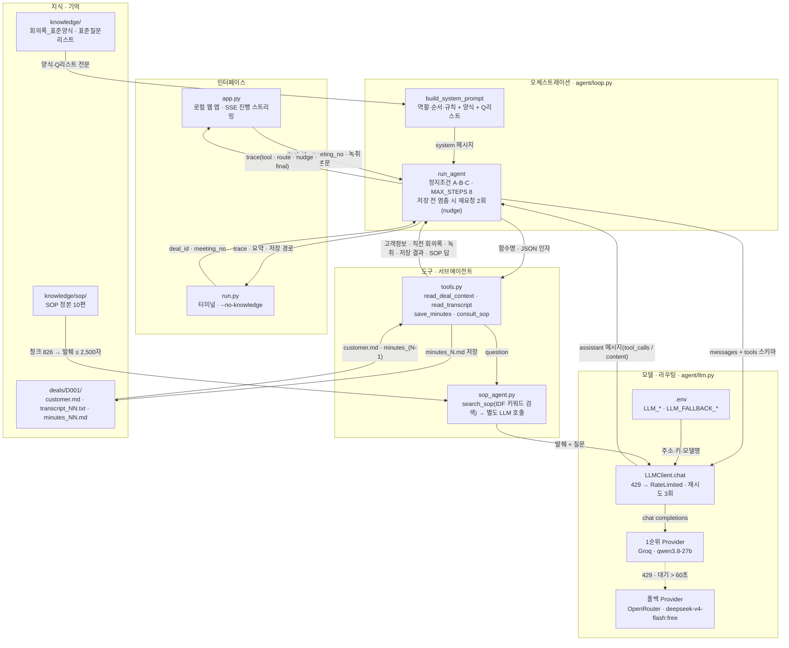
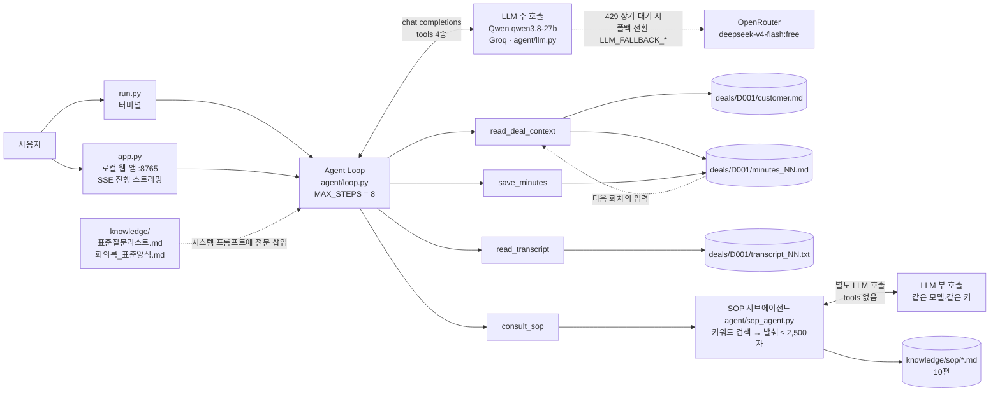
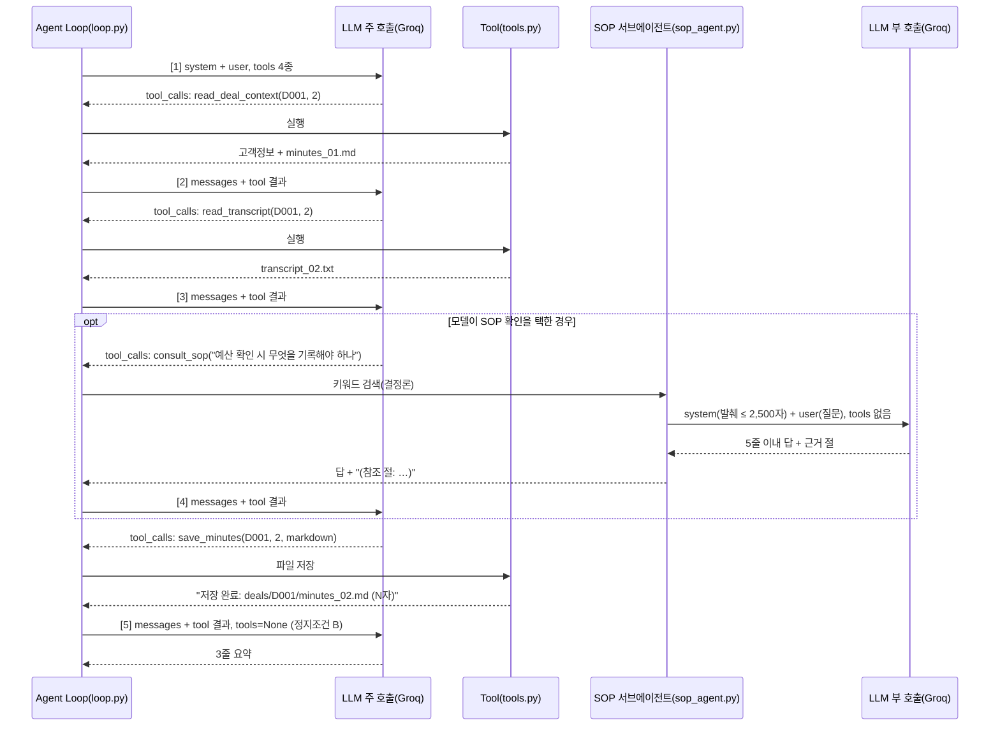

# [Week 3] 영업 회의록 에이전트 — 기술정의서

작성: 이정인(jilee) / 기준일: 2026-09-19 / 대상 브랜치: week-03/jilee

이 문서는 같은 폴더의 작업정의서(범위·의사결정·완료 조건)와 짝을 이루는 기술 문서이다. 작업정의서가 "무엇을 어디까지 했는가"를 기획자 눈높이로 적었다면, 이 문서는 "어떤 연구와 기법 위에 서 있고, 왜 이렇게 설계했으며, 어디까지 믿을 수 있는가"를 개발자 독자에게 적는다. 수치는 기준일에 저장된 `deals/D001/`·`experiments/` 파일에서 직접 세었고, 코드 인용은 `agent/`의 현재 소스를 따른다.

## 1. 개요

### 1.1 문제 정의

문제의 주인은 B2B 영업 담당자이다. 영업 회의에서는 고객의 문제, 예산, 결정권자, 일정 같은 정보가 오가고 "누가 언제까지 무엇을 한다"는 약속이 생기지만, 정리는 사람 손에 맡겨진다. 그 결과 세 가지가 반복된다. 회의 후 녹취 정리 시간이 없어 할 일이 누락되고, 지난 회의의 약속이 다음 회의에서 유실되며, 자격검증(딜이 추진할 만한지 판단하는 영업 SOP 단계)에 필요한 정보가 어디까지 확보됐는지 아무도 세지 않는다. Week 2 기획서[18]는 이 문제를 "회의 前 아젠다 작성 · 회의 後 회의록 정리 · 할 일의 다음 회의 연결"로 정의했고, Week 3에서는 그중 회의 後 처리만 구현하였다.

### 1.2 시스템 한 문장 정의

회의 녹취(STT, 음성을 글자로 바꾼 결과)를 입력받아, 영업 SOP에서 옮긴 표준 양식 8절 회의록과 액션아이템을 생성·저장하고, 직전 회의록을 읽어 액션아이템을 승계 판정하며, 표준 질문 Q01~Q11의 확보 여부를 갱신하는 Tool Calling 기반 단일 에이전트이다. 모델은 Qwen qwen3.8-27b를 Groq 무료 API로 서빙받고, 코드는 파이썬 표준 라이브러리만으로 작성하였다.

### 1.3 이 문서의 범위

2장은 이 구현이 기대는 연구와 개념을, 3장은 설계를, 4장은 구현 결정을, 5장은 실험 결과를, 6장은 평가 지표의 수식과 프로토콜을, 7장은 한계와 향후 연구를 다룬다. 회의 前 아젠다 빌더, RAG(검색증강생성) 연결, 산업지식 수집은 범위 밖이며 7장에서 방향만 적는다.

## 2. 관련 연구와 개념

### 2.1 LLM 에이전트와 ReAct 루프

LLM 에이전트는 모델이 한 번 답하고 끝나는 대신, 관찰과 행동을 번갈아 수행하며 목표에 접근하는 프로그램이다. Yao 등[1]의 ReAct는 추론 흔적(reasoning trace)과 과업 행동(action)을 한 궤적 안에서 교대로 생성하게 하면, 추론이 행동 계획을 세우고 행동이 가져온 관찰이 추론을 갱신한다는 것을 보였다. Wei 등[7]의 Chain-of-Thought는 그 앞 단계로, 중간 추론 단계를 생성하게 하는 것만으로 산술·상식·기호 추론 성능이 오른다는 관찰이다. ReAct는 이 추론을 외부 세계와 잇는 행동으로 확장한 셈이다. Anthropic[8]은 이런 시스템을 두 부류로 나눈다. 워크플로(workflow)는 LLM과 도구가 미리 정한 코드 경로로 엮인 것이고, 에이전트(agent)는 LLM이 자기 진행과 도구 사용을 스스로 지시하는 것이다. 같은 글은 "가장 단순한 구성에서 시작해 측정 가능한 개선이 있을 때만 복잡도를 올리라"고 권한다. OpenAI 가이드[10]도 에이전트를 "도구 호출로 비결정적 단계를 엮어 목표를 향해 가는 시스템"으로 정의하고 모델·도구·지시(instructions) 세 요소로 분해한다.

이 구현과의 연결은 다음과 같다. `agent/loop.py`의 `run_agent`는 ReAct의 관찰·행동 교대를 OpenAI 호환 규격으로 옮긴 것이다. 모델은 `tool_calls`로 행동을 내고, 파이썬이 실행한 관찰을 `role: "tool"` 메시지로 되돌린다. 추론 흔적은 별도 필드로 받지 않으며 모델 내부(Qwen3의 thinking 모드[15])에 맡긴다. 도구 선택 순서를 코드로 고정하지 않았으므로 Anthropic 분류상 "에이전트"이지만, 시스템 프롬프트가 작업 순서 4단계를 명시하고 정지조건을 코드가 쥐고 있어 실제 궤적은 워크플로에 가깝다. 이 절충이 §3.2의 설계 근거이다.

### 2.2 Tool Calling(함수 호출)의 원리와 OpenAI 호환 규격

Tool Calling은 모델이 자연어 대신 구조화된 함수 호출 요청(함수 이름 + JSON 인자)을 출력하고, 실행은 호출 측 프로그램이 맡는 방식이다. Schick 등[3]의 Toolformer는 모델이 언제 어떤 API를 부를지 스스로 학습할 수 있음을 보였고, 이후 상용 API는 이를 학습이 아닌 프롬프트 규격으로 제공한다. OpenAI 규격[14]에서는 `tools` 배열에 각 함수의 `name`·`description`·`parameters`(JSON Schema)를 넣어 보내면, 모델이 `tool_calls[].function.arguments`에 JSON 문자열을 담아 돌려주고, 개발자는 실행 결과를 `tool_call_id`로 짝지어 되돌린다. `tool_choice`는 `auto`(0회 이상 자유), `required`, `none`, 특정 함수 강제 중 하나이다. 같은 문서는 "함수 이름·설명을 분명히 쓰고, 처음 노출하는 함수 수를 작게 유지하며, 이미 아는 값은 모델에게 채우게 하지 말라"고 권한다. Groq[13]는 이 규격을 그대로 따르며, qwen/qwen3.8-27b가 병렬 도구 호출을 지원한다고 명시한다.

이 구현과의 연결은 `agent/tools.py`의 `TOOL_SCHEMAS`와 `agent/llm.py`의 `chat`이다. 함수 4종의 스키마를 보내고 `tool_choice: "auto"`로 둔다. "이미 아는 값은 채우게 하지 말라"는 권고와 달리 `deal_id`·`meeting_no`를 모델이 채우게 한 것은 의도한 선택이다. 학습용 코드에서 모델이 인자를 고르는 모습을 그대로 보이려 했고, 값이 두 개뿐이라 오류 여지가 작다. 다만 `read_deal_context`가 `meeting_no` 없이 호출되면 가장 최근 회의록을 직전으로 읽는 함정이 있어, 스키마에서 `required`로 지정하고 설명문에 이유를 적었다.

### 2.3 Context Engineering: 무엇을 보여줄 것인가

Anthropic[9]은 컨텍스트 엔지니어링을 "추론 시점에 최적의 토큰 집합을 골라 유지하는 일"로 정의하고, 프롬프트 엔지니어링(지시문을 쓰고 배치하는 일)의 상위 개념으로 둔다. 같은 글의 논점은 셋이다. 첫째, 어텐션 예산은 유한하므로 컨텍스트가 길어질수록 성능이 떨어지는 "context rot"이 생긴다. 둘째, 시스템 프롬프트는 "복잡하고 부서지기 쉬운 논리를 하드코딩"하는 것과 "모호한 고수준 지침" 사이의 적정 고도(right altitude)를 잡아야 한다. 셋째, 필요한 자료는 미리 다 싣기보다 가벼운 식별자만 두고 도구로 그때 불러오는 just-in-time 방식이 낫다. LangChain[11]은 같은 문제를 모델 컨텍스트(한 호출에 들어가는 지시·메시지·도구·응답 형식), 도구 컨텍스트(도구가 읽고 쓰는 상태·저장소), 생명주기 컨텍스트(요약·가드레일·로깅)로 삼분한다.

이 구현은 컨텍스트를 세 층으로 나눈다. (1) 시스템 프롬프트 = 역할·작업 순서·규칙 + `knowledge/`의 양식과 질문 리스트 전문. 실행마다 같으며 딜과 무관하다. (2) 도구 반환 = 고객정보·직전 회의록·녹취. 딜과 회차에 따라 달라지므로 프롬프트에 박지 않고 `read_deal_context`·`read_transcript`가 그때 가져온다(just-in-time). (3) 기억 = 파일 시스템의 `minutes_NN.md`. 이번 실행의 산출물이 다음 실행의 도구 반환이 된다. §5.3의 지식베이스 유무 비교는 층 (1)을 뺐을 때 무엇이 무너지는지 보는 실험이고, §3.4의 SOP 서브에이전트는 470KB짜리 SOP 정본을 층 (1)에 싣지 않고 도구 뒤로 숨긴 결정이다.

### 2.4 외부 기억과 컨텍스트 창 한계

Packer 등[2]의 MemGPT는 운영체제의 메모리 계층에 빗대어, 컨텍스트 창을 주기억, 외부 저장소를 보조기억으로 두고 모델이 스스로 페이지 인·아웃하는 "가상 컨텍스트 관리"를 제안했다. Liu 등[5]의 Lost in the Middle은 긴 컨텍스트에서 관련 정보가 중간에 있을 때 성능이 크게 떨어지고, 앞이나 끝에 있을 때 가장 좋다는 것을 실험으로 보였다. 두 논문의 함의는 "넣을 수 있다고 다 넣지 말고, 무엇을 언제 어디에 둘지 정하라"는 것이다. Anthropic[9]은 실무 기법으로 압축(compaction), 구조화된 메모(structured note-taking), 서브에이전트 분리를 든다.

이 구현의 기억은 MemGPT보다 훨씬 단순하다. 모델이 페이지를 고르지 않고, `read_deal_context`가 직전 회의록 한 건만 고정 반환한다. 회차가 쌓여도 입력 크기가 일정하다는 장점과, 1차 합의가 3차에서 보이지 않는다는 단점을 맞바꾼 것이다(3차 실행은 `minutes_02.md`만 읽고 `minutes_01.md`는 읽지 않는다). 대신 회의록 8절이 Q코드 누적 상태를, 2절이 액션아이템 상태를 담아 "구조화된 메모" 역할을 한다. 배치 순서에서는 Lost in the Middle을 의식해 규칙을 시스템 프롬프트 앞부분에, 녹취를 대화 끝부분(가장 최근 도구 반환)에 오게 했다. 양식과 질문 리스트는 그 사이에 놓이는데, 이것이 8절 판정이 흔들리는 한 원인일 수 있다(§5.6).

### 2.5 RAG와 이번에 쓰지 않은 이유, SOP 서브에이전트의 최소 검색

Lewis 등[4]의 RAG는 파라미터 기억(모델 가중치)과 비파라미터 기억(밀집 벡터 색인)을 결합해, 질의마다 관련 문서를 검색해 생성에 붙이는 구조이다. 지식이 크고 질의에 따라 필요한 부분이 달라질 때 유효하다. 이번 구현의 정식 지식베이스는 `knowledge/` 두 편, 합계 약 2,600자이다. 검색 없이 전문을 실을 수 있고, 회의록 작성에는 두 편 전체가 매번 필요하므로 "무엇을 골라올지"라는 RAG의 문제 자체가 성립하지 않는다. 임베딩 API와 벡터 저장소를 붙이면 의존성이 늘고 표준 라이브러리 원칙(§4.1)이 깨진다. 이것이 RAG를 제외한 이유이다.

그러나 SOP 정본은 다르다. `knowledge/sop/`는 사내 영업 SOP 정본 10편 약 470KB이며, 한꺼번에 실으면 Groq 분당 8K 토큰 한도를 수십 배 넘는다. 여기에만 최소 검색을 두었다. `agent/sop_agent.py`는 문서를 절·표 행·문단 단위로 잘라(826 청크) 질문 단어의 출현 빈도에 IDF(역문서빈도, 흔한 단어일수록 낮은 가중치)를 곱해 점수를 매기고, 상위 청크를 2,500자 안에서 골라 별도 LLM 호출로 답을 만든다. 벡터 색인이 없는 어휘 기반 검색이므로 동의어를 못 잡지만, 결정론적이라 LLM 없이 테스트할 수 있고(§4.4) 외부 패키지가 필요 없다. Lewis 등[4]의 용어로는 비파라미터 기억을 밀집 벡터 대신 문자열 일치로 구현한 축소판이다.

### 2.6 에이전트 평가

Yao 등[6]의 τ-bench는 도구·에이전트·사용자 상호작용을 시뮬레이션하고, 같은 과제를 k번 시도해 모두 성공할 확률 pass^k로 일관성을 잰다. 최신 함수 호출 에이전트도 과제의 절반 미만을 통과하며, pass^k는 k가 커질수록 급락한다. 즉 "한 번 성공"과 "매번 성공"은 다른 지표이다. Anthropic[8]은 평가를 위해 실행 경로를 투명하게 남기라고 하고, OpenAI[10]는 가드레일을 여러 겹 두고 사람 개입 조건을 정하라고 한다.

이 구현의 평가 지표는 Week 2 기획서의 KPI에서 왔다. 니즈/정보 확보율(확보 Q코드 ÷ 11), 액션아이템 이행률(완료 ÷ 전체), 그리고 작업정의서에서 추가 제안한 대화 추출률(녹취에 심은 정답이 회의록에 살아남는 비율)이다. 수식과 계산 예는 §6에 둔다. τ-bench의 교훈은 §5.6에 그대로 나타났다. 같은 1차 녹취를 다시 돌리면 확보율이 27%에서 64%까지 흔들렸고, 3차는 첫 실행 100%가 재실행에서 73%로 바뀌었다. pass^1은 높아 보여도 pass^3은 낮다는 뜻이며, 판정 규칙의 코드화(§7)가 여기서 나온 과제이다. 실행 궤적은 `RunResult.trace`에 단계·도구·인자·결과 미리보기로 남겨 사후 검토가 가능하게 했다.

### 2.7 부정 지시의 취약성과 긍정형 규칙

언어 모델이 부정(negation, "~가 아니다"·"~하지 않는다")을 제대로 다루지 못한다는 것은 벤치마크로 반복 확인된 사실이다. Truong 등[20]은 GPT-neo·GPT-3·InstructGPT를 여러 부정 벤치마크로 평가해, 모델이 부정의 존재에 둔감하고, 부정의 어휘 의미를 포착하지 못하며, 부정 아래에서 추론에 실패한다는 세 가지 한계를 보고했다. 모델 크기를 키워도 부정 처리가 비례해 나아지지 않았다. García-Ferrero 등[21]은 약 40만 문장, 그중 3분의 2에 여러 형태의 부정이 든 대규모 벤치마크를 만들어, LLM이 긍정문 분류에는 능숙하지만 부정문에서는 표면 단서에 기대어 실패한다는 것을 보였다. 프롬프트 실무 지침도 같은 방향이다. Anthropic의 프롬프트 작성 지침[22]은 출력 형식을 제어하는 첫째 방법으로 "하지 말 것 대신 할 것을 말하라(Tell Claude what to do instead of what not to do)"를 들고, "마크다운을 쓰지 마라" 대신 "매끄럽게 이어지는 산문 문단으로 구성하라"를 예로 든다. OpenAI 도움말의 프롬프트 모범 사례[23]도 "하지 말 것만 말하지 말고 대신 무엇을 할지 말하라"를 항목으로 두고, 개인정보를 묻지 말라는 지시 대신 도움말 문서로 안내하라는 지시를 예로 든다.

이 구현의 규칙 문장은 이 근거로 모두 긍정형이다. "녹취에 없는 내용은 만들지 않는다" 대신 "녹취와 고객정보에 있는 내용만으로 쓴다", "담당·기한이 없으면 액션아이템으로 올리지 않는다" 대신 "담당과 기한이 모두 있는 일만 액션아이템에 올리고, 그 밖의 일은 미합의 사항에 둔다"로 쓴다. 양식 파일의 작성 규칙 5개도 같은 원칙으로 적었고, 파일 머리에 "지시는 무엇을 하라의 긍정형으로 적는다. 부정형 지시는 모델이 놓치기 쉽다"고 이유를 남겼다. 다만 §5.6의 규칙 위반(기한 없는 항목이 7절에 오름)은 긍정형 규칙 아래에서도 나타났다. 부정 처리 취약성이 원인의 전부가 아니며, "확인 불가"라는 값을 기한 칸에 넣는 우회로가 열려 있는 한 문장을 어떻게 쓰든 코드 검사가 필요하다는 뜻이다.

## 3. 시스템 설계

### 3.0 에이전트 아키텍처



다섯 계층은 책임이 겹치지 않는다. 인터페이스는 입력을 받아 진행 상황을 보여주고, 오케스트레이션은 루프의 순서와 정지를 쥐며, 모델·라우팅은 어떤 제공자에게 어떻게 보낼지를 정하고, 도구·서브에이전트는 파일과 SOP에 닿는 유일한 통로이며, 지식·기억은 코드가 아닌 파일이다. 계층 사이를 오가는 것은 그림의 화살표에 적은 데이터뿐이다. 모델은 파일을 직접 열지 못하고, 도구는 모델을 부르지 않는다(consult_sop만 예외로, 별도 대화를 연다).

### 3.1 전체 구조



구조는 직선이다. 진입점 2종(`run.py`, `app.py`)이 같은 `run_agent`를 부르고, 루프가 LLM과 도구 4종 사이를 오가며, 도구는 딜 폴더의 파일을 읽고 쓴다. LLM 호출은 `LLMClient` 하나가 맡고, 1순위 제공자가 한도 초과로 오래 막히면 같은 실행 안에서 폴백 제공자로 넘어간다(§4.3). `consult_sop`만 예외로, 도구 안에서 두 번째 LLM 호출이 일어난다. 이 호출은 주 대화의 메시지 목록과 분리된 새 대화(시스템 프롬프트 + 발췌 + 질문)이며 도구 없이 답만 받는다. Anthropic[9]이 말한 "집중된 과제를 서브에이전트에 위임하고 압축된 요약만 받는" 구조를 최소 형태로 옮긴 것이다. 주 에이전트의 컨텍스트에는 발췌 2,500자가 들어오지 않고, 5줄 이내 답과 참조 절 목록만 들어온다.

### 3.2 Agent Loop 알고리즘

```text
run_agent(deal_id, meeting_no, llm, on_step, use_knowledge):
    messages ← [system: build_system_prompt(use_knowledge),
                user:   "딜 {deal_id}의 {meeting_no}차 회의 녹취를 회의록으로 정리해 저장해줘."]
    saved ← None; nudges ← 0
    for step in 1..MAX_STEPS(8):
        msg ← llm.chat(messages, tools=TOOL_SCHEMAS)          # temperature 0.2, max_tokens 8192
        note_route_switch()                                     # 폴백 전환이 있었으면 trace에 route 1회
        if msg.tool_calls is empty:
            if saved is None and nudges < 2:                    # 저장 전 멈춤: 2회까지 이어가라고 재요청
                nudges += 1
                messages.append(assistant(msg.content or "(빈 응답)"))
                messages.append(user("아직 회의록이 저장되지 않았다. … save_minutes로 저장하라."))
                log(nudge); continue
            final ← msg.content; break                          # 정지조건 A: 모델이 도구 없이 답함
        assistant ← (msg.content, msg.tool_calls)
        if msg.reasoning_details: assistant.reasoning_details ← msg.reasoning_details   # 추론형 모델 규격
        messages.append(assistant)
        for call in msg.tool_calls:                             # 병렬 호출이면 순서대로 모두 실행
            args ← json.loads(call.arguments) or {}
            try:    output ← TOOL_FUNCTIONS[call.name](**args); ok ← True
            except: output ← "오류: " + str(e);                ok ← False   # 예외를 문자열로 되돌림
            if call.name == "save_minutes" and ok: saved ← output
            log(step, call.name, ok, args(markdown은 길이만), output[:300])
            messages.append(tool(call.id, call.name, output))
        if saved:                                               # 정지조건 B: 저장 성공
            msg ← llm.chat(messages, tools=None)                # 도구 없이 요약만 받음
            final ← msg.content; break
    else:
        final ← "(최대 단계 수에 도달해 중단했습니다)"           # 정지조건 C: 8단계 초과
    return RunResult(final, trace, saved)
```



정지조건이 셋인 이유는 실측에서 나왔다. 정지조건 A만으로는, 저장 후에도 도구 목록이 열려 있어 모델이 `save_minutes`를 최대 6회 반복 호출했다. 저장 성공을 감지하면 도구를 빼고 한 번 더 부르는 정지조건 B가 이를 막았고, 단위테스트 `test_normal_path_saves_and_stops`가 이를 고정한다(중복 저장 계획을 넣어도 도구 호출은 3회, LLM 호출은 4회여야 한다). 정지조건 C는 무한 루프 방지이며 `test_max_steps_guard`가 검증한다. 재요청(nudge)은 정지조건 A의 예외이다. 일부 모델은 저장 전에 빈 답이나 잡담으로 도구 호출을 멈추는데, 그대로 두면 회의록 없이 실행이 끝나므로 "아직 저장되지 않았다"는 사용자 메시지를 붙여 두 번까지 이어가게 한다. 두 번 뒤에도 멈추면 정지조건 A로 종료한다. `reasoning_details`는 OpenRouter 규격의 추론형 모델이 돌려주는 추론 기록으로, assistant 메시지에 그대로 되돌려주지 않으면 모델이 앞 단계의 판단을 잃는다(§5.8). 도구 오류는 예외를 밖으로 던지지 않고 "오류: …" 문자열로 모델에 되돌린다. 모델이 인자를 고쳐 다시 시도할 기회를 주는 것이며, OpenAI[10]가 말한 "경로 수정을 인식하는" 에이전트의 최소 요건이다. `test_tool_error_is_returned_to_model_not_raised`가 이 동작을 고정한다.

### 3.3 Tool 설계

| 이름 | 입력 | 출력 | 결정론 | 부작용 | 비고 |
| --- | --- | --- | --- | --- | --- |
| `read_deal_context` | `deal_id`, `meeting_no`(필수) | 고객정보 + 직전 회의록 1건(없으면 "첫 회의" 표시) | 예 | 없음(읽기) | `meeting_no`보다 앞선 회차 중 최신만 직전으로 본다. 에이전트의 기억 |
| `read_transcript` | `deal_id`, `meeting_no` | 녹취 원문 | 예 | 없음(읽기) | 파일 없으면 `FileNotFoundError` → 오류 문자열로 되돌림 |
| `save_minutes` | `deal_id`, `meeting_no`, `markdown` | "저장 완료: 경로 (글자 수)" | 예 | 있음(파일 쓰기, 같은 회차는 덮어씀) | 저장 성공이 정지조건 B를 발동 |
| `consult_sop` | `question`(SOP 용어를 넣은 한 문장) | 5줄 이내 답 + "(참조 절: …)" | 검색은 예, 답은 아니오 | 없음(LLM 부 호출 1회) | 검색 결과 없으면 LLM 호출 없이 안내문 반환 |

OpenAI 가이드[10]의 분류로는 앞의 둘이 데이터 수집형, 셋째가 행동형, 넷째가 오케스트레이션형(다른 에이전트를 부르는 도구)이다. Anthropic[8]이 강조한 도구 설명의 품질에 맞춰, 각 `description`에 "언제 부르는가"(회의록 쓰기 전 반드시, 작성이 끝나면 반드시, 애매할 때 한 번)를 적었다. 딜 코드는 정규식 `[A-Za-z0-9_-]+`로 검사해 경로 탈출을 막는다. `save_minutes`는 `markdown`을 인자로 받으므로 회의록 전문이 모델 출력에 실린다. 출력 상한이 부족하면 인자 JSON이 중간에 끊겨 파싱에 실패하거나 잘린 회의록이 저장되는데, 이것이 §3.9의 `max_tokens` 상향 이유이다.

### 3.4 SOP 서브에이전트 설계

주 에이전트가 "SOP상 이 항목을 어떻게 기록해야 하는가"를 물으면 SOP 문서에서 근거를 찾아 답하는 부품이다. 흐름은 질문 → 문단 검색(파이썬, 결정론) → 발췌 조립 → 부 LLM 호출 → 답 + 참조 절이다. 검색과 생성을 분리한 이유는 둘이다. 검색이 결정론적이면 "무엇을 근거로 답했는가"가 실행마다 같아 회사 규칙을 따르는 맥락이 흔들리지 않고, LLM 없이 테스트할 수 있다.

**말뭉치.** `knowledge/sop/`에 사내 영업 SOP 정본 10편(확정판정, 프로세스 지도, 액티비티 지도, 태스크 지도, 서브태스크 2편, 실행가이드, 흐름동학, 작성방법론, RACI 지도)을 복제해 두었으며 합계 약 470KB이다. `SOP_DIR.rglob("*.md")`로 하위 폴더까지 재귀 탐색하므로 폴더를 나눠 넣어도 된다. 이 말뭉치는 `consult_sop`만 읽고 시스템 프롬프트에는 실리지 않는다.

**분절.** 문서마다 형식이 다르므로(표 위주 / 제목 위주) 두 단계로 자른다. 1단계는 제목 단위이다. `#`~`####` 마크다운 제목 또는 `**n.n**`·`**n.n.n**` 굵은 번호 제목이 나올 때마다 새 청크를 시작하고, mermaid 블록은 자르기 전에 제거한다(도형 라벨이 점수를 오염시킨다). 2단계는 재분할이다. 1단계 청크가 2,000자를 넘으면, 본문에 `| \`` 또는 `| IX`로 시작하는 표 행이 있을 때는 행 하나를 청크 하나로 삼고(태스크 지도처럼 행 하나가 태스크 하나인 문서) 제목에 행의 앞 네 칸을 이어 붙이며, 표 행이 없을 때는 빈 줄 기준 문단을 1,500자 안팎으로 묶는다. 40자 이하 청크는 버린다. 정본 10편에서 826개 청크가 나온다.

**점수식.** 질문에서 2글자 이상 한글·영숫자 토큰을 뽑고 불용어(무엇·어떻게·해야·하나·합니까·있나)를 뺀 집합을 T라 할 때,

```text
score(c) = Σ_{t ∈ T} IDF(t) × ( count(t, c.text) + 3 × count(t, c.title) )
IDF(t)   = ln( N / (1 + df(t)) ) + 0.1
```

N은 전체 청크 수(826), df(t)는 본문 또는 제목에 t가 든 청크 수이다. IDF를 곱하는 이유는 말뭉치가 커지면서 "기록"·"결과" 같은 흔한 단어가 점수를 지배했기 때문이며, +0.1은 모든 청크에 나오는 단어의 가중치가 0이 되어 완전히 무시되는 것을 막는 바닥값이다. 제목 가중치 3은 절 제목에 등장한 단어가 그 절의 주제일 가능성이 높다는 휴리스틱이며 실측 튜닝 없이 정했다. 점수가 0보다 큰 청크를 내림차순으로 정렬한 뒤, 누적 글자 수가 2,500자를 넘지 않는 범위에서 순서대로 담는다(넘치는 청크는 건너뛰고 다음 청크를 본다). 2,500자는 분당 8K 토큰 한도를 고려한 상한이다.

| 요소 | 값 | 코드 위치 |
| --- | --- | --- |
| 말뭉치 | SOP 정본 10편, `rglob("*.md")` 재귀 탐색 | `SOP_DIR`, `search_sop` |
| 분절 | 제목 단위, 2,000자 초과 시 표 행 또는 1,500자 문단 재분할, 40자 이하 제거, 826 청크 | `_sections` |
| 토큰화 | 2글자 이상 한글·영숫자, 불용어 6개 제외 | `_terms` |
| 점수식 | Σ_t IDF(t) × (본문 등장 수 + 3 × 제목 등장 수), IDF = ln(N/(1+df)) + 0.1 | `search_sop` |
| 발췌 상한 | 2,500자 | `MAX_CONTEXT_CHARS` |
| 부 호출 | 시스템(3문장 + 발췌) + 사용자(질문), tools 없음 | `consult_sop` |

부 호출의 시스템 프롬프트는 세 문장이다. "발췌만 근거로 답한다", "발췌에 근거가 없으면 'SOP 발췌에 해당 규정 없음'이라고 쓴다", "5줄 이내, 확인 항목·기록 규칙·최소 완료 조건을 그대로 인용하고 끝에 근거 절 번호를 적는다". "규정 없음"을 명시적으로 허용한 것이 설계의 요점이다. 근거 없는 질문에 그럴듯한 규정을 지어내는 것이 가장 나쁜 실패이므로, 모름을 말할 길을 열어두었다. 검색 결과가 비면 LLM을 부르지 않고 "SOP 용어를 넣어 다시 물어보라"는 안내문을 반환한다.

LLM까지 이어진 실제 호출 결과 2건은 다음과 같다. (1) "담당과 기한이 없는 일은 어떻게 처리하나"에는 "SOP 발췌에 해당 규정 없음"으로 답했다. 자격검증·활동기록 절에 액션아이템 처리 규정이 없으므로 맞는 답이다. (2) "예산 확인 시 무엇을 기록해야 하나"에는 예산 확보 여부·출처·확인 경로를 기록하라는 답을 2.5.1(예산 확보 여부 확인)을 근거로 내놓았다. 표준 질문 Q09의 확보 기준과 일치한다. LLM 없이 검색만 돌린 실측 3건은 아래와 같다.

| 질문 | 뽑힌 청크(점수 순, 파일 · 제목) | 청크 수 · 합계 |
| --- | --- | --- |
| 예산 확인 시 무엇을 기록해야 하나 | 실행가이드 T02 미팅 리포트 작성(63.5), 실행가이드 T01 BANT 사전 점검(60.1), 태스크 지도 PG02 예산 편성 T02 예산 규모 적정성 판정·기록(52.2), 같은 곳 T01 예산 산정(48.4), 서브태스크 S04 예산 확인(44.9) | 5 · 2,452자 |
| 담당과 기한이 없는 일은 어떻게 처리하나 | 실행가이드 T01 날인·계약대장 등록(14.1), 실행가이드 T01 수주 전략 작성(11.0), 작성방법론 행위 전개에 주는 규율(5.7), 태스크 지도 1차 가견적 작성(3.5) | 4 · 2,388자 |
| 참석자 기록 범위 | 실행가이드 T01 고객 접점 기록(47.6), 서브태스크 S03 합의 기록(30.4), 태스크 지도 범위·수량 산정(26.9), 서브태스크 범위 정리(23.9) 외 6건 | 10 · 2,448자 |

첫째와 셋째 질문은 주제에 맞는 청크가 상위에 왔다. 둘째 질문은 SOP에 해당 규정이 없어 "담당"·"기한"이 우연히 든 무관한 청크가 낮은 점수로 뽑혔다. 이 경우 서브에이전트 프롬프트의 "규정 없음" 조항이 방어선이지만, 낮은 점수 청크에서 억지로 규정을 찾는 실패는 종단 검증 전이다. 점수 하한을 두어 무관한 청크는 LLM에 넘기지 않는 것이 후속 과제이다.

### 3.5 프롬프트 설계

| 구성 요소 | 내용 | 근거 |
| --- | --- | --- |
| 역할 | "영업 조직의 회의록 담당자" | 역할 한 줄로 어조와 관점을 고정 |
| 작업 순서 | 1 `read_deal_context` → 2 `read_transcript` → 3 작성·`save_minutes` → 4 3줄 요약. (선택) 작성 전 `consult_sop` 1회 | 도구 순서를 코드로 강제하지 않는 대신 지시로 유도 |
| 승계 규칙 | 직전 액션아이템을 2절에 옮겨 완료·진행 중·미착수 판정 | 기억의 사용법을 명시 |
| 확보 규칙 | 8절에 Q코드. 직전 확보 + 이번 확보 = 누적, 나머지가 미확보 | KPI① 산출의 입력 |
| 작성 규칙 | 녹취·고객정보에 있는 내용만, 고객 표현 그대로, 미확인은 "확인 불가", 담당·기한이 모두 있는 일만 액션아이템, 한국어 | 양식의 작성 규칙 5개를 요약 반복 |
| STT 지시 | STT 결과라 오타·띄어쓰기·고유명사 오류가 있음. 문맥과 고객정보로 바로잡고, 확신 없으면 원문을 괄호로 병기 | 교정과 보존의 절충 |
| 양식 | `회의록_표준양식.md` 전문(8절 틀 + 작성 규칙 5) | 형식 일관성 |
| 질문 리스트 | `표준질문리스트.md` 전문(Q01~Q11 + 확보 기준 + 확보율 식) | 판정 기준 |

합계 3,409자이다. 양식의 작성 규칙은 모두 긍정형("있는 내용만 쓴다")이며, 양식 파일 머리에 그 이유를 "부정형 지시는 모델이 놓치기 쉽다"고 적어 두었다(§2.7). Anthropic[9]의 "적정 고도"로 보면, 절 구성과 판정 기준은 구체적으로, 문장 표현은 모델에 맡기는 위치이다. 지식베이스 없는 대조 프롬프트는 다음 3줄, 195자이다.

```text
당신은 영업 조직의 회의록 담당자다. read_deal_context(deal_id, meeting_no)로 고객정보와 직전 회의록을 읽고,
read_transcript로 이번 회의 녹취를 읽은 뒤, 회의록을 마크다운으로 작성해 save_minutes로 저장한다.
저장이 끝나면 한국어로 3줄 이내 요약을 답하고 끝낸다. 답변은 모두 한국어로 쓴다.
```

### 3.6 지식베이스(knowledge/) 설계

두 문서 모두 사내 영업 SOP 태스크맵(`12_태스크맵_개정안.md`)에서 옮겼다. 표준 질문 리스트는 PG02 자격검증의 태스크별 "최소 완료 조건"을 질문과 확보 기준으로 바꾼 것이다. 태스크 번호는 v1 발췌본의 절 제목 기준이다.

| SOP 태스크 | Q코드 | 질문 | 확보 기준(요지) |
| --- | --- | --- | --- |
| 2.2.1 고객 현황·문제점 기록 | Q01 | 어떤 상황이고 무엇이 불편한가 | 고객 표현 그대로 기록 |
| 2.2.2 요구사항 도출·구체화 | Q02 | 문제가 요구사항으로 옮겨졌는가 | 항목 단위, 대응 판단 가능 |
| 2.2.3 우선순위 부여 | Q03 | 중요도·시급성이 있는가 | 필수·선택·가점 구분 |
| 2.3.1 긴급도 확인 | Q04 | 얼마나 급한가 | 긴급도 + 근거 일정 |
| 2.3.2 의사결정 조직 파악 | Q05 | 결정자·예산권자·지지자 | 이름과 직위 |
| 2.3.3 경쟁 상황 파악 | Q06 | 경쟁사·기존 공급사 | 대상과 확인 경로 |
| 2.4.1 기대효과 청취 | Q07 | 풀리면 무엇이 좋아지는가 | 고객 표현 그대로 |
| 2.4.2 측정 가능한 값 확인 | Q08 | 잴 수 있는 값이 있는가 | 값 또는 "없음" 명시 |
| 2.5.1 예산 확보 여부 확인 | Q09 | 예산 확보·출처 | 확보·미확보·확인 불가 + 출처 |
| 2.5.2 집행 시점 확인 | Q10 | 언제 집행하는가 | 날짜 + 회계연도 구분 |
| 2.5.3 예상 금액 추정 | Q11 | 예상 사업금액·고객 목표금액 | 금액으로 기재 |
| 2.2.4 / 2.3.4 / 2.4.3 / 2.5.4 등록 | (없음) | 시스템 등록 행위 | 회의에서 확인할 정보가 아님 |

회의록 8절은 10.2 미팅 결과 기록의 태스크를 절로 옮기고, 에이전트에 필요한 연결 장치 두 절을 더했다.

| 회의록 절 | SOP 태스크 | 성격 |
| --- | --- | --- |
| 머리(일시·방식·회의 목적) | 10.1.1 방문 목적·대상 설정 | 계획 정보의 사후 기록 |
| 1. 참석자 | 10.2.4 참석자·역할 등록 | 의사결정 조직 갱신(Q05 입력) |
| 2. 지난 회의 액션아이템 점검 | (없음) | 에이전트 추가: 기억 승계와 KPI③ 입력 |
| 3. 논의 요지 | 10.2.1 논의 내용 기록 | |
| 4. 고객 요구·문제점 | 10.2.2 고객 요구·문제점 기록 | Q01~Q03 입력. 중요도·시급성 칸이 Q03 판정 근거 |
| 5. 합의 사항 | 10.2.3 합의·미합의 사항 기록 | |
| 6. 미합의 사항 · 다음 행동 | 10.2.3 합의·미합의 사항 기록 | 담당·기한 없는 일의 수용처 |
| 7. 액션아이템 | 10.2.3의 파생 | 담당·기한이 모두 있는 일만 |
| 8. 확보된 표준 질문 항목 | (없음) | 에이전트 추가: KPI① 누적 상태 |

2절과 8절이 SOP에 없는 이유는, SOP는 사람이 시스템에 등록하는 절차를 적은 것이고 회차 간 연결은 시스템이 맡는다고 가정하기 때문이다. 이 구현에는 시스템이 없으므로 회의록 자체가 상태 저장소가 되어야 했다.

### 3.7 데이터 설계

딜 폴더 하나에 세 종류 파일을 둔다. `customer.md`(고객정보, 수기 작성), `transcript_NN.txt`(녹취, 회차 2자리), `minutes_NN.md`(회의록, 에이전트 생성). `read_deal_context`가 `minutes_*.md` 중 `meeting_no` 미만의 최대 회차를 직전으로 고르므로, 3차 실행은 2차만 읽고 1차를 읽지 않는다. 회의록이 다음 회의의 입력이 되는 순환은 다음과 같다.

```text
transcript_01 ─▶ minutes_01 ─┐
transcript_02 ───────────────┴▶ minutes_02 ─┐
transcript_03 ──────────────────────────────┴▶ minutes_03
                (customer.md는 매 회차 공통 입력)
```

샘플 딜 D001은 자동차 부품 다이캐스팅 제조사(한빛정밀, 가상)의 외관 검사 자동화 건이다. 인물은 실명형으로 두었다. 고객 측 정수연 품질팀장·이재훈 생산팀 과장·최민호 공장장, 당사 김도현(영업)·박성민(기술컨설팅)이다. 실명형을 쓴 이유는 STT 오인식 교정(박선민→박성민)과 담당 배정이 실제 이름 형태에서 어떻게 동작하는지 보기 위해서이다. 녹취는 `experiments/clean_transcripts/`의 원문에 오류를 주입해 만들었으며, 1·2차의 diff에서 확인되는 주입 항목은 다음과 같다(3차는 원문 없이 처음부터 구어체로 작성).

| 유형 | 1차 | 2차 |
| --- | --- | --- |
| 고유명사·용어 오인식 | 다이 케스팅, 클래임, 하우정류, 박선민 | 크렉, 푸미(품의) |
| 한글 숫자 | 열두 명, 사천만 원 | 구십칠 퍼센트, 일억 이천·일억 오천, 시월 중순, 일월 세째 주 |
| 띄어쓰기 | 검사 원, 체크 시트 | 비 가동 |
| 추임새·구어 | 어, ~랑, 범위 안 | 음, 네네, ~랑 |

3차 녹취는 스트레스용이다. 다섯 줄짜리 한 문장, 자기정정("어 아니 그게 아니고"), 끼어들기("--"), 담당 혼선("제가 보낸 거 맞죠" / "내가 보낸 거 맞아"), 일정 재조정(견적서 8일→6일, 품의 10일→13일)을 넣었다.

### 3.8 로컬 앱과 진행 스트리밍(SSE)

`app.py`는 표준 라이브러리 `http.server.ThreadingHTTPServer`로 127.0.0.1:8765에 뜬다. 경로는 `/`(화면), `/api/deals`(딜·녹취·회의록 목록), `/api/transcript`, `/api/minutes`(조회), `/api/run`(실행)이다. `/api/run`은 화면에서 편집한 녹취를 먼저 `transcript_NN.txt`에 써서 에이전트가 항상 파일을 읽게 한 뒤, 응답을 `text/event-stream`으로 열고 `run_agent`의 `on_step` 콜백에서 단계마다 `data: {json}\n\n` 한 건씩 흘려보낸다. 이것이 Server-Sent Events(SSE, 서버가 한 방향으로 이벤트를 밀어주는 HTML 표준[17])이며, 화면(`static/index.html`)은 `fetch` 스트림을 읽어 빈 줄 단위로 잘라 즉시 그린다. 무료 요금제에서 한 실행이 30초에서 2분 걸리므로, 어느 도구까지 왔는지 보이지 않으면 사용자는 멈춘 것으로 오해한다. 진행 막대는 정상 경로 4단계(조회·녹취·저장·요약) 기준이며, `STEP_LABELS`에 `consult_sop`가 없어 이 도구가 호출되면 함수 이름이 그대로 표시된다. 이벤트 종류는 `start`·`step`·`error`·`done` 넷이고, `done`에 최종 요약·저장 경로·회의록 전문을 담는다. `step`의 entry에는 `tool`·`final` 외에 폴백 전환을 알리는 `route`와 저장 전 멈춤 재요청을 알리는 `nudge`가 있으며, 화면은 전자를 "라우팅" 항목으로, 후자를 단계 번호와 함께 trace 목록에 그린다.

### 3.9 토큰 예산 분석

Groq 무료 요금제의 qwen/qwen3.8-27b 한도는 분당 30회, 일 1,000회, 분당 8K 토큰(TPM), 일 200K 토큰(TPD)이다[12]. 한도 초과 시 429와 `retry-after` 헤더가 온다. 이 구현은 토큰 사용량을 계측하지 않으므로(응답의 `usage` 필드를 읽지 않는다) 아래는 글자 수 실측에 토큰 환산 가정을 얹은 추정이다. 한국어 1자당 0.5~0.8 토큰으로 가정한다(Qwen 계열 토크나이저의 한국어 효율은 공개 수치가 없어 범위로 둔다).

| 항목 | 글자 수(실측) | 비고 |
| --- | --- | --- |
| 시스템 프롬프트 | 3,409 | 양식·질문 리스트 포함 |
| 도구 스키마 JSON | 1,354 | 매 호출 동봉 |
| 사용자 지시 | 약 40 | |
| 고객정보 + 직전 회의록 | 238 + 2,104~2,791 | 1차는 회의록 없음 |
| 녹취 | 1,058 / 1,223 / 1,332 | 1·2·3차 |
| 회의록 출력(save_minutes 인자) | 2,104 / 2,791 / 3,140 | 모델 출력 |
| SOP 부 호출(선택) | 약 250 + 발췌 ≤ 2,500 + 질문 | 주 대화와 분리된 별도 요청 |

2차 실행의 호출별 입력을 누적하면 다음과 같다(글자 수, 이전 호출 입력 + 새 메시지).

| 호출 | 새로 더해지는 내용 | 누적 입력(자) | 출력(자) |
| --- | --- | --- | --- |
| 1 | 시스템 + 스키마 + 지시 | 약 4,800 | 도구 호출 1건(약 80) |
| 2 | 고객정보 + minutes_01 | 약 7,200 | 도구 호출 1건 |
| 3 | transcript_02 | 약 8,500 | 회의록 2,791 |
| 4 | 저장 결과, tools 없음 | 약 10,000(스키마 제외) | 요약 약 150 |
| 합계 | | 약 30,500 | 약 3,100 |

가정 범위를 적용하면 한 실행에 약 17K~27K 토큰이 오가며, 그중 마지막 두 호출이 각각 4K~8K 토큰이다. 분당 8K 한도는 요청 단위가 아니라 1분 창의 합계이므로, 호출 3과 4가 같은 분 안에 나가면 한도를 넘는다. 실측에서 429가 나고 `Retry-After` 대기 후 통과한 것과, 실행이 결국 성공한 것을 함께 보면 실제 환산율은 가정의 하한(0.5) 쪽에 가깝다고 추정된다. 3차는 직전 회의록이 2,791자로 가장 길고 녹취도 가장 길어 가장 무겁다. 이것이 녹취를 1,000~1,300자로 묶고 직전 회의록을 1건으로 고정한 이유이다.

일 한도 관점은 별개의 제약이다. 200K 토큰은 위 추정으로 회의록 생성 7~11회 분량이며, 재시도로 되풀이된 호출, 지식베이스 없는 비교 실험, 서브에이전트 시험 호출이 모두 같은 예산에서 나간다. 하루 실험(회의록 생성 약 10회, 비교 실험 2회, 서브에이전트 시험)은 이 한도를 실제로 소진했고, 그 시점의 429는 분 단위 대기로 풀리지 않았다(§5.8). 분당 한도는 대기로, 일 한도는 제공자 전환으로만 대응할 수 있으므로 둘을 구분해 다뤄야 한다. `llm.py`는 요구된 대기 시간이 60초를 넘으면 일 한도로 보고 즉시 폴백으로 넘어간다(§4.3).

폴백 관점에서 토큰 예산은 두 제공자의 합이 아니라 각각의 별도 한도이다. OpenRouter 무료 요금제는 토큰이 아니라 요청 수(하루 50회)로 제한되므로, 한 실행에 4~5회(재요청·재시도 포함 시 그 이상)를 쓰면 폴백만으로는 하루 10회 안팎이다. 폴백 모델이 추론형이면 `reasoning_details`가 assistant 메시지에 실려 매 호출 다시 전송되므로 입력이 호출마다 더 빨리 커진다. 따라서 폴백은 실행 1건을 끝까지 마치기 위한 장치이지 실험 횟수를 늘리는 장치가 아니다.

`max_tokens`는 출력 상한이다. 미지정 시 회의록이 1,007자에서 잘렸고, 4,096으로 지정한 뒤에도 3차 회의록이 7절에서 잘려 8절 없이 저장되었다. 회의록 2,953자에 `save_minutes` 인자 JSON의 이스케이프(줄바꿈·따옴표)와 Qwen3의 thinking 토큰이 출력 예산을 함께 쓰므로, 글자 수보다 훨씬 많은 토큰이 소비된 것으로 본다. 8,192로 올려 해소했으나 이는 상한을 넓힌 것이지 소비를 줄인 것이 아니다. 긴 녹취에는 분할(§7)이 필요하다.

### 3.10 프롬프트와 대화 구조

한 번의 LLM 호출에 들어가는 내용을 층으로 나누면 다음과 같다. 층마다 출처와 수명이 다르며, 이것이 §2.3에서 말한 "무엇을 어디에 둘 것인가"의 구체적 답이다.

| 층 | 내용 | 출처 | 수명·재전송 |
| --- | --- | --- | --- |
| System Role | "영업 조직의 회의록 담당자" 한 줄 | `build_system_prompt` 고정 문자열 | 실행 내내 고정, 매 호출 전송 |
| Policy | 작업 순서 4단계와 승계·확보 규칙, 긍정형 작성 규칙 5(있는 내용만·고객 표현 그대로·확인 불가·담당과 기한이 모두 있는 일만·한국어), 양식의 작성 규칙 5, STT 지시(교정하되 확신 없으면 원문 병기), "SOP는 도구로 묻는다"(consult_sop 1회) | `build_system_prompt` + `회의록_표준양식.md`의 규칙부 | 같음 |
| Knowledge | 8절 양식 틀, Q01~Q11 표와 확보 기준, 확보율 식 | `knowledge/` 두 파일 전문 | 같음. 딜과 무관 |
| Tool Definition | 함수 4종의 JSON 스키마(이름·설명·매개변수) | `tools.TOOL_SCHEMAS` | 매 호출 `tools`로 전송(정지조건 B의 마지막 호출만 제외) |
| User Query | "딜 D001의 2차 회의 녹취를 회의록으로 정리해 저장해줘." | `run_agent`가 조립 | 실행당 1건 |
| Conversation History | assistant의 `tool_calls`와 tool의 반환(고객정보·직전 회의록·녹취·SOP 답·저장 결과)이 순서대로 쌓인 `messages` | 루프 안에서 누적 | 한 실행 안에서만 유지, 매 호출 전체 재전송, 실행 종료 시 폐기 |
| Output Contract | 저장 후 3줄 이내 요약(확보율 %, 새 액션아이템 수, 미확보 항목) | Policy의 4단계 | 정지조건 B의 마지막 호출에서만 |

두 가지가 설계의 요점이다. 첫째, 대화 이력은 실행이 끝나면 버린다. 회차를 넘어 남는 것은 `minutes_NN.md` 파일뿐이며, 다음 실행은 새 `messages`에서 시작해 `read_deal_context`로 그 파일을 다시 읽는다. 기억이 대화가 아니라 파일에 있다는 뜻이고, 그래서 회차가 쌓여도 입력 크기가 일정하다. 둘째, 위 층 중 Policy·Knowledge·Tool Definition은 딜과 무관한 고정 비용으로 매 호출 약 4,800자를 차지한다. 호출 수가 4~5회이므로 실행당 고정 비용만 약 2만 자이며, 이를 줄이려면 마지막 호출처럼 필요 없는 층을 빼는 식의 호출별 조립이 필요하다. 지식베이스 없는 대조 실행(§5.3)은 Policy의 대부분과 Knowledge 전부를 뺀 구성이다.

## 4. 구현

### 4.1 표준 라이브러리만 쓴 이유와 대가

HTTP는 `urllib.request`, 직렬화는 `json`, 서버는 `http.server`, 테스트는 `unittest`만 쓴다. 이유는 스터디의 "파이썬으로 직접 만들자"는 취지와, 루프의 매 줄을 눈으로 따라갈 수 있어야 발표에서 동작을 코드로 짚을 수 있다는 점이다. Anthropic[8]도 프레임워크가 저수준 프롬프트와 응답을 가려 디버깅을 어렵게 한다고 지적한다. 대가는 넷이다. 재시도·스트리밍·토큰 계측을 직접 써야 하고, `urllib`의 기본 User-Agent가 Cloudflare에 막히는 문제(§4.3)를 스스로 찾아야 했으며, 벡터 검색이 없어 SOP 검색이 어휘 일치에 머물고, `http.server`는 운영용이 아니므로 로컬 시연 이상으로 쓸 수 없다.

### 4.2 제공자 추상화(.env)

`LLMClient`는 `.env`에서 1순위 제공자 `LLM_BASE_URL`·`LLM_API_KEY`·`LLM_MODEL`과 선택적 폴백 `LLM_FALLBACK_BASE_URL`·`LLM_FALLBACK_API_KEY`·`LLM_FALLBACK_MODEL`을 읽어 `Provider` 데이터클래스 둘로 만든다. `load_env`는 `.env`를 한 줄씩 읽어 `os.environ.setdefault`로 올리므로 이미 있는 환경변수를 덮지 않는다. 요청 본문은 OpenAI chat completions 규격(`model`·`messages`·`tools`·`tool_choice`·`temperature`·`max_tokens`)이라 같은 규격을 지원하는 제공자는 세 값만 바꿔 교체된다. `.env.example`의 폴백 기본값은 OpenRouter의 `deepseek/deepseek-v4-flash-0731:free`이며, 같은 Qwen 무료판은 공용 풀이라 자주 막힌다는 이유가 주석에 있다. OpenRouter는 오류를 HTTP 200에 담아 보내기도 하므로 응답에 `choices`가 없으면 형식 오류로 올린다. `temperature`는 0.2로 고정했다. 0이 아닌 이유는 Groq 문서상 0이 완전 결정론을 보장하지 않고, 회의록 문장 생성에 약간의 자유도가 필요하다고 보았기 때문이며, 이 값이 §5.6 비결정성의 한 요인이다.

### 4.3 재시도(429 Retry-After)·폴백 라우팅과 User-Agent 1010 문제

`LLMClient`는 `Provider` 둘(primary, fallback)을 들고 `active`로 현재 제공자를 가리킨다. `_post`는 429를 `RateLimited(wait, detail)` 예외로 바꾼다. 대기 시간은 `Retry-After` 헤더에서 읽고, 헤더가 없으면 오류 본문의 "try again in 46m38s" 같은 문구를 정규식 `(\d+)h(\d+)m([\d.]+)s`로 파싱해 초로 환산하며, 둘 다 없으면 15초로 둔다. `chat`은 최대 3회 재시도하되 분기 규칙이 있다.

```text
chat(messages, tools):
    for attempt in 0..3:
        try: return post(active, messages, tools)
        except RateLimited(wait):
            can_fallback ← active is primary and fallback.ok
            if (wait > LONG_WAIT_SEC(60) or attempt == 3) and can_fallback:
                switched_reason ← "…한도 초과(wait초 대기 요구) → 폴백 …"
                active ← fallback; continue        # 폴백도 같은 재시도 규칙을 탄다
            if attempt < 3: sleep(min(wait, 60)); continue
            raise RuntimeError("LLM 호출 실패 (429)")
```

요구된 대기가 60초를 넘거나 재시도가 소진되었고 폴백이 설정되어 있으면, 기다리지 않고 활성 제공자를 폴백으로 바꾼 뒤 같은 요청을 이어 보낸다. 그 실행이 끝날 때까지 폴백을 유지하며, 전환 이유를 `switched_reason`에 남겨 루프가 `type: "route"` 항목으로 trace와 화면에 한 번 표시한다. 대기가 짧으면 60초 상한으로 `time.sleep`한 뒤 재시도한다. 폴백이 없으면 재시도 소진 후 `RuntimeError`로 올린다. 분당 한도는 몇십 초 뒤 풀리지만 일 한도는 몇 시간 뒤 풀리므로, "얼마나 기다리라고 하는가"가 둘을 구분하는 신호이다. 폴백 기본값은 OpenRouter의 DeepSeek V4 Flash 무료판이다. 같은 Qwen의 OpenRouter 무료판(`qwen3.8-27b:free`)은 공용 풀이라 429가 잦아 폴백 후보에서 제외했다. 실측에서 Groq 일 한도 도달 시 DeepSeek로 전환되어 실행이 이어졌다(§5.8). 첫 호출에서 403이 났는데 본문은 Cloudflare 오류 1010, "사이트 소유자가 브라우저 시그니처를 근거로 접근을 차단"[16]이었다. 파이썬 `urllib`의 기본 User-Agent(`Python-urllib/3.12`)가 차단 대상이었고, `User-Agent: meeting-agent/0.1`을 지정해 해결했다. `requests` 같은 라이브러리를 썼다면 겪지 않았을 문제이며 §4.1의 대가에 해당한다. 본문은 `ensure_ascii=False`로 UTF-8 직렬화한다. Git Bash에서 `curl`로 한국어를 보냈을 때 셸 인코딩이 깨져 모델이 중국어로 답한 일이 있어, 테스트는 반드시 `run.py`로 한다.

### 4.4 테스트 전략

`tests/test_agent.py`는 6건이며 인증값 없이 돈다. `FakeLLM`은 정해진 순서의 `tool_calls`를 내고 `tools=None`이면 요약 문장을 낸다. `DEALS_DIR`·`OUTPUT_DIR`를 임시 폴더로 패치해 실제 딜 폴더를 건드리지 않는다.

| 테스트 | 검증 대상 |
| --- | --- |
| `test_normal_path_saves_and_stops` | 정상 경로 도구 3회·LLM 4회, 중복 저장 계획이 정지조건 B에 막힘, 파일 내용 |
| `test_previous_minutes_are_carried_into_context` | 직전 회의록이 `read_deal_context` 반환에 포함 |
| `test_tool_error_is_returned_to_model_not_raised` | 없는 회차 요청이 예외 대신 `ok=False`와 오류 문자열로 기록 |
| `test_max_steps_guard` | 20회 도구 계획에도 trace 8건에서 중단, 중단 메시지 |
| `test_budget_question_hits_bant_or_budget_sections` | 예산 질문 검색 결과가 비지 않고 제목에 "예산" 또는 "BANT"가 있으며 합계 2,500자 이하 |
| `test_unknown_terms_return_empty` | 말뭉치에 없는 토큰("zzqqxx")은 빈 결과 |

SOP 검색이 LLM 없이 검증 가능한 것은 §3.4에서 검색과 생성을 분리한 직접 결과이다. 검증하지 않는 것은 모델의 판단 품질(확보율 판정, 규칙 준수)이며, 이는 §5의 실측과 §6의 지표로만 본다. 기준일 기준 6건 모두 통과했다(0.03초).

### 4.5 파일 트리

```text
jilee/week-03/
├── run.py                  터미널 진입점. --no-knowledge 시 OUTPUT_DIR를 experiments/no_knowledge/로 바꿈
├── app.py                  로컬 웹 앱(http.server, SSE)
├── .env.example            LLM_* (1순위 Groq) · LLM_FALLBACK_* (2순위 OpenRouter)
├── agent/
│   ├── llm.py              Provider, RateLimited, LLMClient.chat: 429 재시도·폴백 전환, User-Agent
│   ├── tools.py            Tool 4종 본체 + TOOL_SCHEMAS + TOOL_FUNCTIONS
│   ├── loop.py             build_system_prompt, run_agent(MAX_STEPS=8), RunResult
│   └── sop_agent.py        _sections, _terms, search_sop(IDF 가중 키워드 검색), consult_sop
├── knowledge/
│   ├── 표준질문리스트.md    Q01~Q11, 확보 기준, 확보율 식
│   ├── 회의록_표준양식.md   8절 양식 + 작성 규칙 5
│   └── sop/                사내 영업 SOP 정본 10편. consult_sop만 읽음
├── deals/D001/             customer.md, transcript_01~03.txt, minutes_01~03.md
├── experiments/
│   ├── clean_transcripts/  STT 오류 주입 전 원문(1·2차)
│   └── no_knowledge/D001/  지식베이스 없이 생성한 minutes_01~02.md
├── static/index.html       화면(딜·회차 선택, 녹취 편집, 진행 막대, trace, 회의록)
├── tests/test_agent.py     가짜 LLM 4건 + SOP 검색 2건
├── README.md · 작업정의서.md · 기술정의서.md
```


## 5. 실험

### 5.1 설정

모델 qwen/qwen3.8-27b(Groq), temperature 0.2, max_tokens 8,192, MAX_STEPS 8. 딜 1건(D001), 회차 3건, 지식베이스 있음이 정식 실행이고, 1·2차에 한해 지식베이스 없음을 대조로 돌렸다. 각 조건은 회차당 1회 실행 결과가 파일로 남아 있으며, 반복 실행의 관찰(§5.6)은 파일로 남기지 않았다. 평가는 작성자가 회의록과 녹취를 대조해 수행했다. 글자 수는 파일을 UTF-8로 읽어 파이썬 `len()`으로 센 값이다(줄바꿈은 1자).

### 5.2 회차별 결과

| 회차 | 녹취(자) | 회의록(자) | 2절 승계 행 | 7절 액션아이템 | 6절 미합의 | 8절 새로 확보 | 8절 미확보 | 누적 확보율 |
| --- | --- | --- | --- | --- | --- | --- | --- | --- |
| 1차(09-03) | 1,058 | 2,104 | 0(첫 회의) | 3 | 3 | Q01·Q02·Q03·Q04·Q06·Q07·Q08 | Q05·Q09·Q10·Q11 | 64%(7/11) |
| 2차(09-24) | 1,223 | 2,791 | 3(완료 3) | 4 | 4 | Q04·Q05·Q07·Q08·Q09·Q10·Q11 | Q03 | 91%(10/11) |
| 3차(10-02) | 1,332 | 3,140 | 4(완료 2·진행 중 2) | 5(기한 "확인 불가" 2) | 2 | Q06 | Q03 | 91%(10/11) |

세 회차 모두 8절이 완비되었다. 누적 확보율은 §6.1의 식으로 8절 목록에서 계산한 값이다. 두 가지가 눈에 띈다. 첫째, "새로 확보"의 정의를 모델이 지키지 않았다. 2차의 새로 확보에는 1차에서 이미 확보한 Q04·Q07·Q08이, 3차의 새로 확보 Q06도 1차 항목이 섞여 있다. 미확보 목록은 맞으므로 누적 확보율은 영향을 받지 않지만, 회차별 증분을 8절에서 읽을 수는 없다. 둘째, 2·3차의 Q03 미확보는 녹취에 우선순위 발언이 없으므로 규칙에 맞는 판정이다. 4절 중요도·시급성 칸이 채워져 있어도(1차 "필수/높음") 그것이 고객 발언에 근거한 우선순위인지는 모델 판단이며, Q03 판정이 실행마다 흔들리는 이유이다(§5.6). 확보율은 모델의 요약 문장이 아니라 8절 Q코드 목록을 파싱해 코드로 계산해야 한다(§7).

3차 7절은 5건이며, 그중 "미확인 크렉 샘플 1건 판정 / 정수연 / 확인 불가"와 "산업용 PC 기준 검사 속도 문서 제공 / 박성민 / 확인 불가" 2건이 기한 없이 올랐다(§5.6). 2차에서 승계한 "내부 품의안 제출"은 2절에서 "진행 중(품의 10월 13일)"로 판정되었으나 7절에 새 기한으로 다시 오르지 않았다. 일정이 바뀐 승계 항목은 2절 판정과 7절 재등록 둘 다 필요한데, 양식에 그 규칙이 없다.

승계는 설계대로 동작했다. 2차는 1차 액션아이템 3건을 2절에 옮겨 모두 완료로 판정했고, 3차는 2차 4건 중 현장 테스트와 감사 자료 요건을 완료, 견적서·보고서 일정과 품의를 진행 중으로 판정하며 일정 변경(6일·8일·13일) 근거를 결과 칸에 적었다. 1차에서 미합의였던 예산과 결정권자는 2차 5절·8절로 옮겨졌다.

3차 실행에서 주 에이전트는 `consult_sop`를 호출하지 않았다. 시스템 프롬프트의 SOP 지시가 "(선택) 애매한 점이 있으면 한 번만"이라 모델이 애매하지 않다고 판단하면 부르지 않으며, 기한 없는 항목이 7절에 오른 바로 그 실행에서 "기한 없는 일의 처리"를 묻지 않았다. 선택 지시는 도구 사용 여부를 모델 판단에 맡기므로, 규칙 준수를 보장하는 수단으로는 쓸 수 없다. SOP 확인이 필요하다면 프롬프트 지시가 아니라 저장 전 코드 검사에서 특정 조건(7절 기한 공란)일 때 강제로 호출하는 편이 낫다.

### 5.3 지식베이스 유무 비교

| 항목 | 지식베이스 있음 | 지식베이스 없음(`experiments/no_knowledge/`) |
| --- | --- | --- |
| 분량 | 1차 2,104자, 2차 2,791자 | 1차 1,000자, 2차 1,201자 |
| 절 구성 | 8절 고정 | 기본 정보·주요 논의·합의사항/액션 아이템·다음 회의. 두 실행이 우연히 비슷하나 고정 근거 없음 |
| 승계 | 2차 2절에 1차 3건 판정 | 승계 절 없음, 0건 |
| 미합의 | 6절 별도, 다음 행동 연결 | 절 없음 |
| 담당·기한 규칙 | 기한 없는 일은 6절로 | "경쟁사 1곳 추가 견적 요청 / 최민호 / 미정"을 액션아이템에 올림 |
| 고객 표현 | 4절에 인용 그대로 | 요약문으로 바꿈 |
| STT | "박선민"→박성민, "푸미"→품의 병기 | "품의(푸미)" 표기는 했으나 "사천만 원 넘게"를 "약 4,400만 원"으로 오역 |
| Q코드 | 8절에 확보·미확보 | 없음. 확보율 산출 불가 |

지식베이스가 없어도 요약의 사실 정확도는 대체로 유지되었다("다이 케스팅"→다이캐스팅, "일억 이천"→1.2억 원). 차이는 언어 능력이 아니라 형식·규칙·상태 추적에서 났다. 확보율 같은 지표는 지식베이스 없이는 정의조차 되지 않는다. 회의당 1회 실행이므로 문구 차이가 아니라 절의 유무와 규칙 준수 여부만 근거로 삼는다.

### 5.4 STT 오류 교정 관찰

| 원문 표기 | 회의록 처리 | 위치 |
| --- | --- | --- |
| 다이 케스팅 | 3절 "다이캐스팅", 4절 인용문 안에는 원문 유지 | 1차 |
| 클래임 사천만 원 | 3절 "클레임 비용 4,000만 원 이상" | 1차 |
| 하우정류 | "하우징류" | 1차 |
| 박선민 | 참석자 표에 "박성민" | 1차 |
| 구십칠 퍼센트 | "97%" | 2차 |
| 일억 이천~일억 오천 | "1억 2천만~1억 5천만 원" | 2차 |
| 푸미 | "품의(녹취 '푸미')", 4절 인용에는 "푸미(품의)" | 2차 |
| 시월 중순, 일월 세째 주 | 4절 인용에 원문 유지, 3절에 "1월 3주차" | 2차 |

규칙(교정하되 인용은 보존)이 대체로 지켜졌다. 한 가지 전파 현상이 있다. 2차·3차 회의록의 참석자 표에 "박성민 (녹취에 '박선민'으로 표기)"가 있으나 '박선민'은 1차 녹취에만 나온다. 1차 회의록의 병기 문구가 직전 회의록 승계를 타고 2차로, 다시 3차로 옮겨진 것이다. 기억 승계가 사실만이 아니라 표기 흔적도 전파한다는 뜻이며, 이는 딜 누적 상태를 회의록 본문과 분리해야 할 근거가 된다(§7).

### 5.5 스트레스 테스트(3차)

다섯 줄짜리 한 문장은 3절에서 세 항목(조명 변경 효과, 미확인 샘플, 이형제)으로 분해되었다. 자기정정("세척기 쪽에서 어 아니 그게 아니고 세척은 괜찮은데")은 정정 후 내용(사출 쪽 이형제 도포량)만 남았다. 끼어들기("--")는 검사 속도 논의로 이어 붙였다. 담당 혼선은 녹취의 결론대로 정수연 발송·김도현 수령으로 정리되었고, 2절에서 해당 액션아이템을 완료로 판정했다. 일정 재조정은 2절 결과 칸과 5절·7절에 반영되었다(견적서 6일, 요약본 6일, 정식 보고서 8일, 품의 13일). 출력 상한이 4,096일 때는 회의록이 7절에서 잘려 8절이 없었고, 8,192에서 8절까지 완비되었다.

### 5.6 비결정성과 관찰된 규칙 위반

같은 1차 녹취를 여러 번 돌렸을 때 확보율은 27%(3/11)에서 64%(7/11) 사이를 오갔고, 3차 녹취도 실행에 따라 모델 요약의 확보율이 100%와 73% 사이에서 달라졌다. 같은 실행 안에서도 8절의 Q코드 목록과 요약 문장의 퍼센트가 어긋나는 경우가 있어, 요약 문장은 지표로 쓰지 않는다. 흔들리는 항목은 주로 Q03(우선순위)·Q04(긴급도)·Q08(측정값)처럼 "적혀 있다"의 기준이 해석에 열린 것들이다. τ-bench[6]의 pass^k로 말하면 pass^1과 pass^k의 간격이 크다. 원인 후보는 temperature 0.2, 판정 기준의 문장형 서술, 그리고 §2.4에서 말한 양식·질문 리스트의 배치 위치이다.

규칙 위반은 두 종류가 관찰되었다. 첫째, 3차 7절에 "미확인 크렉 샘플 1건 판정 / 정수연 / 확인 불가"와 "산업용 PC 기준 검사 속도 문서 제공 / 박성민 / 확인 불가"가 올랐다. 기한이 없으므로 양식 규칙 4번(담당과 기한이 모두 있는 일만)에 따라 6절에 두어야 했다. 이 위반은 긍정형 규칙(§2.7) 아래에서도 나왔다. 규칙 3번의 "확인되지 않은 항목은 확인 불가로 적는다"가 규칙 4번을 우회하는 경로가 된 것으로 본다. 6절에는 같은 항목이 "정수연 팀장이 샘플 판정 (기한 미정)"으로도 적혀 있어, 모델이 미합의로 인식하고도 7절에 중복해 올렸다. 둘째, 1차 녹취의 한 실행에서 녹취에 없는 "공장장(최민호)"이 6절에 들어갔다. 고객정보에도 없는 인물이므로 규칙 3번 위반이며, 모델이 "예산은 공장장님이 결정"이라는 발언에서 이름을 추정해 채운 것이다. 저장된 파일에는 없다. 두 사례 모두 프롬프트에 규칙이 있음에도 발생했으므로, 저장 전 코드 검사(7절 기한 칸이 "확인 불가"이면 반려, 1·6절 인물이 녹취·고객정보에 없으면 반려)가 필요하다.

### 5.7 위협 요인

내적 타당도 위협은 넷이다. 표본이 딜 1건·회의 3회이고, 녹취가 작성자의 자작이라 실제 STT의 오류 분포(화자 분리 실패, 겹침, 긴 침묵)를 반영하지 못하며, 평가자가 작성자와 같아 판정 관대화가 있을 수 있고, 조건당 1회 실행이라 비결정성 폭을 통계로 말할 수 없다. 외적 타당도 위협은 확보율 판정을 모델 자신이 한다는 점이다. 모델이 회의록을 쓰고 같은 모델이 Q코드를 매기므로 지표가 산출물과 독립이 아니다. §6의 추출률(정답 심기)은 이 의존을 끊기 위한 것이다. 마지막으로 SOP 서브에이전트는 LLM 호출까지 이어지는 종단 자동 테스트가 없다.

### 5.8 일 한도 소진과 실행 중단

하루 실험은 회의록 생성 약 10회(3회차 정식 실행과 반복 실행), 지식베이스 없는 비교 실험 2회, SOP 서브에이전트 시험 호출로 구성되었고, 이 과정에서 Groq 무료 일 한도 200,000 토큰에 도달했다. §3.9의 추정(실행당 17K~27K 토큰)으로 10회면 170K~270K이므로 한도와 맞아떨어진다. 도달 시점의 429는 분 단위 `Retry-After`가 아니라 오류 본문에 "try again in 46m38s" 형태로 수십 분 대기를 요구했다. 폴백이 없을 때 이 429는 60초 상한 재시도로 풀리지 않아 실행이 멈추며, 멈춘 지점은 정지조건 B의 마지막 호출, 즉 회의록이 이미 저장된 뒤 3줄 요약을 받는 단계였다. 파일은 남았지만 `final_answer`가 비어 화면에는 오류만 표시되었다.

폴백 라우팅(§4.3)을 갖춘 뒤에는 같은 상황에서 DeepSeek V4 Flash 무료판(OpenRouter)으로 전환되어 실행이 이어졌고, trace에 `route` 항목이 남았다. 전환 뒤 두 가지가 관찰되었다. 첫째, DeepSeek는 추론형 모델이라 응답에 `reasoning_details`가 실리는데, 이를 assistant 메시지에 되돌려주지 않으면 모델이 앞 단계의 판단을 잃고 `read_deal_context`·`read_transcript` 같은 조회 도구만 반복하다 저장에 이르지 못했다. 루프가 `reasoning_details`를 그대로 되돌려주도록 한 뒤에는 저장까지 진행되었고, 그 결과는 `deals/D001/`의 파일로 확인했다. 둘째, 정지조건 B의 마지막 호출은 회의록 산출에 필수가 아니므로, 이 호출이 실패해도 저장 경로와 파일을 결과로 돌려주는 부분 성공 처리가 있어야 한다. 현재 코드는 예외를 그대로 올린다. τ-bench[6]식으로 말하면 과제 성공(파일 저장)과 실행 성공(루프 정상 종료)을 분리해 세어야 하며, 일 한도는 pass^k를 재는 반복 실험 자체를 무료 요금제에서 하루 10회 안팎으로 제한한다는 점도 §6.5 프로토콜의 실행 조건에 넣어야 한다.

## 6. 평가 지표 정의

### 6.1 니즈/정보 확보율(KPI①)

확보율(n) = |S_n| ÷ 11 × 100, S_n = S_{n-1} ∪ N_n. S_n은 n차까지 누적 확보된 Q코드 집합, N_n은 n차 8절의 "새로 확보" 집합이다. 판정은 딜 누적 자료(고객정보·회의록)에 확보 기준을 충족하는 내용이 실제로 적혀 있을 때만 한다. 계산 예: 1차 N_1 = {Q01, Q02, Q03, Q04, Q06, Q07, Q08}, |S_1| = 7 → 64%. 2차 N_2 = {Q05, Q09, Q10, Q11}(1차 중복 제외), |S_2| = 10 → 91%. 현재는 모델이 8절에 적은 목록을 사람이 읽어 계산하며, 요약 문장의 퍼센트는 쓰지 않는다(§5.2의 불일치).

### 6.2 액션아이템 이행률(KPI③)

이행률(n) = (n차 2절에서 "완료"로 판정된 행 수) ÷ (n-1차 7절 행 수) × 100. 승계 누락률 = 1 − (n차 2절 행 수 ÷ n-1차 7절 행 수). 계산 예: 2차 2절 완료 3 ÷ 1차 7절 3 = 100%, 누락 0. 3차 완료 2 ÷ 2차 7절 4 = 50%, 누락 0(4행 모두 옮겨짐). 이행률은 고객과 당사의 실제 실행을 재는 것이지 에이전트 성능이 아니다. 에이전트 성능은 승계 누락률과, 판정(완료·진행 중·미착수)이 녹취 근거와 맞는지의 판정 정확도로 잰다.

### 6.3 대화 추출률(정답 심기)

녹취를 만들 때 정답 항목 집합 G = {결정 d_1..d_a, 약속 p_1..p_b, 수치 v_1..v_c}를 미리 정하고, 회의록에서 각 항목이 의미상 보존되어 있는지 사람이 판정한다. 추출률 = |회의록에 살아남은 G의 원소| ÷ |G| × 100. 유형별로 나눠 결정 추출률·약속 추출률·수치 추출률을 따로 보고한다. 계산 예(2차 녹취에 대해 사후 정의): 결정 4(현장 테스트 야간, 1월 감사 전 1라인, 대시보드 포함, 경쟁 견적 1곳 추가), 약속 4(테스트 10월 첫째 주, 제안·견적 10월 8일, 품의 10월 10일, 감사 요건 다음 주), 수치 5(97%, 90% 초반, 1.2~1.5억, 10월 중순, 1월 3주). 현재 2차 회의록에는 13개 모두 있어 100%이지만, 사후 정의라 편향이 있으므로 정식 측정은 녹취 작성 전에 G를 확정해야 한다.

### 6.4 STT 교정률

주입 오류 집합 E(원문과 STT본의 diff에서 얻는다)에 대해, 인용문 밖 서술에서 바른 표기로 나타난 원소 수 ÷ |E| × 100. 인용문 안은 규칙상 보존이 맞으므로 분모에서 뺀다. 오교정률 = 회의록에서 원문에 없던 새 오류가 생긴 수 ÷ |E|. 계산 예(1차): E = {다이 케스팅, 클래임, 하우정류, 박선민, 열두 명, 사천만 원, 검사 원, 체크 시트}, 8건 모두 서술부에서 교정 → 100%, 오교정 0. 대조군(지식베이스 없음)은 "사천만 원 넘게"→"약 4,400만 원"으로 오교정 1건, 7/8 = 88%.

### 6.5 강건성 평가 축의 실험 프로토콜

작업정의서의 7개 축을 데이터 생성법·측정법·합격선으로 구체화한다. 합격선은 제안값이며 실측 후 조정한다.

| 축 | 데이터 생성 | 측정 | 합격선(안) |
| --- | --- | --- | --- |
| 대화 분량 | 같은 딜의 30·60·120분 녹취(약 5천·1만·2만 자)를 정답 집합과 함께 작성 | 8절 완비 여부, 추출률, 429 발생 횟수, 실행 시간 | 1만 자에서 8절 완비 100%, 추출률 ≥ 90% |
| 대화 추출률 | 결정·약속·수치 각 10개 이상을 심은 녹취 5건 | §6.3 유형별 추출률 | 결정·약속 ≥ 95%, 수치 ≥ 90% |
| 발화자 구분 | 같은 녹취에서 화자 표기 제거본, 화자 오배정본(20% 행 뒤바꿈) | 7절 담당 정확도, "화자 불명" 표기 사용률 | 오배정본에서 담당 정확도 ≥ 80%, 표기 제거본에서 근거 없는 담당 배정 0 |
| 공정 용어 부재 | 가상 사내 약어·공정어 10개를 정의 없이 섞은 녹취 | 용어 오해석 건수(사람 판정), "확인 불가" 처리 건수 | 오해석 0, 모르는 용어는 원문 보존 |
| 숫자 정보 | 금액·날짜·수량 20건 이상, 단위 혼합(억·천만·만), 상대 날짜("다음 주") 포함 | 수치 추출률, 단위 오류 수, 상대→절대 날짜 변환 수 | 단위 오류 0, 수치 추출률 ≥ 95% |
| 비한국어 요소 | 영어 약어(PPAP·MES·OEE)와 영어 문장 10곳 이상 | 표기 통일 여부, 오역 건수 | 약어 표기 일관 100%, 오역 0 |
| 긴 미팅 맥락 | 회의 10회짜리 딜 1건, 1차 결정이 10차에서 참조되는 녹취. 한 회의 안 결정 번복 녹취 | 10차 회의록에 1차 결정 잔존 여부, 번복 반영 여부 | 잔존 100%(누적 상태 파일 도입 후), 번복 반영 100% |

각 축은 조건당 3회 이상 실행해 pass^3을 함께 보고한다. 7축 × 3회 = 21회 이상의 실행은 무료 일 한도(§5.8, 하루 10회 안팎)로는 며칠에 걸쳐야 하므로, 폴백 제공자를 갖춘 뒤 진행하거나 축을 날짜별로 나눈다. 이 프로토콜은 Week 4(Context & Memory)와 Week 8(Evaluation)의 실험 항목이다.

## 7. 한계와 향후 연구

**회의 前 아젠다 빌더.** 기획서의 산식 "질문 리스트 − 누적 자료 = 이번에 확인할 사항"은 8절이 Q코드로 정리되어 입력이 준비되었다. 미확보 Q코드, 6절 미합의, 7절 액션아이템을 읽어 안건을 만드는 도구 하나와 프롬프트 하나면 된다. 회의록이 아젠다의 입력이 되고 아젠다가 다음 회의록의 입력이 되는 순환이 닫힌다.

**산출물 구조화와 KPI 자동 집계.** 확보율·이행률이 사람이 표를 다시 읽어야 나오는 것이 가장 큰 운영 한계이다. `save_minutes`가 마크다운과 함께 JSON(참석자, 액션아이템, Q코드 상태, 미합의)을 저장하고, 저장 전에 규칙 검사(7절 기한 공란·"확인 불가" 반려, 8절 Q코드 형식, 인물의 녹취·고객정보 존재, 8절 완비)를 코드로 수행해 실패 시 오류 문자열로 모델에 되돌리면, §5.6의 위반 두 종류가 정지조건 안에서 교정된다. 이것이 OpenAI[10]가 말한 겹겹의 가드레일이며 Anthropic[8]의 평가자·최적화기(evaluator-optimizer) 패턴의 코드 버전이다.

**라우팅·서빙·마스킹·토큰 계측.** 일 한도 도달(§5.8)로 폴백의 필요성은 실증되었고, `llm.py`의 `LLM_FALLBACK_*` 전환과 DeepSeek 무료판으로의 실측 전환까지 확인되었다. 남은 것은 폴백 모델이 달라졌을 때 회의록 품질이 유지되는지의 비교(같은 녹취를 Qwen과 DeepSeek로 돌려 §6의 지표로 대조), 추론형 모델의 `reasoning_details`가 매 호출 재전송되며 늘어나는 입력의 계측, 폴백 자체가 429일 때의 3순위 처리, 그리고 작업 종류별 분리(녹취 정리는 작은 모델, 판정은 큰 모델)이다. 실제 녹취에는 고객사 기밀과 개인정보가 섞이므로 외부 무료 API로는 보낼 수 없고, 고유명사를 자리표시자로 치환했다가 복원하는 마스킹 층이 최소 요건, 사내 GPU 서버의 오픈웨이트 서빙이 목표이다. 이 PC(VRAM 4GB)로는 27B급을 돌릴 수 없다. 토큰 계측은 응답 `usage`를 `trace`에 남기는 것으로 시작하며, §3.9의 추정을 실측으로 바꾼다.

**긴 녹취 분할과 딜 누적 상태 파일.** 1만 자급 녹취는 분당 8K 토큰과 출력 상한에 동시에 걸린다. 시간 구간별로 나눠 구간 요약을 만들고 병합하는 map-reduce가 필요하며, 구간 경계의 화자·주제 연결과 결정 번복 감지가 설계 쟁점이다. 회차가 길어지면 직전 1건 승계로는 초반 합의가 사라지므로, 결정·미결·Q코드 상태만 담은 딜 상태 파일을 회의록과 별도로 두고 `read_deal_context`가 그 파일을 읽게 한다. Anthropic[9]의 구조화된 메모, MemGPT[2]의 보조기억을 파일 한 장으로 옮기는 셈이다. §5.4의 표기 전파 문제도 상태 파일이 사실만 담으면 사라진다.

**SOP 서브에이전트 고도화.** 점수 하한을 두어 무관한 청크로 답을 만들지 않게 하고, 종단 호출을 테스트에 넣어야 한다. 어휘 검색의 동의어 한계는 SOP 용어집을 질문 확장에 쓰는 것으로 일부 보완할 수 있다. 임베딩 검색은 표준 라이브러리 원칙과 맞바꿀 만한 근거가 생기면 도입한다.

**다른 에이전트와의 연결.** 견적·제안 작성 에이전트는 4절 요구사항, Q09~Q11의 예산·일정, 1절 결정권자를 입력으로 받는다. 마크다운을 다시 읽어 해석하지 않으려면 산출물 구조화(JSON)가 선행되어야 하며, `knowledge/`의 질문 리스트와 양식은 두 에이전트가 공유한다.

## 8. 참고문헌

[1] S. Yao, J. Zhao, D. Yu, N. Du, I. Shafran, K. Narasimhan, Y. Cao, "ReAct: Synergizing Reasoning and Acting in Language Models," arXiv:2210.03629, 2022. https://arxiv.org/abs/2210.03629

[2] C. Packer, S. Wooders, K. Lin, V. Fang, S. G. Patil, I. Stoica, J. E. Gonzalez, "MemGPT: Towards LLMs as Operating Systems," arXiv:2310.08560, 2023. https://arxiv.org/abs/2310.08560

[3] T. Schick, J. Dwivedi-Yu, R. Dessì, R. Raileanu, M. Lomeli, L. Zettlemoyer, N. Cancedda, T. Scialom, "Toolformer: Language Models Can Teach Themselves to Use Tools," arXiv:2302.04761, 2023. https://arxiv.org/abs/2302.04761

[4] P. Lewis, E. Perez, A. Piktus, F. Petroni, V. Karpukhin, N. Goyal, H. Küttler, M. Lewis, W. Yih, T. Rocktäschel, S. Riedel, D. Kiela, "Retrieval-Augmented Generation for Knowledge-Intensive NLP Tasks," arXiv:2005.11401, 2020. https://arxiv.org/abs/2005.11401

[5] N. F. Liu, K. Lin, J. Hewitt, A. Paranjape, M. Bevilacqua, F. Petroni, P. Liang, "Lost in the Middle: How Language Models Use Long Contexts," arXiv:2307.03172, 2023. https://arxiv.org/abs/2307.03172

[6] S. Yao, N. Shinn, P. Razavi, K. Narasimhan, "τ-bench: A Benchmark for Tool-Agent-User Interaction in Real-World Domains," arXiv:2406.12045, 2024. https://arxiv.org/abs/2406.12045

[7] J. Wei, X. Wang, D. Schuurmans, M. Bosma, B. Ichter, F. Xia, E. Chi, Q. Le, D. Zhou, "Chain-of-Thought Prompting Elicits Reasoning in Large Language Models," arXiv:2201.11903, 2022. https://arxiv.org/abs/2201.11903

[8] Anthropic (E. Schluntz, B. Zhang), "Building Effective AI Agents," 2024-12-19. https://www.anthropic.com/engineering/building-effective-agents

[9] Anthropic, "Effective Context Engineering for AI Agents," 2025-09-29. https://www.anthropic.com/engineering/effective-context-engineering-for-ai-agents

[10] OpenAI, "A Practical Guide to Building Agents," 2025. https://cdn.openai.com/business-guides-and-resources/a-practical-guide-to-building-agents.pdf

[11] LangChain, "Context engineering in agents," LangChain Docs. https://docs.langchain.com/oss/python/langchain/context-engineering

[12] Groq, "Rate Limits," GroqCloud Docs. https://console.groq.com/docs/rate-limits

[13] Groq, "Tool Use," GroqCloud Docs. https://console.groq.com/docs/tool-use

[14] OpenAI, "Function calling," OpenAI API Docs. https://developers.openai.com/api/docs/guides/function-calling

[15] Qwen Team (A. Yang, A. Li, B. Yang et al.), "Qwen3 Technical Report," arXiv:2505.09388, 2025. https://arxiv.org/abs/2505.09388

[16] Cloudflare, "Cloudflare 1XXX errors: Error 1010," Cloudflare Docs. https://developers.cloudflare.com/support/troubleshooting/http-status-codes/cloudflare-1xxx-errors/

[17] WHATWG, "HTML Living Standard, §9.2 Server-sent events." https://html.spec.whatwg.org/multipage/server-sent-events.html

[18] 이정인, "[Week 2] 영업 회의록 에이전트" 기획서, 10th-agent 저장소 브랜치 week-02/jilee, `jilee/week-02/README.md`, 2026.

[19] 이정인, "[Week 3] 영업 회의록 에이전트 — 작업정의서," `jilee/week-03/작업정의서.md`, 2026-09-19.

[20] T. H. Truong, T. Baldwin, K. Verspoor, T. Cohn, "Language models are not naysayers: An analysis of language models on negation benchmarks," Proceedings of the 12th Joint Conference on Lexical and Computational Semantics (*SEM 2023), pp. 101–114, Toronto, 2023. arXiv:2306.08189. https://aclanthology.org/2023.starsem-1.10/

[21] I. García-Ferrero, B. Altuna, J. Álvez, I. Gonzalez-Dios, G. Rigau, "This is not a Dataset: A Large Negation Benchmark to Challenge Large Language Models," Proceedings of EMNLP 2023, 2023. arXiv:2310.15941. https://aclanthology.org/2023.emnlp-main.531/

[22] Anthropic, "Prompting best practices," Claude Developer Platform Docs, §Control the format of responses: "Tell Claude what to do instead of what not to do." https://platform.claude.com/docs/en/build-with-claude/prompt-engineering/claude-prompting-best-practices

[23] OpenAI, "Best practices for prompt engineering with the OpenAI API," OpenAI Help Center, article 6654000: "Instead of just saying what not to do, say what to do instead." https://help.openai.com/en/articles/6654000-best-practices-for-prompt-engineering-with-the-openai-api
