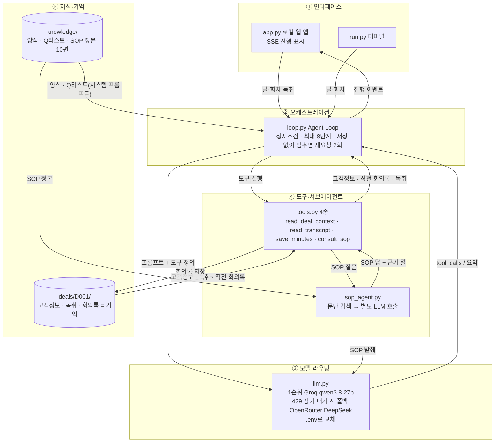
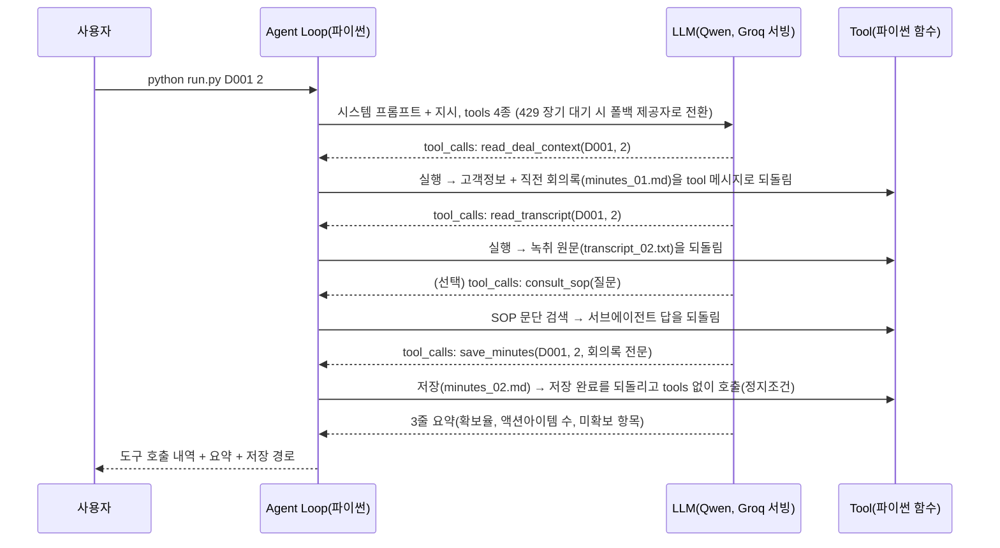

# [Week 3] 영업 회의록 에이전트 — 작업정의서

작성: 이정인
기준일: 2026-09-19
대상 브랜치: week-03/jilee

## 1. 문서 개요

**Week 2 기획서의 1단계(회의 後 처리)를 파이썬으로 구현하고, 딜 1건·회의 3회차로 검증한 결과를 정의한다.**

독자는 결과를 검토하는 경영진과 스터디 구성원, 후속 단계를 이어갈 작성자 본인이다. Week 2에서 정의한 에이전트는 "회의 前에는 아젠다를 작성하고 회의 後에는 녹취를 표준 회의록으로 정리하며, 이번 회의의 할 일이 다음 회의로 이어지는 에이전트"이다. 이 문서의 수치는 기준일 현재 저장된 파일을 기준으로 한다.

```text
jilee/week-03/
├── run.py · app.py              터미널 실행(--no-knowledge 비교 실험 포함) · 로컬 웹 앱
├── .env.example                 제공자 설정 예시(주소·인증값·모델명)
├── agent/                       llm.py(API 호출) · tools.py(Tool 4종) · loop.py(Agent Loop) · sop_agent.py(SOP 서브에이전트)
├── knowledge/                   표준질문리스트.md(Q01~Q11) · 회의록_표준양식.md(8절) · sop/(사내 영업 SOP 정본 10편)
├── deals/D001/                  customer.md · transcript_01~03.txt · minutes_01~03.md
├── experiments/                 clean_transcripts/(STT 오류 삽입 전 원문) · no_knowledge/(비교 실험 결과)
├── static/index.html · tests/  웹 앱 화면 · 가짜 LLM 자동 테스트 6건
└── 작업정의서.md                본 문서
```

## 2. 과제 요구사항과 대응

**과제의 4요소(정하기·만들기·적용하기·공유하기)를 회의록 에이전트 하나로 모두 충족한다.**

| 요소 | 과제 요구 | 이번 작업의 대응 |
| --- | --- | --- |
| 정하기 | 누구의 어떤 문제 | 영업 담당자가 회의 후 녹취를 정리하지 못해 할 일이 누락되고, 지난 회의의 약속이 다음 회의에서 유실되는 문제 |
| 만들기 | 파이썬+LLM으로 핵심 기능 하나 | 녹취 → 표준 양식 회의록 + 액션아이템 생성·저장. 표준 라이브러리만으로 구현 |
| 적용하기 | Tool Calling·RAG·컨텍스트 중 선택 | Tool Calling 4종 + 컨텍스트 구성(양식·질문 리스트·직전 회의록) + SOP 조회 서브에이전트. RAG 제외 |
| 공유하기 | 무엇을·어떻게·어디서 막혔나 | §5, §9, §9-보, §10 |

## 3. 작업 범위

**회의 後 처리만 구현하고, 기억은 직전 회의록 1건 승계로 한정한다.**

| 구분 | 내용 |
| --- | --- |
| 포함 | 딜 코드·회차 입력 → 고객정보·직전 회의록 읽기 → 녹취 읽기 → (필요 시 SOP 조회) → 8절 회의록·액션아이템 저장. 터미널·웹 앱·자동 테스트 |
| 제외 | 회의 前 아젠다 빌더(2단계), 지식베이스 RAG·회차 전체 누적(3단계), 산업지식 수집(4단계), 음성 인식 자체 |
| 샘플 | 딜 D001 한빛정밀(자동차 부품 다이캐스팅, Inbound). 당사 김도현(영업)·박성민(기술컨설팅). 고객 정수연 품질팀장·이재훈 생산팀 과장·최민호 공장장 |

회의 3회차는 1차(09-03) 문제 청취, 2차(09-24) 공장장 참석·예산·일정, 3차(10-02) 야간 현장 테스트 후 회의로 구성하여, 액션아이템 승계와 확보율 상승이 회차를 넘어 일어나도록 하였다. 녹취에는 STT(음성인식) 오류를 회의당 8건 넣었다. 오인식("다이 케스팅", "하우정류", "클래임", "크렉", "푸미", "박선민"), 한글 숫자("사천만 원", "구십칠 퍼센트", "일억 이천"), 띄어쓰기 오류, 추임새("어", "음", "네네")이며 원문은 experiments/clean_transcripts/에 있다. 입력 규약은 딜 폴더 하나에 customer.md와 transcript_NN.txt를 두는 것이며, 회의록 minutes_NN.md도 같은 폴더에 저장되어 다음 회차의 입력이 된다.

## 4. 주요 의사결정

**범위·모델·구현 방식·컨텍스트 출처·도구·루프의 6가지를 정하였다.**

| 번호 | 결정 | 근거 |
| --- | --- | --- |
| 1 | Week 2 로드맵 1단계만 구현 | 회의 後는 입력·출력이 분명하고, 저장된 회의록이 다음 회의 입력이 되어 Memory 루프의 뼈대가 됨 |
| 2 | 1순위 모델 Qwen qwen3.8-27b(Groq 무료 서빙), 2순위 폴백 DeepSeek V4 Flash 무료(OpenRouter) | Tool Calling 지원·한국어·무료·교체 가능성. OpenAI 호환 API라 .env 값만 바꾸면 교체 |
| 3 | 프레임워크 없이 표준 라이브러리(urllib·json)만 사용 | "파이썬으로 직접 만들자"는 취지. 외부 패키지 설치 없음 |
| 4 | 컨텍스트 출처 = 사내 영업 SOP 정본 10편을 knowledge/sop/에 그대로 복제 | 확정판정·프로세스지도·액티비티지도·태스크지도·서브태스크 2편·실행가이드 PG04·흐름동학·작성방법론·RACI지도. 표준 질문 Q01~Q11은 자격검증 태스크의 최소 완료 조건에서, 8절 양식은 미팅 결과 기록 절차에서 옮김. 양식·질문 리스트 2편과 SOP 정본을 합쳐 지식베이스라 부름 |
| 5 | Tool 4종: read_deal_context(고객정보+직전 회의록), read_transcript(녹취), save_minutes(저장), consult_sop(SOP 조회) | 모델은 판단만, 파일 읽기·쓰기·검색은 파이썬 함수 |
| 6 | Agent Loop 최대 8단계, 저장 성공 시 도구 없이 요약만 받고 종료 | 정상 경로 4단계. 반복 저장 방지 |

| LLM(대규모 언어 모델) 제공자 | 무료 조건 | 한도 | 판정 |
| --- | --- | --- | --- |
| Groq | qwen3.8-27b, gpt-oss 등. 카드 불필요 | 30회/분, 1,000회/일, 8K 토큰/분, 200K 토큰/일 | 선정 |
| OpenRouter | qwen3.8-27b:free, deepseek-v4-flash:free 등 22종 | 하루 50회(크레딧 10달러 시 1,000회). qwen 무료판은 공용 풀이라 429가 잦음 | 폴백(DeepSeek) |
| 기타 | Alibaba Model Studio(90일 한정), Cerebras(무료 종료), 로컬 Ollama | 기간 한정 · 종료 · 이 PC GPU VRAM 4GB로 27B급 불가 | 제외 |

## 4-보. 결정이 필요한 사항

**모델·서빙 구분은 정리되었고 라우팅은 1차 구현을 마쳤으며, 서빙 위치·토큰 제어·마스킹 3건은 후속 결정이 필요하다.**

**1) 모델과 서빙 회사의 구분.** "Groq와 Qwen을 둘 다 썼는가"에 대한 답은 "모델 하나를 서빙 회사 하나에서 썼다"이다. Qwen은 알리바바가 공개한 오픈웨이트 모델(가중치가 공개되어 누구나 돌릴 수 있는 모델)로 회의록을 판단하는 두뇌이고, Groq는 그 모델을 자사 칩에서 돌려 API(프로그램이 요청을 보내고 답을 받는 창구)로 내주는 서빙 회사이다. 같은 Qwen을 OpenRouter에서도 받을 수 있다. 발표 용어는 "Qwen 모델을 Groq에서 서빙받았다"로 통일한다.

**2) 라우팅(요청을 어느 제공자로 보낼지) — 1차 구현 완료, 관찰 중.** .env의 LLM_FALLBACK_* 세 값으로 2순위 제공자를 두고, 1순위(Groq)가 429로 60초 넘게 기다리라 하거나 재시도가 소진되면 같은 실행 안에서 폴백으로 전환하며 그 실행이 끝날 때까지 폴백을 유지한다. 실측에서 Groq 일일 한도(200,000 토큰/일) 도달 시 OpenRouter의 DeepSeek V4 Flash 무료판으로 자동 전환되었고, 화면에 "라우팅" 행으로 전환 사유가 표시되었다. 폴백 모델을 같은 Qwen이 아닌 DeepSeek로 둔 이유는 OpenRouter의 qwen3.8-27b 무료판이 공용 풀이라 429가 잦기 때문이다. DeepSeek는 추론형 모델이라 응답의 reasoning_details를 다음 호출에 되돌려줘야 도구 흐름이 이어진다(§10). 남은 선택지는 작업별 모델 분리(녹취 정리는 작은 모델, 요약·판정은 큰 모델)이며 실측 근거가 생기면 Week 5(Architecture & Reliability)에서 검토한다.

**3) 서빙 위치(어디서 돌릴 것인가).** 현재는 개인 PC 로컬 앱이며 녹취가 외부 무료 API로 나간다. 실제 녹취에는 고객사 기밀·개인정보가 섞이므로 외부 무료 API에 보낼 수 없다(사내 모델선정 방법론의 데이터·규제 게이트 원칙).

| 선택지 | 앱 위치 | 모델 위치 | 데이터 | 비고 |
| --- | --- | --- | --- | --- |
| ① 현재 | 개인 PC | Groq 무료 API | 가짜 데이터 전용 | 이 PC(GPU VRAM 4GB)로는 27B급 직접 실행 불가 |
| ② 데모 | 스터디 제공 가비아 클라우드 VM | 외부 API | 가짜 데이터 전용 | 참석자 접속 시연 |
| ③ 실사용 | 사내 서버 | 사내 서버에 오픈웨이트 모델(Qwen 등) 직접 서빙 | 실데이터 가능 | GPU 서버 필요 |

권고는 Week 8 데모까지 ①→②, 실데이터 투입은 ③이 갖춰진 뒤에만이다.

**4) 토큰 제어.** 토큰은 모델이 글을 세는 단위이며 무료 한도의 기준이다. 한 것은 출력 상한 8,192 토큰(3차 회의록 분량 기준), 분당 한도(429) 대기 후 재시도와 폴백 전환, 기억을 직전 회의록 1건으로 제한해 회차가 쌓여도 입력이 커지지 않게 한 것, 녹취 길이 1,000~1,300자 제한, SOP 발췌 상한 2,500자이다. 안 한 것은 실행당 토큰 사용량 집계와 화면 표시, 긴 녹취 분할, 회차 누적 시 압축이다. 하루 실험 규모(회의록 생성 약 10회, 비교 실험, 서브에이전트 시험)로 Groq 일일 한도 200,000 토큰이 소진되므로, 권고는 사용량 표시부터이다.

**5) 개인정보·기밀 마스킹.** 현재 없다. 가짜 데이터라 문제가 없으나 실제 녹취의 고객사명·이름·금액·연락처는 외부 API로 보낼 수 없다. 선택지는 ① 보내기 전 고유명사를 자리표시자([고객1] 등)로 치환하고 결과에서 복원하는 마스킹 층, ② 사내 서버 모델(서빙 선택지 ③과 묶임)이다. 권고는 실데이터 투입 전 ①을 최소 요건으로 두고 장기적으로 ②로 가는 것이다.

## 5. 에이전트 아키텍처

**인터페이스·오케스트레이션·모델/라우팅·도구/서브에이전트·지식/기억의 5계층이며, 회의록 파일이 다음 회차의 기억이 되는 직선 구조이다.**



시스템 프롬프트(모델에 처음 주는 역할·규칙 지시문)는 loop.py가 조립하며 구성은 §6-보에 정리하였다. 루프에는 저장 없이 모델이 멈추면 두 번까지 "작업 순서대로 도구를 호출해 저장하라"고 재요청하는 보호 장치가 있다. `--no-knowledge`를 붙이면 양식·질문 리스트 없이 3줄 프롬프트만 주고 결과를 experiments/no_knowledge/에 저장한다.

SOP 서브에이전트는 주 에이전트가 "SOP상 처리 방법이 애매할 때 한 번" 부르는 consult_sop 도구의 본체이다. 파이썬이 SOP 정본 826개 문단에서 질문 단어와 겹치는 문단을 고르고(드문 단어에 가중, 발췌 상한 2,500자), 별도 LLM 호출이 그 발췌만 근거로 5줄 이내 답과 근거 절 번호를 낸다. 근거가 없으면 "해당 규정 없음"으로 답한다. 회사 규칙을 매번 프롬프트에 붙여 넣는 대신 한 도구로만 참조하게 하여, 실행마다 같은 정책 맥락이 유지되게 한 것이다. 실측 2건은 아래와 같다.

| 질문 | 답 |
| --- | --- |
| 예산 확인 시 무엇을 기록해야 하나 | 확보 여부(확보·미확보·확인 불가), 출처, 확인 경로. 근거는 BANT 사전 점검·미팅 리포트 작성 절 |
| 담당·기한 없는 일은 미합의로 두나 | "해당 규정 없음"(SOP에 명문 규정이 없음이 사실) |



Tool Calling(모델이 JSON으로 "이 함수를 이 인자로 실행해 달라"고 내고 실행은 프로그램이 맡는 방식)과 Agent Loop(도구 호출 → 실행 → 결과 되돌림의 반복)가 위 그림의 전부이다. 도구 실행이 실패하면 오류 문자열을 모델에 되돌려 스스로 고치게 하고, 8단계를 넘으면 중단한다. app.py는 같은 run_agent를 화면에서 호출하고, 단계마다 진행 상황을 화면에 바로 보낸다.

## 6. 적용한 개발 방법·기법

**스터디에서 다룬 기법 중 회의록 생성에 필요한 것만 골라 적용하였고, RAG는 의도적으로 뺐다.**

| 기법 | 이번 작업에서의 적용 |
| --- | --- |
| Tool Calling | 모델이 JSON으로 함수 실행을 요청하고 파이썬이 실행(조회·녹취·저장·SOP 조회 4종) |
| Agent Loop(ReAct 패턴) | 도구 결과를 다시 모델에 넣는 반복. 최대 8단계 |
| 컨텍스트 구성 | 시스템 프롬프트 = 양식·질문 리스트(고정), 딜 자료 = 도구로 가져옴(가변) |
| 외부 기억 | 파일이 기억. 직전 회의록 1건만 승계해 입력 크기 고정 |
| 폴백 라우팅 | 1순위 제공자가 429로 장기 대기를 요구하면 같은 실행 안에서 .env의 2순위 제공자로 전환. 추론형 모델의 reasoning_details를 다음 호출에 되돌려 도구 흐름 유지 |
| 루프 보호 | 저장 없이 멈추면 두 번까지 재요청. 최대 8단계 |
| 서브에이전트 분리 | SOP 참조를 consult_sop 도구 뒤의 별도 LLM 호출로 분리. 주 에이전트의 프롬프트는 그대로 두고 정책 맥락만 도구로 공급 |
| Loop Engineering 6요소 | 트리거(녹취 입력) · 액션(도구 4종) · 정지조건(저장 성공) · 검증자(단위테스트·품질 조건) · 상태(trace) · 관찰롤백(회의록 파일 재생성) |
| 제공자 추상화 | OpenAI 호환 호출. .env 값만으로 Groq↔OpenRouter 교체 |
| 프레임워크 미사용 | 표준 라이브러리만 사용해 루프를 눈으로 따라갈 수 있게 함 |
| 비교 실험 | 지식베이스 유무 대조(§9-보) |
| 스트레스 테스트 | STT 오류·긴 문장·자기정정·끼어들기가 섞인 3차 녹취(§9-보) |
| 가짜 LLM 단위테스트 | API 없이 루프·정지조건·오류 처리·SOP 검색 검증 |
| 진행 스트리밍(SSE) | 단계마다 화면에 전송해 실행 중 상태를 보여줌 |
| RAG 미사용 | 양식·질문 리스트는 짧아 프롬프트에 직접 넣고, SOP 정본은 검색 없이 단어 겹침으로 발췌. 임베딩 검색은 3단계에서 도입 |

기법마다 코드 위치가 하나씩 대응되므로(Tool Calling은 tools.py, 루프는 loop.py, 컨텍스트 조립은 build_system_prompt, 서브에이전트는 sop_agent.py) 발표에서 동작을 코드로 짚을 수 있다. 기법을 더 넣지 않은 것은 Week 2의 "가장 단순한 직선 구조부터"라는 원칙에 따른 것이다.

### 6-보. 프롬프트와 대화 구조

| 구성 요소 | 이번 구현에서의 내용 | 위치 |
| --- | --- | --- |
| System Role(역할) | "영업 조직의 회의록 담당자" + 작업 순서 4단계 | loop.py 시스템 프롬프트 |
| Policy(정책·규칙) | 긍정형 규칙 5개(녹취·고객정보에 있는 내용만, 고객 표현 그대로, 확인 불가 표기, 담당·기한 모두 있는 일만 액션아이템, 한국어) + STT 교정 지시 + 회의록 양식 작성 규칙 5개 + SOP는 consult_sop 도구로 참조 | 시스템 프롬프트 · knowledge/회의록_표준양식.md · knowledge/sop/ |
| Knowledge(지식) | 회의록 양식 8절, 표준 질문 Q01~Q11 | 시스템 프롬프트에 포함(고정) |
| Tool Definition(도구 정의) | 4종의 이름·설명·입력 JSON 스키마 | tools.py TOOL_SCHEMAS, 매 호출에 함께 전송 |
| User Query(사용자 요청) | "딜 D001의 N차 회의 녹취를 회의록으로 정리해 저장해줘" 한 문장 | loop.py |
| Conversation History(대화 이력) | 한 실행 안에서는 assistant의 도구 호출과 tool 결과가 메시지 목록에 누적되어 매 호출에 전부 다시 전송됨(왕복마다 토큰이 늘어남). 실행이 끝나면 이력은 버리고 회의록 파일만 다음 실행의 기억으로 남음 | loop.py messages · deals/*.md |
| Output Contract(출력 약속) | 저장 후 3줄 요약(확보율·액션아이템 수·미확보) | 시스템 프롬프트 |

지시는 "무엇을 하라"의 긍정형으로 통일하였다. 부정형("~하지 마라")은 모델이 놓치기 쉽다는 것이 알려져 있어, 규칙 5개와 양식 규칙을 모두 긍정형으로 적었다(예: "녹취에 없는 내용은 만들지 않는다" 대신 "녹취와 고객정보에 있는 내용만으로 쓴다"). 대화 이력이 매 호출에 다시 전송되는 구조는 토큰 사용량이 왕복 수에 비례해 늘어나는 원인이며, §4-보 4)의 사용량 표시 권고와 이어진다. SOP 정본 10편(약 47만 바이트)은 이 구조에 넣지 않고 도구 뒤에 두었기 때문에 주 에이전트의 입력 크기는 회차와 무관하게 일정하다.

## 7. 완료 조건

**8개 항목 모두 완료이며, 3차 회의록의 기한 없는 액션아이템 2건은 결함으로 기록한다.**

| 항목 | 판정 기준 | 확인 방법 | 현재 상태 |
| --- | --- | --- | --- |
| 1차 회의록 생성 | 8단계 이내 저장, 8절 완비 | 터미널 실행(§9) | 완료. 4단계, 2,160자 |
| 승계·확보율 상승(KPI①) | 직전 액션아이템이 2절에 옮겨져 판정되고, 8절 확보 항목이 회차마다 늘어남 | 2·3차 실행 후 2절·8절 확인 | 완료. 아래 실측 표 |
| 액션아이템 도출 | 7절 모든 행에 담당·기한 | 7절 확인 | 1차 3건, 2차 4건, 3차 5건. 3차에 기한 "확인 불가" 2건(§8) |
| STT 오류 교정 | 고유명사 교정·원문 병기, 한글 숫자 정규화 | clean_transcripts/ 대조 | 완료. "박선민"→"박성민 (녹취에 '박선민'으로 표기)", "구십칠 퍼센트"→97%, "일억 이천"→1억 2천만 원 |
| SOP 조회 | 질문에 SOP 근거 절과 함께 답하고, 근거 없으면 "해당 규정 없음" | consult_sop 단독 호출 2건 | 완료(§5 표). 주 에이전트의 자발 호출은 미발생(§11) |
| 지식베이스 효과 | 지식베이스 없는 결과와 형식·승계·규칙에서 차이 | 비교 실험 후 대조 | 완료. §9-보 |
| 제공자 교체·폴백 | .env 값만으로 교체하고, 1순위 한도 초과 시 2순위로 자동 전환 | 화면의 "라우팅" 행 | 완료. Groq 일일 한도 도달 시 OpenRouter DeepSeek로 전환되어 회의록 저장까지 완료 |
| 로컬 앱·자동 테스트 | 화면에서 실행·표시, unittest 6건 통과 | 웹 앱 실행, 단위테스트 | 완료 |

실측 요약은 아래와 같다. 확보율은 확보 항목 수 ÷ 11이며, 고객정보와 회의록에 실제로 적힌 내용만 확보로 본다.

| 회차 | 녹취 | 회의록 | 승계 | 확보율 | 액션아이템 |
| --- | --- | --- | --- | --- | --- |
| 1차(09-03) | 1,076자 | 2,160자 | 없음(첫 회의) | 64%(Q01·Q02·Q03·Q04·Q06·Q07·Q08) | 3건 |
| 2차(09-24) | 1,244자 | 2,856자 | 3건 전량 완료 | 91%(Q03만 미확보) | 4건 |
| 3차(10-02) | 1,332자 | 3,203자 | 4건(완료 2·진행 중 2) | 91%(신규 Q06, Q03만 미확보) | 5건 |

단서는 판정의 비결정성이다. 같은 녹취를 여러 번 돌리면 1차 확보율이 27%에서 64%, 3차가 73%에서 100% 사이로 달라졌고, 한 실행에서는 1차 녹취에 없는 "공장장(최민호)"이 6절에 들어간 적도 있다(§11 판정 코드화). 2·3차의 Q03 미확보는 녹취에 우선순위 발언이 없으므로 규칙에 맞는 판정이다.

## 8. 품질 조건

**회의록 표준 양식의 작성 규칙 5개에 STT 오류 교정 1개를 더한 6항목으로 판정하며, 3차에서 위반 1건이 났다.**

| 항목 | 판정 기준 | 실측 |
| --- | --- | --- |
| 8절 완비 | 8개 절이 모두 있다 | 1·2·3차 충족 |
| 녹취 외 내용 없음 | 녹취·고객정보에 있는 내용만, 미확인은 "확인 불가" | 저장본 충족. 실행에 따라 위반 1회 관찰(§7) |
| 고객 표현 보존 | 4절 인용문은 고객의 말 그대로 | 충족. "시월 중순", "다이 케스팅"은 인용문 안에 원문 유지 |
| 담당·기한 모두 있는 일만 액션아이템 | 7절에 빈 담당·기한 없음 | 1·2차 충족. 3차 위반: "미확인 크렉 샘플 판정", "검사 속도 문서" 2건을 기한 "확인 불가"로 7절에 올림 |
| 미합의는 다음 행동 연결 | 6절 각 항목이 "→ 다음 행동"으로 끝남 | 충족. 1차의 예산·결정권자 미합의가 2차 5절·8절로 이동 |
| STT 오류 교정 | 고유명사는 고객정보로 교정·원문 병기, 숫자 정규화, 인용문은 보존 우선 | 충족. 표 밖 서술은 교정, 인용문은 보존, "푸미"는 "푸미(품의)" 병기 |

판정은 현재 사람이 회의록과 녹취를 대조하는 방식이다. 3차 위반은 모델이 규칙을 프롬프트로 받고, consult_sop로 물을 수도 있었는데 묻지 않은 채 어긴 사례이므로, 저장 전에 규칙을 코드로 검사하는 과제(§11)로 연결한다.

## 9. 검증 절차

**준비는 Python 3.12와 .env뿐이며, 터미널·웹 앱·자동 테스트 세 경로로 검증한다.**

| 경로 | 명령 | 확인 내용 |
| --- | --- | --- |
| 준비 | .env.example → .env 복사, LLM_BASE_URL·LLM_API_KEY·LLM_MODEL 세 값 입력(폴백은 LLM_FALLBACK_* 세 값, 선택) | Groq·OpenRouter 계정 모두 카드 없이 발급. 외부 패키지 설치 없음 |
| 터미널 | `python run.py D001 1` → `D001 2` → `D001 3` | 도구 호출 내역, 3줄 요약, deals/D001/minutes_NN.md 생성. 2차부터 승계 |
| 비교 실험 | `python run.py D001 1 --no-knowledge` → `D001 2 --no-knowledge` | experiments/no_knowledge/D001/에 저장. 정식 회의록은 그대로 |
| 웹 앱 | `python app.py` → http://localhost:8765 | 아래 3단계 |
| 자동 테스트 | `python -m unittest` | 가짜 LLM으로 6건: 정상 경로 3도구·4호출 종료, 직전 회의록 승계, 도구 오류 되돌림, 8단계 중단, SOP 검색이 예산·BANT 절을 찾음, 무관한 질문은 빈 결과. 인증값 없이 실행 가능 |

웹 앱의 확인 절차는 딜·회차 선택, 녹취 입력(저장된 녹취 불러오기 또는 직접 붙여넣기·수정), 실행의 3단계이며, 결과는 무료 요금제 기준 30초~2분 내에 도구 호출 과정·요약·회의록 순으로 표시된다. 저장된 회의록은 실행 없이 다시 열 수 있고, 새 회차는 회차 목록의 "(새 회차)" 항목으로 추가된다. 입력한 녹취는 deals/<딜>/transcript_<회차>.txt에 저장된 뒤 에이전트가 읽으므로 터미널 실행과 결과가 같다.

같은 회차를 다시 실행하면 회의록이 덮어써지고 문구는 실행마다 달라진다. 검증 항목은 다섯 가지이다. 8절 완비, 녹취 외 내용 없음, 2절 승계, 8절 확보율 상승, STT 오류 교정과 원문 병기.

## 9-보. 지식베이스 유무 비교

**지식베이스는 형식 일관성·승계·규칙 준수를 좌우하며, 확보율 같은 지표는 지식베이스 없이는 성립하지 않는다.** 같은 녹취 2건을 지식베이스(양식·질문 리스트) 없이 3줄 프롬프트로 돌렸으며, 도구·모델·온도는 정식 실행과 같다.

| 항목 | 지식베이스 있음 | 지식베이스 없음 |
| --- | --- | --- |
| 회의록 분량 | 1차 2,160자, 2차 2,856자 | 1차 1,032자, 2차 1,238자(절반 이하) |
| 절 구성 | 8절 고정 | 기본 정보·주요 논의·합의사항/액션 아이템·다음 회의. 실행마다 달라짐 |
| 지난 액션아이템 승계 | 3건 승계·판정 | 0건, 해당 절 없음 |
| 미합의 사항 | 별도 절, 다음 행동 연결 | 절 없음 |
| 담당·기한 없는 항목 | 미합의로 내림 | "경쟁사 1곳 추가 견적 요청 / 최민호 / 미정"을 액션아이템으로 올림 |
| STT 오류 | "박선민" 교정·원문 병기 | "품의(푸미)"로 적었으나 오인식 설명 없음. "사천만 원 넘게"를 "약 4,400만 원"으로 잘못 옮김 |
| Q코드 추적 | 8절에 확보·미확보 | 없음, 확보율 산출 불가 |
| 고객 표현 | 4절 인용문 그대로 | 요약문으로 바꿔 씀 |

지식베이스 없는 결과도 요약은 정확하고 "다이 케스팅"→다이캐스팅, "일억 이천"→1.2억 원 같은 일반 교정은 되었다. 차이는 모델의 언어 능력이 아니라 "무엇을 어디에 어떤 규칙으로 적을지"에서 났다. 비교는 회의당 1회 실행이므로 근거는 문구가 아니라 절의 유무와 규칙 준수 여부에 둔다.

### 스트레스 테스트(3차 회의)

transcript_03.txt(2026-10-02 야간 현장 테스트 후 회의, 1,332자)는 일부러 어렵게 만든 녹취이다. 다섯 줄짜리 한 문장, 자기정정("어 아니 그게 아니고"), 끼어들기("--"), 담당이 헷갈리는 대화("제가 보낸 거 맞죠" / "내가 보낸 거 맞아"), 일정 재조정(견적서 8일→6일, 품의 10일→13일 검토)을 넣었다.

| 항목 | 결과 |
| --- | --- |
| 승계 | 2차 액션아이템 4건 모두 2절에 옮김. 완료 2(현장 테스트, 감사 자료 요건), 진행 중 2(견적서·보고서 일정 조정, 품의 13일 검토) |
| 담당 혼선 | 감사 자료 요건은 정수연 발송으로 바르게 정리 |
| 액션아이템·미합의 | 액션아이템 5건, 미합의 2건. 일정 재조정(견적서 6일, 요약본 6일, 정식 보고서 8일) 반영 |
| 확보율 | 91%(신규 Q06, Q03 미확보) |
| 결함 | 기한 없는 2건(크렉 샘플 판정, 검사 속도 문서)을 "확인 불가"로 7절에 올림(규칙 위반, §8) |

### 강건성 평가 축과 다음 실험

현재 실측은 1,000~1,300자짜리 녹취 3건뿐이며, 실제 회의는 더 길고 더 지저분하다. 어떤 조건에서 회의록이 무너지는지 미리 축을 정해 두어야 실험이 산발적으로 흩어지지 않는다.

| 축 | 현재 상태 | 위험 | 실험 방법 | 대응안 |
| --- | --- | --- | --- | --- |
| 대화 분량 | 1,000~1,300자 3건만 실측 | 긴 녹취는 분당 8K 토큰 한도와 출력 상한에 걸림 | 30분·60분·120분 분량(약 5천·1만·2만 자) 투입 | 시간 구간별 분할 → 구간 요약 → 병합(map-reduce). 구간 경계에서 화자·주제 이어주기 |
| 대화 추출률 | 측정 안 함 | 결정·약속이 빠져도 알 수 없음 | 녹취에 정답 항목(결정 N개·액션 N개·수치 N개)을 심고 회의록에 몇 개가 살아남는지 비율 계산 | 추출률을 KPI에 추가, 누락 유형별 프롬프트 보강 |
| 발화자 구분 | "이름:" 표기가 있음 | STT가 화자 구분을 못 주면 담당 배정이 틀림 | 화자 표기를 지운 녹취, 화자를 잘못 붙인 녹취로 실행 | 참석자 목록·직위·말투로 화자 추정. 확신 없으면 "화자 불명"으로 표기하고 액션아이템 담당은 비움 |
| 공정 정보 부재 | 다이캐스팅·이형제·택트 같은 용어는 모델 상식에 의존 | 낯선 공정·약어가 나오면 오해석 | 가상의 사내 약어·특수 공정어를 섞은 녹취로 실행 | 고객사·산업별 용어집을 knowledge/에 두고 도구로 조회(RAG 1단계) |
| 숫자 정보 | 한글 숫자("일억 이천")는 정규화됨 | 단위 혼동(억/천만), 상대 날짜("다음 주")가 절대 날짜로 안 바뀜 | 금액·날짜·수량이 20건 이상 나오는 녹취로 정답 대조 | 회의 일자를 기준으로 상대 날짜를 절대 날짜로 바꾸는 후처리. 금액은 원 단위 병기 |
| 한국어가 아닌 요소 | 미검증 | 영어 약어(PPAP·MES·OEE)·외래어 표기 흔들림, 영어 문장 섞임 | 영어 용어·문장이 섞인 녹취로 실행 | 용어집에 표기 기준(원어·한글) 등록, 회의록은 기준 표기로 통일 |
| 짧은 미팅 vs 긴 미팅의 맥락 유지 | 직전 회의록 1건만 승계 | 긴 딜(회의 10회 이상)에서 초반 합의가 사라짐. 긴 회의 안에서 앞 결정이 뒤에서 뒤집힌 것을 놓침 | 회의 10회짜리 딜로 1차 결정이 10차 회의록에 남는지 확인. 한 회의 안에 결정 번복이 있는 녹취 실행 | 딜 단위 누적 요약(결정·미결·확보 Q코드만 담은 상태 파일)을 회의록과 별도로 유지. 긴 회의는 구간 요약 후 "번복" 여부를 별도 점검 |

이 축들은 Week 4(Context & Memory)와 Week 8(Evaluation)의 실험 항목이다. 추출률과 확보율을 함께 재야 "잘 정리했는가"와 "빠뜨리지 않았는가"를 나눠 볼 수 있다.

## 10. 구현 중 막힌 것과 해결

**막힌 것 9건은 모두 해결되었고, 대부분 모델이 아니라 호출 방식과 제공자 한도의 문제였다.**

| 막힌 것 | 원인 | 해결 |
| --- | --- | --- |
| Groq 호출이 HTTP 403(Cloudflare 1010)으로 막힘 | 파이썬 urllib 기본 User-Agent 차단 | User-Agent 헤더 지정 |
| save_minutes 6회 반복 호출, 회의록 1,007자에서 잘림 | 출력 상한 미지정, 저장 후에도 도구 목록 유지 | 출력 상한 지정, 저장 성공 시 도구 없이 요약만 받고 종료 |
| 분당 8K 토큰 한도로 HTTP 429 | 시스템 프롬프트+고객정보+직전 회의록+녹취가 한 대화에 쌓임 | 녹취 1,000~1,300자로 제한, Retry-After만큼 대기 후 재시도 |
| Git Bash에서 curl로 보내면 모델이 중국어로 답함 | 셸 인코딩이 깨져 전달됨 | 파이썬에서 UTF-8로 직렬화. 테스트는 run.py로 |
| 1차를 다시 만들 때 2차 회의록을 "직전"으로 읽음 | 가장 최근 파일을 직전으로 잡음 | read_deal_context에 meeting_no를 주어 앞선 회차만 읽음 |
| 3차 회의록이 7절에서 잘려 8절 없이 저장됨 | 인용이 많아 회의록이 출력 상한 4,096 토큰을 넘음 | 상한을 8,192로 상향 |
| 최종 요약 호출이 429로 거절되고 작업이 멈춤 | Groq 일일 한도 200,000 토큰 소진(46분 대기 요구) | 폴백 라우팅 구현. 60초 넘는 대기 요구 시 2순위 제공자로 전환 |
| 폴백을 OpenRouter qwen3.8-27b 무료판으로 두면 다시 429 | 무료 공용 풀이라 잠깐씩 막히는 일이 잦음 | 폴백 모델을 DeepSeek V4 Flash 무료판으로 변경 |
| DeepSeek로 전환 뒤 조회 도구만 반복하고 저장을 안 함 | 추론형 모델은 응답의 reasoning_details를 다음 호출에 되돌려줘야 도구 흐름이 이어짐 | assistant 메시지에 reasoning_details를 포함해 되돌림. 저장 없이 멈추면 재요청 2회 |

## 11. 남은 과제

**로드맵 2~4단계, 판정 코드화, 토큰 한도, Context 확충, 다른 에이전트와의 연결 순으로 남는다.**

| 과제 | 내용 | 시점 |
| --- | --- | --- |
| 2단계 아젠다 빌더 | 표준 질문 리스트 − 직전 회의록 8절 확보 항목 = 이번 회의 확인 사항. 8절이 Q코드로 정리되어 입력은 준비됨 | 다음 |
| 판정 규칙 코드화 | 확보율이 실행마다 27~64%(1차)·73~100%(3차)로 오가고, 기한 없는 항목이 7절에 오르고, 절 누락과 녹취 외 고유명사 유입이 나는 것을 저장 전에 코드로 검사. 4절 중요도 칸 파싱으로 Q03 판정 등 | 다음 |
| SOP 조회의 강제 | 3차 실행에서 주 에이전트는 consult_sop를 호출하지 않았고(선택 지시라 호출 안 함) 규칙 위반이 났다. 저장 전 규칙 검사를 코드로 강제하거나 consult_sop 호출을 필수 단계로 올림 | 다음 |
| Groq 토큰 한도 | 실제 녹취(수천 자)에는 분당 8K 토큰이 부족하고 일일 200K 토큰은 하루 실험으로 소진된다. 녹취 분할, 프롬프트 축소, 폴백 관찰(전환 빈도·DeepSeek 품질 비교). §4-보 2)·4)와 묶음 | Week 5 |
| 3~4단계 | 지식베이스 임베딩 검색(현재 SOP는 단어 겹침 발췌)·회차 전체 누적(현재 3차는 1차를 읽지 않음), 산업지식 수집 파이프라인 | 이후 |
| 기타 | 액션아이템 이행률(KPI③) 자동 집계 | Week 8 |

### Context 확충

| 늘릴 것(현재는 양식·질문 리스트 2편, SOP 정본 10편, 딜 1건) | 내용 |
| --- | --- |
| ① 딜 샘플 | 업종·거래 성격이 다른 딜 3~5건. 회의 3회 이상인 딜을 늘려 직전 1건 승계의 한계 확인 |
| ② 조직 지식 | 솔루션 소개 자료, 산업별 용어집(Week 2 지식 4층의 상시·내부, 상시·외부) |
| ③ STT 오류 사전 | 자주 틀리는 고유명사·숫자 표기 목록. 모델의 추측 부담을 줄이고 검사 기준이 됨 |
| ④ 회의 유형별 양식 | 초도 미팅·제안 발표·계약 협의는 확인 항목과 절 구성이 다름 |

에이전트가 스스로 만들어내는 데이터도 따로 관리해야 한다. 회의록, 액션아이템, Q코드 확보 상태, 참석자·의사결정 조직 갱신 정보가 매 회의 생산되어 다음 회의의 입력이 되는데, 지금은 마크다운 한 파일에 섞여 있어 확보율·이행률 집계에 사람이 표를 다시 읽어야 한다. 저장 시 이 네 가지를 JSON 같은 구조화된 형식으로 함께 남기고 read_deal_context와 KPI 집계가 그 파일을 읽도록 바꾸는 것이 과제이다.

### 다른 에이전트와의 연결

| 후속 에이전트(Week 2 로드맵) | 이 에이전트에서 받는 산출물 | 만드는 것 |
| --- | --- | --- |
| 회의 前 아젠다 빌더 | 미확보 Q코드, 미합의 사항, 직전 액션아이템 | 이번 회의 확인 사항과 안건 |
| 견적·제안 작성 에이전트 | 4절 요구사항, 예산·일정(Q09~Q11), 참석자·결정권자 | 제안서·견적서 초안 |

knowledge/의 질문 리스트·양식·SOP 정본과 consult_sop 도구도 이들과 공유한다. 후속 에이전트가 마크다운을 다시 읽어 해석하지 않으려면 위 Context 확충의 산출물 구조화(JSON)가 선행 과제이다.
