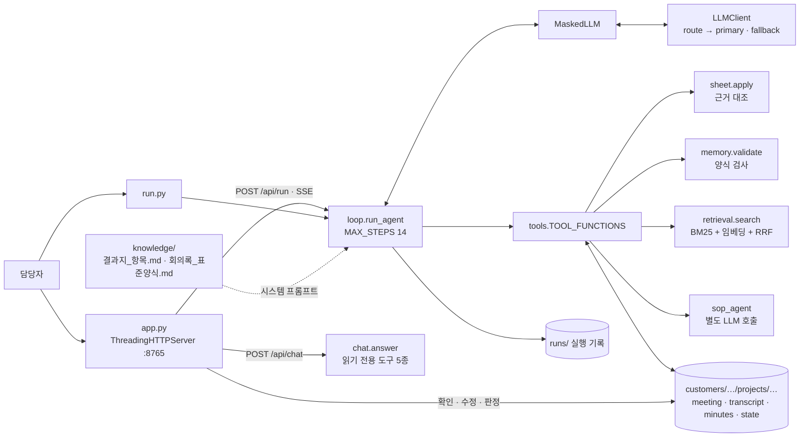

# [Week 5] 영업 회의 에이전트 — 기술정의서

작성: 이정인(jilee) / 기준일: 2026-10-10 / 대상 폴더: `jilee/week-05`(커밋 전)

같은 폴더의 [작업정의서](./작업정의서.md)(범위 · 완료 조건)와 짝을 이루는 기술 문서다. 어떻게 설계했고 코드가 실제로 어떻게 도는지를 적는다. 왜 그렇게 정했는지는 [의사결정기록](./의사결정기록.md)에 있어 여기서는 번호로만 가리킨다. 수치는 기준일의 소스(`agent/` · `app.py`)와 `runs/KR0001/P001/`의 실행 기록 10건, 테스트 실행 결과에서 직접 읽었다.

## 1. 개요

### 1.1 문제 정의

Week 4의 에이전트는 회의 녹취를 표준 회의록으로 바꾸고 표준 질문 11개의 확보 여부를 셌다. Sales AX 프로젝트 정의서가 풀려는 문제(고객의 진짜 Pain이 드러나지 않는다, 지는 수주에 비용을 쓴다, 고객 문제와 해결안이 연결되지 않는다, 영업 데이터가 AI Ready 상태가 아니다)에 견주면 회의록은 부산물이고, 회의를 거듭할수록 채워지는 고객정보가 산출물이어야 했다(의사결정기록 0 · 1절).

### 1.2 시스템 한 문장 정의

회의 원문을 받아, 화면설계 「리드 결과지 · 고객 니즈 확인」의 항목을 근거 발화와 함께 AI 초안으로 채우고 그 근거 문서인 회의록을 남기는 Tool Calling 기반 단일 에이전트다. 순서는 모델이 정하고, 코드는 결과지 갱신과 회의록 저장 두 지점에서만 검사한다. 무엇이 확정인지는 사람이 정한다.

### 1.3 이 문서의 범위

2장은 Week 4에서 달라진 것, 3장은 설계, 4장은 구현, 5장은 실측, 6장은 지표의 정의, 7장은 코드와 설명이 어긋난 곳과 한계다. ReAct · Tool Calling · 컨텍스트 엔지니어링 같은 배경 개념과 참고문헌은 [Week 4 기술정의서](../week-04/기술정의서.md) 2장 · 8장에 있고 여기서 되풀이하지 않는다.

## 2. Week 4에서 달라진 것

| 구분 | Week 4 | Week 5 | 코드 |
| --- | --- | --- | --- |
| 산출물 | 회의록(8절) | 결과지 + 회의록(7절) | `agent/sheet.py` |
| 확보 여부 | 회의록 8절의 표준 질문 표 Q01 ~ Q11 | 결과지의 확정 항목 10개. 회의록에서는 표를 없앰 | `sheet.GATE` |
| 저장 단위 | `deals/D001/` | `customers/{고객}/projects/{프로젝트}/` | `agent/store.py` |
| 프롬프트 | 작업 순서 4단계 | 목표 + 끝내기 조건 | `loop.build_system_prompt` |
| 도구 | 4종 | 6종(`update_result_sheet` · `search_project_history` 추가, 조회 도구 이름 변경) | `tools.TOOL_SCHEMAS` |
| 끝내기 | 회의록 저장 성공 | 결과지 갱신 성공 1회 이상 + 회의록 저장 성공 | `loop._loop` · `tools.save_minutes` |
| 최대 단계 · 재요청 | 12단계 · 2회 | 14단계 · 3회 | `loop.MAX_STEPS` · `MAX_NUDGES` |
| 근거 | 없음 | 값마다 발언 번호. 코드가 실제 발언을 저장 | `sheet.Grounder` |
| 확정 | 저장하면 반영 | AI 초안 → 사람 확인 | `sheet.confirm` |
| 라우팅 | 한도 초과 시 실행 단위 전환 | 요청 크기 규칙 추가(요청 단위) | `llm.LLMClient.route` |
| 폴백 모델 | deepseek-v4-flash 무료판 | nemotron-3-super-120b 무료판 | `.env` |
| 화면 | 실행과 회의록 보기 | 홈 · 일정 · 회의 목록 · 회의(원문 ∥ 회의록) · 결과지 · 그래프 · 묻고 답하기 · 서비스 연결 | `static/index.html` |
| 테스트 | Week 4 README 기준 | 139건 | `tests/` |

Week 4에서 넘어온 것: 프로젝트 기억(상태 파일), 저장 전 규칙 검사, 긴 녹취 분할, 마스킹, 이력 검색, 관계 그래프, 실행 기록, SOP 서브에이전트.

## 3. 시스템 설계

### 3.1 전체 구조



진입점은 둘(`app.py`, `run.py`)이고 둘 다 같은 `run_agent`를 부른다. LLM 호출은 `LLMClient` 하나가 맡고, 실행 중에는 `MaskedLLM`이 감싼다. 주 에이전트 · 긴 원문의 구간 정리 · SOP 문의가 모두 같은(마스킹된) 클라이언트를 쓴다(`tools.bind_llm`). 모델은 파일을 직접 열지 못한다.

`agent/`의 모듈은 20개이고 줄 수는 `app.py` 660 · `agent/` 4,602 · `static/index.html` 2,325 · `charts.js` 621 · `graph.js` 412다.

### 3.2 Agent Loop

```text
run_agent(customer_id, project_id, meeting_no, llm, on_step, options):
    tools.check_gate(...)                         # 앞 회차 가운데 원문은 있는데 반영된 상태가 없는 것이 있으면 중단
    opts  ← normalize_options(options)            # scope · length · update_sheet · use_search · use_sop · note
    scope ← 담당자가 정했으면 그 값, 아니면 원문의 참석 줄에서 읽은 값(외부 · 내부)
    pending_NN.json 삭제                           # 같은 회차를 다시 돌리면 결과지 갱신도 처음부터
    llm   ← MaskedLLM(llm, 사전)                  # MASKING=off가 아니면
    messages ← [system: build_system_prompt(opts, scope),
                user:   "고객 {c}의 프로젝트 {p} {n}차 회의({scope} 회의)를 처리해줘." (+ 담당자가 덧붙인 말)]
    schemas ← active_tools(opts)                  # 옵션으로 끈 도구는 모델에게 보이지 않는다
    for step in 1..14:
        msg ← llm.chat(messages, tools=schemas)   # temperature 0.2, max_tokens 8192
        if msg.tool_calls is empty:
            if 저장 전이고 nudges < 3:
                nudges += 1; "아직 일이 끝나지 않았다. 남은 것: …"을 붙이고 continue
            final ← msg.content; break
        messages.append(assistant(content, tool_calls, reasoning_details))
        for call in msg.tool_calls:
            try:    output ← TOOL_FUNCTIONS[name](**args); ok ← True
            except: output ← "오류: " + str(e);            ok ← False   # 거부 사유도 여기로 돌아온다
            if name == "save_minutes" and ok:        saved ← output
            if name == "update_result_sheet" and ok: sheet_updated ← True
            messages.append(tool(call.id, name, output))
        if saved:                                  # 회의록 저장이 끝났으면 도구 없이 보고만 받는다
            final ← llm.chat(messages, tools=None).content; break
    else: final ← "(최대 단계 수에 도달해 중단했습니다)"
    finally: save_run_log(...)                     # 실패해도 실행 기록을 남긴다
```

끝내기 조건 가운데 "결과지 갱신 성공 1회 이상"은 루프가 아니라 `save_minutes`가 강제한다. 이번 회차의 `pending_NN.json`이 없으면 저장을 거부하고 "먼저 update_result_sheet로 결과지를 갱신"하라고 돌려준다(`update_sheet` 옵션을 끈 실행은 예외). 루프는 저장 성공만 보고 닫는다.

거부는 예외로 구현했다. 두 검사 도구는 어긋난 점을 번호 매긴 목록으로 `ValueError`에 담아 던지고, 루프가 이를 "오류: …" 문자열로 모델에게 돌려준다. 도구 실패와 검사 거부가 같은 길을 탄다.

`reasoning_details`는 OpenRouter 규격의 추론형 모델이 돌려주는 추론 기록이다. assistant 메시지에 그대로 되돌려줘야 다음 단계가 이어진다.

### 3.3 도구 6종

| 이름 | 입력 | 출력 | 부작용 | 비고 |
| --- | --- | --- | --- | --- |
| `read_project_context` | 고객 · 프로젝트 · 회차 | 고객 · 프로젝트 · 담당자 + 프로젝트 기억(참석자 · 합의 · 미합의 · 점검할 액션아이템) + 결과지 현황 표 + 등록할 때 적은 안건 · 링크 · 자료 이름 | 없음 | 전화번호 · 메일은 넣지 않는다. 자료의 내용은 읽지 않는다 |
| `read_transcript` | 고객 · 프로젝트 · 회차 | 발언마다 #번호를 붙인 원문. 4,000자 초과면 구간 정리본 | 구간 수만큼 LLM 호출 | §3.7 |
| `update_result_sheet` | summary(필수) · items · goals · requirements · stakeholders · customer_profile · deal_hints · next_questions | "결과지 갱신 완료 — 확정 n/10 · AI 초안 n · 미확보 n" + 아직 미확보인 항목 | `pending_NN.json` 기록, 고객 담당자 등록, 고객 프로필 갱신 | §3.4. 여러 번 불러도 된다 |
| `save_minutes` | 고객 · 프로젝트 · 회차 · markdown | "저장 완료(초안): 경로 (글자 수) · 결과지 변경 제안 n건 …" | `minutes_NN.md` · `draft_NN.json` 기록, `meeting_NN.json`에 변경 목록 | §3.5 |
| `search_project_history` | query · 회차 범위 · 종류(발화 · 회의록) | 찾은 조각과 앞뒤 발화, 질문에 아는 인물이 있으면 관계 정보 | 없음 | §3.8 |
| `consult_sop` | question | 답 + "(참조 절: …)" | LLM 호출 1회 | 발췌 상한 2,500자. Week 4와 같은 서브에이전트 |

`update_result_sheet`의 근거 인자는 "이번 녹취에서 그 내용을 말한 발언의 번호(예: #12)"로 설명한다. 값 목록(항목 코드 · 역할 · 대응 상태 · 거래 조건)은 스키마의 `enum`으로도 준다.

### 3.4 결과지와 근거 대조

결과지는 상태 파일의 `sheet` 키다.

```text
sheet = {
  summary,                                  지금까지 확인된 고객 상황 두세 문장
  items:   { code: {value, status, evidence[≤3], since, updated, previous?, confirmed_by?, history[]} },
  goals:        [ {id G1…, goal, current, target, measure, speaker, status, evidence, history} ],   → S3
  requirements: [ {id R1…, title, background, response, response_status, status, evidence, history} ], → S4
  stakeholders: [ {name, side, dept, title, roles[], status, evidence, history} ],                   → D1 · D2
  next_questions: [ … ≤8 ],
  deal_hints: { 조건: {value, evidence, meeting} }
}
```

| 코드 | 저장 꼴 | 확보로 보는 기준 |
| --- | --- | --- |
| S1 · S2 · B1 ~ B4 · X1 · C1 ~ C9 | `items[code].value` | 값이 있다 |
| S3 비즈니스 목표 | `goals` | 한 건 이상 |
| S4 핵심 요구사항 | `requirements` | 한 건 이상 |
| D1 최종 결재자 | `stakeholders`의 역할 | "의사결정자"가 붙은 사람이 있다 |
| D2 계약 담당자 | `stakeholders`의 역할 | "법무·계약" 또는 "구매"가 붙은 사람이 있다 |

X1은 쌓되 확정 항목 10개에 넣지 않는다. C1 ~ C9는 거래 조건에 따라 해당하는 프로젝트에만 나온다(`sheet.required_extras`).

**근거 대조(`sheet.Grounder.find`)**

1. 근거가 비어 있으면 거부.
2. `#숫자`로 시작하면 그 번호의 발언을 찾는다. 번호가 이번 원문에 없으면 거부하고 범위(#1 ~ #n)를 알려 준다.
3. 번호가 아니면 인용문으로 보고, 인용의 2글자 조각 가운데 한 발언에 든 비율이 0.6(`GROUND_MIN`) 이상인 발언을 찾는다. 없으면 거부하고 가까운 발언 두 개(0.25 이상)를 알려 준다.
4. 받은 근거는 `{meeting, pos, speaker, text[:240]}`로 저장한다. 모델이 적은 글이 아니라 원문의 발언이다.

번호의 뜻은 `store.numbered`(모델에게 보이는 원문)와 `store.utterances`(대조에 쓰는 목록)가 같은 규칙("이름: 발언" 줄, "참석" 줄 제외)으로 세어 맞춘다.

**갱신 규칙(`sheet.apply`)**

- 하나라도 어긋나면 아무것도 반영하지 않는다. 사유를 모두 모아 한 번에 돌려준다.
- 값이 바뀌면 앞 값을 `previous`에 남기고 상태를 초안으로 돌리며 `history`에 "변경"을 쌓는다. 같은 값을 다시 들은 것이면 상태를 그대로 둔다(공백을 뺀 글자열 비교).
- 목표 · 요구사항은 제목이 0.6 이상 비슷한 기존 줄에 합치고, 없으면 새 줄(G n · R n)을 만든다.
- 사람은 한글 2 ~ 4자이고 직함 낱말이 아니며 원문 · 고객 담당자 · 우리 조직 어디엔가 있어야 한다. 우리 쪽 이름은 건너뛴다. 역할을 붙이면 근거가 필요하다.
- 거래 조건은 `deal_hints`에 제안으로만 들어간다. 값은 사람이 `POST /api/project/deal`로 정한다.
- 내부 회의는 `items · goals · stakeholders · customer_profile`을 보내면 전체를 거부한다.

**사람 확인**: `sheet.confirm`이 초안인 줄을 "확인"으로 바꾸고 누가 언제 했는지 이력에 남긴다. `tools.edit_sheet`로 고친 값은 곧바로 확인된 값이고 이력에 "수정"으로 남는다. 둘 다 가장 최근 회차의 `state_NN.json`을 고친다.

### 3.5 회의록 저장 검사

`save_minutes`는 먼저 `tidy_minutes`로 양식의 안내 문구를 옮긴 머리말과 발언 번호 표시 `(#12)`를 걷어 낸 뒤 `memory.validate`를 돌린다.

| 검사 | 기준 |
| --- | --- |
| 절 | `## 1. 참석자` ~ `## 7. 액션아이템` 일곱 절이 모두 있다 |
| 표 | 모든 행의 칸 수가 헤더와 같다 |
| 3절 논의 요지 | 한 줄 목록이 네 줄 이상이면 `### 주제 — 결론` 제목이 있어야 한다 |
| 7절 액션아이템 | 담당과 기한이 비었거나 "확인 불가 · 미정 · 없음"이면 거부 |
| 인물 | 1절 참석자와 7절 담당자의 한글 이름이 원문 · 고객 담당자 · 우리 조직 · 프로젝트 기억에 있다 |
| 순서 | 이번 회차의 결과지 갱신(`pending`)이 있다 |

통과하면 회의록 파일을 쓰고, `memory.update_state`가 회의록에서 사실을 뽑아 상태를 만든다.

| 회의록의 절 | 상태 파일에서 하는 일 |
| --- | --- |
| 머리의 `일시:` | 회차의 날짜 |
| 1절 참석자 | 이름 기준으로 합치고 최신 직위로 갱신, 참석한 회차를 누적 |
| 2절 지난 액션아이템 점검 | 항목명이 0.4 이상 비슷한 열린 항목과 짝지어 상태(완료 · 진행 중 · 미착수)를 반영 |
| 5절 합의 | 회차별로 누적 |
| 6절 미합의 | 최신 회차 것으로 교체 |
| 7절 액션아이템 | `A{회차}-{순번}`으로 새로 등록(미착수) |

결과지는 회의록에서 뽑지 않는다. `pending`에 둔 것을 상태의 `sheet`로 옮긴다.

### 3.6 상태 파일과 게이트

한 회차는 세 파일을 차례로 거친다.

```text
update_result_sheet 성공 → state/pending_NN.json   이번 회차에 갱신한 결과지(회의록 저장 전까지)
save_minutes 성공        → state/draft_NN.json     회의록에서 뽑은 사실 + 결과지. pending은 지운다
confirm_minutes          → state/state_NN.json     다음 회의가 읽는 기억. draft는 지우고 graph_NN.json을 만든다
```

`gate_of`가 돌려주는 회의의 상태는 다섯이다.

| 상태 | 조건 |
| --- | --- |
| 예정 | 원문 파일이 없다 |
| 녹취 확보 | 원문은 있고 `state_NN`이 없다 |
| 회의록 검토 | `draft_NN`이 있다 |
| 결과지 확인 | `state_NN`이 있고, 이 회차가 넣거나 바꾼 값 가운데 초안이 남아 있다 |
| 완료 | 그 초안이 0건이다 |

의사결정기록 11-1로 "회의록 확정 단계"를 없앴다. 구현은 구조를 지운 것이 아니라 호출을 옮긴 것이다. `POST /api/run`이 `run_agent`가 끝나자마자 `tools.confirm_minutes(…, "자동 반영")`을 부른다(`app.py`의 실행 처리 끝). 그래서 앱에서는 "회의록 검토"가 실행 도중에만 잠깐 있는 상태다. 터미널(`run.py`)은 `--confirm`을 붙여야 반영되고, 붙이지 않으면 "회의록 검토"에 머문다. `POST /api/minutes/confirm`도 남아 있다.

`check_gate`는 앞 회차 가운데 원문은 있는데 `state_NN`이 없는 것이 있으면 실행을 막는다. 반영되지 않은 내용 위에 쌓지 않으려는 것이다.

`memory.load_before(n)`은 n보다 앞선 회차 가운데 `state` 파일이 있는 가장 가까운 것을 읽는다. 저장 위치를 바꿀 때는 `memory._read_json` · `_write_json`과 `store._read` · `_write`만 고치면 된다.

### 3.7 긴 원문

원문이 4,000자(`LONG_TRANSCRIPT`)를 넘으면 `read_transcript`가 구간 정리본을 돌려준다.

1. 머리말(일시 · 참석 줄)을 떼고, 발언 한 줄을 자르지 않으면서 2,500자(`CHUNK_CHARS`) 안팎으로 구간을 나눈다.
2. 구간마다 LLM을 한 번 불러 논의 요지 · 결정·합의 · 약속·할 일 · 숫자 · 미결 다섯 묶음으로 정리한다. 정리한 줄 끝에 근거가 된 발언 번호를 `(#12)`로 남기게 한다. 구간 안에서 말을 뒤집으면 `[번복] 처음 말 → 바뀐 말`로 표시하게 한다.
3. 구간 정리본을 순서대로 붙이고 "뒤 구간의 결정이 앞 구간과 다르면 뒤의 것이 최종"이라는 안내를 머리에 둔다.

결과지 갱신과 회의록 작성(합치기)은 주 에이전트가 한다. 구간 정리본에 발언 번호가 남아 있어, 원문 전체를 보지 않고도 근거를 가리킬 수 있다. 4차(5,829자)는 구간 3개로 나뉘었다.

### 3.8 이력 검색

`retrieval.search`의 순서는 다음과 같다.

1. **조각 만들기**: 원문은 발언 한 줄이 조각 하나, 회의록은 3절(논의) · 5절(합의) · 6절(미합의) · 7절(액션아이템)의 항목 하나가 조각 하나다. 조각마다 `[프로젝트 n차 · 날짜 · 종류 · 화자]` 꼬리표를 붙인다.
2. **필터**: 회차 범위와 종류로 후보를 좁힌다.
3. **BM25**: 한글은 2글자 조각, 영문 · 숫자는 낱말로 자른다(k1 1.2, b 0.75). 역색인으로 낱말이 든 조각만 계산한다.
4. **RRF**: 검색기마다의 순위를 `1/(60 + 순위)`로 합친다. 질문에 아는 인물이 있으면 그 사람의 발화만 따로 매긴 순위를 하나 더 합친다. 임베딩 검색기(`agent/embed.py`, Gemini `gemini-embedding-001` 768차원, 조각은 `RETRIEVAL_DOCUMENT` · 질문은 `RETRIEVAL_QUERY`)의 코사인 유사도 순위도 여기서 합친다. 보내기 전에 고객사명 · 인명 · 전화번호 · 메일 주소를 가리고, 벡터는 글의 해시를 열쇠로 `.cache/embeddings/`에 둔다. 벡터 DB 없이 전수 비교한다(조각 수백 개). `EMBED_API_KEY`가 없거나 호출이 실패하면 BM25만 쓴다.
5. **앞뒤 발화**: 찾은 발화의 앞뒤 2개를 함께 돌려준다.
6. **최신성**: 조각의 회차가 최신 회차보다 앞서면 "현재 유효한 사실은 프로젝트 기억 기준으로 확인"을 붙인다.

색인은 프로젝트 폴더의 원문 · 회의록 파일 수정 시각이 바뀔 때만 다시 만든다. 평가는 §5.3.

### 3.9 마스킹

`MaskedLLM.chat` 한 곳에서 처리한다. 보내는 메시지의 `content`와 `tool_calls`의 인자를 가리고, 받은 답의 `content`와 `tool_calls`를 되돌린다. 인자는 JSON을 풀어 값마다 바꾼다(모델이 한글을 `\uXXXX`로 보낼 수 있어서).

| 대상 | 찾는 방법 | 자리표시자 |
| --- | --- | --- |
| 고객사명 | 고객 정보의 이름과 "(주)" 등을 뗀 약칭 | `[고객사A]` |
| 인명 | 고객 담당자 · 우리 조직 · 프로젝트 기억의 참석자 · 원문의 화자 표기와 참석 줄 | `[인물1]` … |
| 전화번호 · 메일 | 정규식 | `[전화1]` · `[메일1]` … |

파일에 저장되는 회의록 · 결과지에는 실제 값이 남는다. 가리는 것은 전송 구간과 실행 기록(`runs/`)이다. 묻고 답하기는 고객을 가로질러 읽을 수 있어 사전을 등록된 모든 고객에서 만들고 고객사마다 다른 자리표시자를 준다(`chat.build_masker`). 홈페이지에서 가져온 공개 글은 가리지 않는다.

### 3.10 프롬프트와 대화 구조

| 구성 요소 | 내용 | 위치 |
| --- | --- | --- |
| 역할 · 목표 | "영업 조직의 회의 기록 에이전트". 목표 하나(결과지 갱신 + 근거 회의록)와 끝내기 조건 둘 | `loop.build_system_prompt` |
| 스스로 판단할 것 | 미확보 항목 채우기, 지난 말과 어긋나면 원문 확인, 요구에 대응 잇기, 새 사람 등록, SOP 문의, 거래 조건 제안, 거부 사유 고치기 | 같은 곳 |
| 회의록 글투 | 개조식, 누가 무엇을 왜 정했는지, 핵심 요약은 줄글 서너 문장 | 같은 곳 |
| 규칙 | 원문과 고객정보에 있는 내용만, 결과 중심, 숫자 · 고유명사는 원문 그대로, 자리표시자는 그대로, STT 오류는 문맥으로 바로잡음, 근거는 발언 번호 | 같은 곳 |
| 지식 | `결과지_항목.md` · `회의록_표준양식.md` 전문 | 시스템 프롬프트 끝 |
| 실행 옵션 | 내부 회의면 따로 한 문단, 분량(간결 · 보통 · 상세), 결과지를 건드리지 않는 실행이면 목표와 끝내기 조건이 바뀜 | `loop.DEFAULT_OPTIONS` |
| 도구 정의 | 6종 가운데 옵션으로 끄지 않은 것 | `loop.active_tools` |
| 사용자 요청 | 한 문장 + 담당자가 덧붙인 말(300자까지) | `loop.run_agent` |
| 대화 이력 | 한 실행 안에서 누적. 실행이 끝나면 버리고 실행 기록으로만 남김 | `loop.save_run_log` |
| 끝 보고 | 다섯 줄 안. 새로 알게 된 것 · 달라진 것 · 아직 모르는 것 | 시스템 프롬프트 |

시스템 프롬프트는 4차 실행 기록에서 6,134자였다. 대화 이력이 매 호출에 다시 전송되므로 입력 토큰은 호출 수에 따라 늘어난다. 4차의 마지막 실행은 호출 9회의 입력이 4,374 → 26,420토큰으로 커졌다.

### 3.11 데이터 설계

```text
org.json                              우리 조직: members[{id, name, org, position, email, phone}]
customers/{고객코드}/
  customer.json                       이름 · 업종 · 규모 · 소재지 · profile{생산품, 주요 설비, 기존 시스템} · contacts[] · 외부 정보
  projects/{프로젝트코드}/
    project.json                      이름 · 단계 · team[{member_id, role}] · deal{거래 조건} · 문의 원문 · 추진 전환 판정 · 참고 사진
    meeting_NN.json                   no · date · time · type · place · scope · attendees · agenda · links · minutes{status…} · changes[]
    transcript_NN.txt                 원문. 첫 줄 "[날짜 시각 / 방식 / 장소]", "참석: …", 이후 "이름: 발언"
    minutes_NN.md                     회의록
    state/state_NN.json               프로젝트 기억(§3.6)
    state/graph_NN.json               관계 그래프(인물 · 회의 · 합의 · 액션아이템 · 요구사항)
    state/minutes_NN.agent.md         사람이 고치기 전 에이전트의 원문(고쳤을 때만)
    files/                            첨부(한 파일 20MB, 프로젝트 200MB. 내용은 LLM으로 보내지 않는다)
runs/{고객}/{프로젝트}/NN_시각.json    실행 기록
```

우리 조직은 사번으로, 고객 측 사람은 고객 단위의 `contacts` 한 곳에서 끌어온다. 고객 · 프로젝트 코드는 `store._code`가 검사한다.

거래 조건은 세 묶음이다(`store.DEAL_AXES` · `DEAL_MULTI` · `DEAL_EVENTS`). 분류 축 넷(사업 유형 · 계약 방법 · 계약 지위 · 공동계약 방식)은 하나씩, 계약 목적물은 여러 개, 조건부 이벤트 일곱은 해당 없음 · 필요 · 완료다. 근거 조항은 `store.py`의 주석에 있다.

실행 기록 한 건에는 걸린 시간, 저장 여부, 옵션, 도구별 거부 횟수, 모델이 고른 도구 순서, 라우팅 사유, 마스킹 요약, 호출별 모델 · 토큰 · 보낸 곳, 보고, 단계 기록, 대화 전문이 마스킹된 채 들어간다.

### 3.12 로컬 앱과 API

`http.server.ThreadingHTTPServer` 하나다. 화면은 `static/index.html` 한 장이 API를 불러 그린다.

| 묶음 | 경로 | 하는 일 |
| --- | --- | --- |
| 실행 | `POST /api/run` | 원문을 파일에 쓰고 에이전트 실행. 단계마다 SSE로 보냄. 끝나면 반영 |
| 회의 | `GET /api/tree` · `/api/meetings` · `/api/meeting` · `/api/transcript` · `/api/minutes` | 목록과 상태, 원문, 회의록 |
| | `POST /api/meeting` · `/api/meeting/scope` · `/api/transcript/import` | 회의 등록, 외부 · 내부, 공개 STT 링크에서 원문 가져오기 |
| | `GET /api/meeting/agenda` | 다음 회의 안건 초안(`ai=1`이면 모델이 4 ~ 7줄로 줄임) |
| 회의록 | `POST /api/minutes/edit` · `GET /api/minutes/diff` | 사람이 고치기, 에이전트 원문과의 차이 |
| 결과지 | `GET /api/sheet` · `POST /api/sheet/confirm` · `/api/sheet/edit` | 보기, 확인, 고치기 |
| 프로젝트 | `POST /api/project/deal` · `/api/project/decision` · `/api/project/inquiry` · `/api/action` | 거래 조건, 추진 전환 판정, 문의 원문, 진행 예정 사항의 수행 기록 |
| 고객 | `POST /api/customer` · `/api/customer/enrich` | 기본정보, 홈페이지 소개 · 기사 · 사진 가져오기 |
| 일정 | `GET /api/calendar` · `/calendar.ics?token=` · `POST /api/calendar/config` | 한 달력, 구독용 내보내기, 구글 iCal 주소 |
| 구글 | `/oauth/google/start` · `/callback` · `POST /api/google/calendar` · `/api/google/drive` | 로그인, 회의 올리기, 문서 올리기 |
| 파일 · 사진 | `/api/file` · `/api/files` · `/api/photos/*` | 첨부, 참고 사진 |
| 그래프 | `GET /api/graph` | 일의 흐름과 관계의 노드 · 선 |
| 묻기 | `POST /api/chat` | 읽기 전용 질의 |
| 설정 | `GET · POST /api/config` · `POST /api/config/test` | LLM 제공자 조회 · 저장 · 연결 테스트 |

`APP_PASSWORD`가 있으면 모든 요청에 HTTP 기본 인증을 요구한다(비교는 `hmac.compare_digest`). `HOST`를 로컬 밖으로 열면서 비밀번호가 없으면 앱이 시작을 거부한다. `/calendar.ics`만 예외로 주소의 토큰으로 막는다. 키는 서버의 `.env`에만 두고 화면에는 끝자리만 보인다.

### 3.13 묻고 답하기

`chat.answer`는 회의 처리와 다른 작은 루프다. 도구는 읽기 전용 5종(`list_projects` · `read_project_context` · `search_project_history` · `read_minutes` · `consult_sop`)이고 쓰기 도구는 아예 주지 않는다. 도구 선택은 5단계까지, 화면이 보낸 대화는 뒤에서 6개만, 도구 결과는 4,000자까지 넘긴다. 상한에 닿으면 도구 없이 "지금까지 읽은 내용만으로 답하라"고 한 번 더 부른다. 모델이 고객 · 프로젝트 코드를 빼먹으면 화면에서 보고 있는 것으로 채운다. 답과 함께 읽은 곳의 목록을 돌려준다.

## 4. 구현

### 4.1 표준 라이브러리만 쓴다

HTTP 호출은 `urllib`, 서버는 `http.server`, 검색은 직접 짠 BM25에 임베딩 API 호출을 더한 것이다. 외부 패키지 설치가 없다. 대가는 `app.py`의 경로 분기가 길고, 벡터 DB · OCR · 문서 변환이 없다는 것이다.

### 4.2 호출과 라우팅

요청 본문은 `temperature 0.2` · `max_tokens 8192`이고 도구가 있으면 `tool_choice: "auto"`다. 제한 시간은 180초다. `User-Agent`를 지정한다(기본 값은 Cloudflare 1010에 막힌다).

`LLMClient.route`가 요청마다 보낼 곳을 정한다.

| 순서 | 규칙 | 범위 |
| --- | --- | --- |
| 1 | 이미 폴백으로 넘어갔으면 폴백 | 그 실행이 끝날 때까지 |
| 2 | 어림한 입력 토큰이 1순위의 요청 크기 한도(`LLM_MAX_INPUT_TOKENS`)보다 크면 폴백 | 그 요청만 |
| 3 | 그 밖에는 1순위 | — |

- 429: `Retry-After`(없으면 본문의 "try again in 46m38s")만큼 기다렸다 3회까지 재시도. 60초 넘게 기다리라 하거나 재시도가 소진되면 폴백으로 넘어가 그 실행 내내 쓴다.
- 413: 기다려도 통과하지 못하므로 본문의 "Limit 7000, Requested 7763"에서 한도와 글자 · 토큰 비율을 배워 `.env`에 적고, 그 요청을 폴백으로 다시 보낸다.
- 입력 토큰은 요청 글자 수 ÷ 2.0으로 어림하고, 1순위 응답을 받을 때마다 실제 비율로 고친다.
- 호출마다 모델 · 토큰 · 보낸 곳과 까닭을 `usage_log`에 남긴다.

### 4.3 테스트

139건이고 2026-10-10 실행에서 모두 통과했다(임베딩 5건 추가 뒤 5.6초). 임시 폴더에 고객 → 프로젝트 구조를 만들고 `store.CUSTOMERS_DIR` 등을 바꿔 끼우므로 표본 데이터를 건드리지 않는다. LLM은 정해진 순서대로 `tool_calls`를 내는 가짜(`tests/helpers.FakeLLM`)다.

| 파일 | 건수 | 보는 것 |
| --- | --- | --- |
| `test_agent.py` | 9 | 루프, 저장 뒤 닫기, 게이트, 거부 뒤 다시 부르기, 도구 오류 되돌림, 최대 단계, SOP 검색 |
| `test_sheet.py` | 13 | 근거 대조, 초안 · 확정, 번복, 거래 조건의 추가 확인 |
| `test_memory.py` | 9 | 양식 검사, 상태 추출 |
| `test_controls.py` | 7 | 실행 옵션, 내부 회의, 회의 등록, 안건 초안, 수행 기록 |
| `test_llm.py` | 5 | 한도 초과 전환, 요청 크기 라우팅 |
| `test_retrieval.py` | 9 | 조각, BM25, RRF, 앞뒤 발화 |
| `test_chat.py` | 12 | 읽기 전용 도구, 마스킹 |
| `test_quality.py` | 14 | 한글 숫자, 숫자 대조, 회의 · 회의록 품질 |
| `test_edit.py` · `test_files.py` | 7 · 7 | 회의록 고치기, 첨부 |
| `test_calendar.py` · `test_google.py` | 8 · 14 | 일정 모으기 · iCal, 구글 호출(가짜 응답) |
| `test_crawl.py` · `test_photos.py` | 11 · 3 | 홈페이지 가져오기의 주소 검사, 기사 · 사진 |
| `test_flow.py` | 6 | 그래프 데이터 |

### 4.4 파일

| 경로 | 줄 | 내용 |
| --- | --- | --- |
| `agent/loop.py` | 299 | 루프, 시스템 프롬프트, 실행 옵션, 실행 기록 |
| `agent/tools.py` | 507 | 도구 6종과 스키마, 구간 정리, 안건 초안, 게이트, 결과지 확인 · 고치기 |
| `agent/sheet.py` | 398 | 결과지 항목, 근거 대조, 갱신, 판정, 거래 조건의 추가 확인, 회의별 변경 |
| `agent/memory.py` | 239 | 상태 파일, 회의록 파싱, 저장 전 검사 |
| `agent/store.py` | 346 | 경로, 고객 · 프로젝트 · 회의 읽고 쓰기, 거래 조건, 발언 번호 |
| `agent/llm.py` | 216 | 호출, 라우팅, `.env` 읽고 쓰기 |
| `agent/masking.py` | 128 | 사전, 가리기 · 되돌리기 |
| `agent/retrieval.py` | 174 | 조각, BM25, RRF, 검색 |
| `agent/chat.py` | 220 | 묻고 답하기 |
| `agent/quality.py` | 271 | 회의 · 회의록 품질(코드로 잼) |
| `agent/sop_agent.py` | 104 | SOP 검색과 서브에이전트 |
| `agent/edit.py` · `files.py` | 80 · 174 | 회의록 고치기, 첨부 |
| `agent/gcal.py` · `dates.py` · `google.py` | 260 · 89 · 294 | 일정 · iCal, 날짜 풀기, 구글 로그인 · 캘린더 · 드라이브 |
| `agent/crawl.py` · `photos.py` | 291 · 308 | 홈페이지 한 장 읽기, 기사 · 사진 |
| `agent/flow.py` · `graph.py` | 129 · 75 | 화면용 그래프 데이터, 기억의 관계 그래프 |
| `app.py` · `run.py` | 660 · — | 서버, 터미널 |

## 5. 실측

### 5.1 설정

2026-10-10, 고객 KR0001 · 프로젝트 P001. 1순위 Groq `qwen/qwen3.8-27b`, 폴백 OpenRouter `nvidia/nemotron-3-super-120b-a12b:free`. 마스킹 켬(고객사 1 · 인물 7).

### 5.2 실행 기록 10건

| 회차 | 시작 | 걸린 시간 | 호출 | 입력 토큰 | 출력 토큰 | 가장 큰 요청 | 결과지 거부 | 저장 |
| --- | --- | --- | --- | --- | --- | --- | --- | --- |
| 1차 | 02:38 | 37초 | 2 | 10,135 | 2,075 | 5,715 | 0 | 실패 |
| 1차 | 02:39 | 78초 | 4 | 26,377 | 4,545 | 8,127 | 0 | 됨 |
| 2차 | 02:40 | 200초 | 6 | 70,094 | 20,889 | 17,697 | 1 | 됨 |
| 3차 | 02:44 | 108초 | 4 | 43,135 | 11,102 | 16,026 | 0 | 됨 |
| 4차 | 02:46 | 369초 | 9 | 88,905 | 40,054 | 21,939 | 2 | 실패 |
| 4차 | 02:53 | 181초 | 8 | 80,411 | 17,955 | 22,650 | 1 | 됨 |
| 4차 | 03:13 | 239초 | 8 | 96,586 | 24,986 | 29,984 | 1 | 됨 |
| 4차 | 03:50 | 470초 | 11 | 124,505 | 48,428 | 23,681 | 1 | 됨 |
| 4차 | 05:28 | 276초 | 9 | 106,964 | 22,177 | 26,420 | 3 | 됨 |
| 5차(되돌림) | 06:36 | 77초 | 4 | 52,651 | 12,036 | 18,666 | 0 | 됨 |

읽히는 것은 다음과 같다.

- **도구 순서**: 10건 모두 `read_project_context → read_transcript → update_result_sheet(1 ~ 3회) → save_minutes`였다. `search_project_history`와 `consult_sop`는 0회다.
- **거부와 재시도**: 결과지 갱신은 10건 가운데 6건에서 한 번 이상 거부됐고, 그 가운데 5건이 고쳐서 통과했다. 회의록 저장 검사에서 거부된 실행은 없다.
- **폴백**: 저장까지 간 8건은 모두 실행 도중 폴백으로 넘어갔다. 4차의 마지막 실행은 처음 세 호출(4,374 · 1,749 · 1,743토큰)만 1순위였고 나머지 여섯은 "한도 초과 전환"으로 폴백이었다.
- **요청 크기**: 가장 큰 요청은 29,984토큰이다. 모델을 고르는 기준 "한 요청에 입력 3만 토큰 이상"(의사결정기록 7-11)이 여기서 나왔다.
- **같은 입력의 편차**: 4차를 다섯 번 저장까지 돌린 결과 걸린 시간 181 ~ 470초, 호출 8 ~ 11회, 입력 80,411 ~ 124,505토큰이었다. 다만 그 사이에 근거 지정 방식과 회의록 양식을 바꿨으므로 순수한 반복 측정은 아니다.

### 5.3 이력 검색 평가

질문 22개(`experiments/search_eval/questions.json`)로 잰 결과다(`result.json`).

| 방식 | Recall@5 | MRR |
| --- | --- | --- |
| 낱말 단위 | 0.727 | 0.548 |
| 2글자 조각 | 0.818 | 0.734 |
| 2글자 조각 + 낱말(RRF) | 0.773 | 0.640 |
| 임베딩만 | 1.000 | 0.826 |
| 2글자 조각 + 임베딩(RRF, 지금 코드) | 0.909 | 0.750 |

2글자 조각이 가장 좋았고, 낱말 순위를 합치면 오히려 떨어졌다. 2글자 조각으로도 놓친 질문 넷("대략적인 도입 금액 범위", "감사 자료 요건을 실제로 누가 보냈는지", "하자보수를 2년으로 요구한 부분", "유지보수 비용이 1년에 얼마인지")은 질문의 말과 원문의 말이 다른 경우다. 임베딩 검색기를 더한 것이 이 때문이다(결정 21절). 이 질문 묶음에서는 임베딩만 쓴 쪽이 더 높지만, 질문이 대부분 풀어 쓴 말이고 22개뿐이라 BM25와 1:1로 합친 것을 그대로 둔다. 글자가 그대로 맞아야 하는 질문과 임베딩 호출 실패를 BM25가 받친다.

### 5.4 표본의 지금 상태

4차까지 반영된 `state_04.json` 기준이다.

| 항목 | 값 |
| --- | --- |
| 결과지 | 확정 10 / 10 · AI 초안 0 · 미확보 0(글 항목의 확인자는 김도현) |
| 지난 액션 이행률 | 6 / 10 (60%) |
| 쌓인 것 | 참석자 6 · 합의 26 · 액션아이템 19 · 목표 2 · 요구사항 3 · 이해관계자 4 |
| 거래 조건 | 정해지지 않음(사업 유형 빈 값) → C1 ~ C9 없음 |

1 ~ 3차는 게이트를 만들기 전에 반영된 것이고, 표본 결과에서 규칙에 어긋나게 등록된 세 명을 걷어냈다(의사결정기록 8절). 에이전트가 만든 그대로가 아니다.

## 6. 지표의 정의

| 지표 | 정의 | 코드 |
| --- | --- | --- |
| 확정 n / 10 | 확정 항목 10개 가운데 상태가 "확인"인 것. 표 항목(S3 · S4 · D1 · D2)은 그 줄 가운데 하나라도 확인이면 확인 | `sheet.gate` |
| AI 초안 · 미확보 | 10개 가운데 초안인 것, 값이 없는 것 | `sheet.gate` |
| 완결성 | 사람이 확인한 항목 ÷ (10 + 거래 조건이 요구하는 추가 확인) | `sheet.completeness` |
| 채움 | AI 초안까지 센 항목 ÷ 같은 분모. 완결성과의 차이가 사람이 아직 보지 않은 몫 | `sheet.completeness` |
| 결과지 확인 대기 | 이 회차가 넣거나 바꾼 값 가운데 초안인 것의 수 | `sheet.pending_for` |
| 지난 액션 이행률 | 이번 회차보다 앞서 생긴 액션아이템 가운데 완료 ÷ 전체 | `memory.kpi` |
| Recall@5 · MRR | 정답 조각이 5위 안에 든 질문의 비율, 정답 순위 역수의 평균 | `experiments/search_eval/eval_search.py` |
| 거부 횟수 | 실행 한 건에서 도구별로 `ok`가 거짓인 호출 수 | `loop.save_run_log` |

Week 4의 "확보율(확보 Q코드 ÷ 11)"은 모델이 회의록에 적은 판정을 세는 값이라 실행마다 흔들렸다. 지금의 "확정"은 사람이 누른 기록을 세므로 실행에 따라 달라지지 않는다. 대신 "AI 초안" 수는 여전히 실행마다 다를 수 있다.

## 7. 코드와 설명이 어긋난 곳 · 한계

### 7.1 어긋난 곳

| 곳 | 적힌 것 | 실제 |
| --- | --- | --- |
| `tools.save_minutes`가 모델에게 돌려주는 글 | "담당자가 회의록을 확정하면 반영된다" | 앱에서는 실행 직후 반영된다 |
| `tools.check_gate`의 오류 글 | "N차 회의록이 아직 확정되지 않았습니다" | 앱에서는 "N차를 아직 처리하지 않았다"는 뜻이다 |
| `chat.build_system_prompt` | 바꾸는 방법으로 "회의록을 읽고 '회의록 확정'"을 안내 | 화면에 그 단추가 없다 |
| `static/index.html`의 `confirmMinutes()` | 회의록 확정 함수 | 부르는 곳이 없다 |
| `tools.TOOL_SCHEMAS`의 items 설명 | "C1~C7은 결과지 현황에 나온 경우에만" | 코드는 C1 ~ C9까지 받는다 |
| `meeting_04.json`의 `changes` | B2 "120,400,000원" | 결과지의 값은 사람이 확인한 "1억 2,400만 원". 버린 초안의 변경 목록이 남았다 |

앞의 다섯은 모델이나 사람에게 보이는 글과 동작이라 이번에 고치지 않았다(앞의 둘은 `test_agent.py`가 문구를 확인한다). 마지막은 표본 데이터다. 이번에는 주석과 문서의 옛 설명만 맞췄다(`loop.py` · `tools.py` · `memory.py` · `edit.py`의 머리 주석, 화면의 API 표, README, `.env.example`).

### 7.2 한계

- 근거 번호가 원문에 있는지만 검사한다. 그 발언이 값의 내용을 뒷받침하는지는 사람이 본다.
- 이미 반영된 회차를 다시 돌리면 `pending`부터 새로 만들므로, 사람이 확인해 둔 값이 AI 초안으로 돌아갈 수 있다.
- 액션아이템의 짝짓기는 문자열 유사도 0.4, 목표 · 요구사항의 합치기는 0.6이다. 실측으로 맞춘 값이 아니다.
- 인용문 대조의 기준 0.6도 마찬가지다. 지금은 번호로 가리키므로 인용문 길은 번호가 없을 때만 탄다.
- 이력 검색과 SOP 문의는 에이전트가 고른 적이 없다. 고르게 만드는 조건(회의 사이의 뚜렷한 어긋남)이 표본에 없었는지, 프로젝트 기억만으로 충분했는지 가르지 못했다.
- 마스킹은 사전에 있는 표기만 가린다. 한글로 읽은 전화번호, STT가 잘못 들은 이름, 성 + 직함은 그대로 나간다.
- 서버는 요청마다 스레드를 쓰지만 파일 쓰기에 잠금이 없다. 같은 프로젝트를 두 사람이 동시에 고치는 경우를 다루지 않는다.
- 구글 로그인 · 캘린더 올리기 · 문서 올리기는 가짜 응답으로만 시험했다.
- 무료 요금제에서는 실행 도중 429 · 503으로 실패할 때가 있다. 다시 실행하면 된다.
