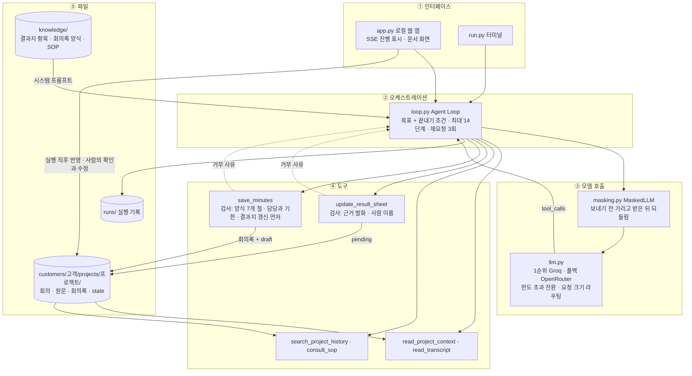
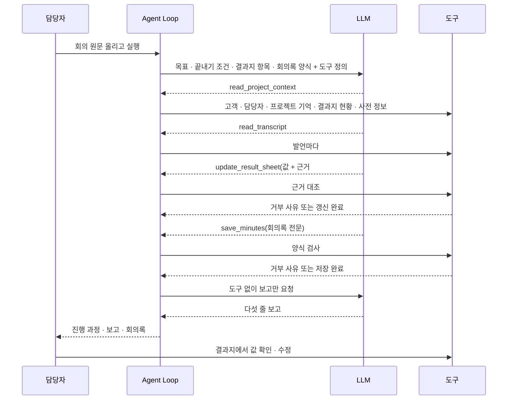

# [Week 5] 영업 회의 에이전트 — 작업정의서

작성: 이정인
기준일: 2026-10-10
대상 폴더: `jilee/week-05` (아직 커밋 전. 현재 브랜치는 `week-04/jilee`이고 `week-05/jilee`는 만들지 않았다)

> 결정의 근거와 버린 안은 [의사결정기록.md](./의사결정기록.md)(0 ~ 19절)에, 설계와 구현은 [기술정의서.md](./기술정의서.md)에 있다. 이 문서는 무엇을 어디까지 했는지만 적는다. 수치는 기준일에 저장된 `customers/KR0001/` · `runs/` 파일과 테스트 실행 결과에서 직접 세었다.

## 1. 문서 개요

**회의록을 만드는 에이전트를, 회의로 리드 결과지를 채우는 에이전트로 바꾸고 고객 1곳 · 프로젝트 1건 · 회의 4회차로 검증한 결과를 정의한다.**

Week 4까지는 "녹취 → 표준 회의록, 표준 질문 11개의 확보 여부 세기"였다. Week 5에서는 산출물의 중심을 회의록에서 결과지로 옮기고, 순서를 지시하던 프롬프트를 목표와 끝내기 조건으로 바꿨다. Week 4 구현은 `jilee/week-04`에 그대로 있다.

```text
jilee/week-05/
├── app.py · run.py              로컬 웹 앱(표준 라이브러리 서버) · 터미널 실행
├── agent/                       loop.py(Agent Loop) · tools.py(도구 6종 · 게이트) · sheet.py(결과지) · memory.py(프로젝트 기억)
│                                store.py(고객 → 프로젝트 → 회의 경로) · llm.py(호출 · 라우팅) · masking.py · retrieval.py · chat.py 외
├── knowledge/                   결과지_항목.md · 회의록_표준양식.md · sop/(사내 SOP 정본 10편, 저장소 제외)
├── customers/KR0001/            customer.json · projects/P001/(project.json · meeting · transcript · minutes · state/)
├── org.json                     우리 조직(사번 · 이름 · 조직)
├── runs/                        실행 기록(마스킹된 상태, 저장소 제외)
├── experiments/search_eval/     이력 검색 평가(질문 22개)
├── static/                      index.html · charts.js · graph.js
├── tests/                       LLM 없이 도는 테스트 139건
├── README.md · 의사결정기록.md   요약 · 결정 기록
└── 작업정의서.md · 기술정의서.md  본 문서와 짝 문서
```

## 2. 주제와 이번 작업의 답

**Week 5 주제 "Agent를 어떻게 설계해야 하는가?"에 대한 답: 목표와 끝내기 조건만 주고 순서는 에이전트에게 맡기되, 사실이 저장되는 두 지점만 코드로 막는다.**

| 물음 | 이번 작업의 답 | 근거 위치 |
| --- | --- | --- |
| 무엇을 맡기나 | 어떤 도구를 어떤 순서로 몇 번 쓸지, 결과지의 어느 항목을 채울지, 지난 원문을 볼지, SOP에 물을지 | `agent/loop.py` 시스템 프롬프트 |
| 무엇을 코드가 쥐나 | 끝내기 조건, 근거가 실제 발언인지, 사람 이름이 실제로 나오는지, 회의록 양식, 무엇이 확정인지, 외부로 나가는 글의 마스킹 | `agent/sheet.py` · `agent/memory.py` · `agent/masking.py` |
| 사람은 어디서 판단하나 | 결과지의 값 확인 · 수정, 거래 조건, 추진 전환 판정 | 화면의 결과지 탭 |
| 믿을 수 있나 | 실행 10건의 기록으로 확인(§7). 거부 뒤 스스로 고쳐 통과한 실행이 5건, 저장까지 가지 못한 실행이 2건 | `runs/KR0001/P001/` |

## 3. 작업 범위

**회의가 끝난 뒤의 처리(원문 → 결과지 갱신 → 회의록)와 그 결과를 사람이 확인하는 화면까지다.**

| 구분 | 내용 |
| --- | --- |
| 포함 | 회의 등록(일시 · 참석자 · 안건 · 참고 자료) → 원문 올리기 → 에이전트 실행 → 결과지에 AI 초안 반영 → 사람이 값 확인 · 수정 → 추진 전환 판정. 회의록 · 결과지 문서 화면, 일정, 그래프, 묻고 답하기, 서비스 연결 |
| 제외 | 음성 인식 자체, CRM · 인사 시스템과의 실제 연동(파일로 대신함), 수주 가능성 자동 판정, 솔루션 품목과의 연결, 서버 배포 |
| 샘플 | 고객 KR0001 한빛정밀(주)(자동차 부품 다이캐스팅) · 프로젝트 P001 외관 검사 자동화. 회의 4회차. 고객과 등장 인물은 모두 지어낸 것이다 |

| 회차 | 녹취 | 회의록 | 비고 |
| --- | --- | --- | --- |
| 1차 | 1,058자 | 2,005자 | 문제 청취 |
| 2차 | 1,223자 | 1,827자 | 예산 · 일정 |
| 3차 | 1,332자 | 2,239자 | 현장 테스트 후 |
| 4차 | 5,829자 | 5,235자 | 계약 조건 협의. 4,000자가 넘어 구간 정리본으로 읽는다. 금액 · 일정 · 범위가 번복된다 |

1 ~ 3차 회의록은 앞선 양식 그대로이고, 4차만 지금 양식(결과 중심)으로 다시 썼다.

## 4. 주요 의사결정

**Week 5에서 정한 것 가운데 구조를 가른 결정 열두 가지다. 전체는 의사결정기록에 있다.**

| 번호 | 결정 | 근거 | 기록 |
| --- | --- | --- | --- |
| 1 | 목적을 "회의록 작성"에서 "회의로 결과지 채우기"로 바꿈 | 회의록은 부산물이고 회의를 거듭할수록 채워지는 고객정보가 산출물 | 1-1 |
| 2 | 채울 항목은 화면설계 「리드 결과지 · 고객 니즈 확인」 기준. 확정 항목 10개(S1 ~ S4 · D1 · D2 · B1 ~ B4) | 결과지에 회의록의 자리가 이미 정해져 있음. 10개의 목록은 제 판단 | 1-2 · 1-3 |
| 3 | 저장 단위를 딜 한 층에서 고객코드 → 프로젝트코드 두 층으로 | 한 고객에 프로젝트가 여러 건 달림 | 2-1 |
| 4 | 순서를 지시하지 않고 목표와 끝내기 조건만 줌 | Week 4 프롬프트는 사실상 고정 순서였음 | 3-1 |
| 5 | 코드는 결과지 갱신과 회의록 저장 두 지점만 막음 | 과정은 맡기고 결과만 검사 | 3-2 |
| 6 | 결과지의 모든 값에 근거 발화를 요구하고 발언 번호(#12)로 가리키게 함 | 4차(5,829자)에서 인용문 대조가 계속 거부됨 | 3-3 · 3-4 |
| 7 | AI가 채운 값은 초안, 사람이 확인해야 확정. 확정된 값이 바뀌면 초안으로 돌림 | 무엇이 확정인지는 에이전트가 정하지 않음 | 3-5 · 3-6 |
| 8 | 거래 조건의 값은 사람이 정하고 에이전트는 근거와 함께 제안만 함 | 계약 사실임 | 6-8 · 9-14 |
| 9 | 요청이 1순위의 요청 크기 한도보다 크면 그 요청만 폴백으로 보냄 | 큰 요청 하나 때문에 실행 전체가 폴백으로 넘어갔음 | 4-1 · 7-10 |
| 10 | 회의를 외부 · 내부로 나눔. 내부 회의는 고객이 말한 사실을 결과지에 넣지 못함 | 우리끼리 한 말이 고객 사실로 들어가면 결과지가 오염됨 | 9-11 |
| 11 | 회의록 확정 단계를 없앰. 만들어지면 바로 프로젝트 기억과 결과지에 반영 | 확정은 누르기만 하는 단계였고 사람이 판단하는 곳은 결과지의 값 | 11-1 |
| 12 | 문서에는 정해진 값만 둠. 상태 · 확인 단추 · 변경 이력 · 근거는 문서 밖 | 문서는 결과물, 작업 도구는 문서 밖 | 10-5 · 10-6 |

11번은 화면과 `/api/run`에서만 그렇다. 코드 안에는 초안 → 확정 구조가 남아 있고, 앱이 실행 직후 확정을 대신 부른다(기술정의서 §3.6). 터미널 실행은 `--confirm`을 붙여야 반영된다.

### 4-보. 아직 정하지 않은 것

| 항목 | 지금 상태 | 다음 행동 |
| --- | --- | --- |
| 확정 항목 10개의 정의 | 화면설계에 목록이 없어 제 판단으로 정함 | 화면설계 담당에게 확인하고 `agent/sheet.py`의 `GATE`를 맞춤 |
| 수주 가능성 판정 | 결과지 7절이 전환 요건 여섯을 값으로 점검해 보이기만 함. 판정은 사람이 함 | 판정 기준을 받아 도구로 붙일지 검토 |
| 요건 ① 적합성 등급 | "확인 필요"로 둠 | 화면설계의 등급 기준 확인 |
| 당사 대응과 솔루션 품목의 연결 | 회의에서 한 말만 이음 | 품목 마스터 · 유사 사례 데이터 위치 확인 |
| 거래 조건의 값 목록 | 법령 용어를 따라 제 판단으로 짬. 빠진 값이 없다고는 말할 수 없음 | 사내 분류가 생기면 `agent/store.py`의 `DEAL_AXES` · `DEAL_EVENTS`를 맞춤 |
| 고객 담당자 · 조직 정보의 연동 | 파일(`customer.json` · `org.json`) | CRM · 인사 시스템의 조회 방법 확인 |
| 1순위 제공자 | Groq 무료. NVIDIA NIM은 키 발급 전이라 써 보지 않음 | 회사 적용 시 유료 등급(입력을 학습에 쓰지 않는 조건) |
| 서버 배포 | 가비아 VM으로 정했으나 OS · 접속 방법을 모름 | VM 정보 확인 후 배포 절차 작성 |

의사결정기록 5절의 "사람 확인의 수정 경로"는 13-1 · 13-2에서 만들었고, "다른 프로젝트의 발견"은 표본 P002를 지우면서(9-15) 닫지 않고 남겼다.

## 5. 에이전트 아키텍처

**화면 · 루프 · 모델 호출 · 도구 · 파일의 다섯 층이고, 사실이 저장되는 두 도구에만 검사가 붙는다.**



한 번의 실행은 이렇게 흐른다. 실측한 실행 10건은 모두 `read_project_context → read_transcript → update_result_sheet(1 ~ 3회) → save_minutes` 순서였다. 순서를 지시하지 않았는데 같은 순서가 나왔고, `search_project_history`와 `consult_sop`는 한 번도 고르지 않았다.



## 6. 적용한 방법 · 기법

| 기법 | 이번 작업에서의 적용 |
| --- | --- |
| 목표 지향 루프 | 순서 대신 목표와 끝내기 조건을 줌. 끝내기 전에 멈추면 남은 일을 알려 3회까지 다시 요구 |
| 저장 지점 검사 | 결과지 갱신은 근거 대조, 회의록 저장은 양식 검사. 어긋나면 사유를 번호 매겨 돌려주고 모델이 고쳐 다시 부름 |
| 근거 지정 | 원문의 발언마다 #번호를 붙이고 근거를 번호로 받음. 저장하는 것은 모델의 인용이 아니라 실제 발언 |
| 사람 확인(초안 · 확정) | AI가 채운 값은 초안. 사람이 확인한 것만 확정 항목으로 셈. 값이 바뀌면 다시 초안 |
| 외부 기억 | 회의록 전문이 아니라 상태 파일(참석자 · 합의 · 미합의 · 액션아이템 · 결과지)을 다음 회의의 컨텍스트로 넣음 |
| 긴 입력 분할 | 4,000자가 넘는 원문은 2,500자 구간으로 나눠 구간마다 정리(map). 결과지 갱신과 회의록 작성(reduce)은 주 에이전트가 함 |
| 검색 | 2글자 조각 BM25 + 임베딩(Gemini, 768차원) + 메타데이터 필터 + RRF + 앞뒤 발화 붙이기. 벡터 DB는 두지 않음(파일 캐시 · 전수 비교) |
| 서브에이전트 | SOP 문의를 도구 뒤의 별도 LLM 호출로 분리 |
| 마스킹 | LLM 호출 한 곳에서 고객사명 · 인명 · 전화번호 · 메일 주소를 자리표시자로 바꾸고 되돌림 |
| 라우팅 | 한도 초과 전환(실행 단위)과 요청 크기(요청 단위). 한도는 413을 한 번 받고 배워 `.env`에 적음 |
| 도구 권한 분리 | 묻고 답하기에는 읽기 전용 도구만 줌. 실행 옵션으로 끈 도구는 모델에게 보이지 않음 |
| 가짜 LLM 테스트 | API 없이 루프 · 거부 후 재시도 · 게이트 · 라우팅을 시험 |
| 프레임워크 미사용 | 표준 라이브러리만 사용. 외부 패키지 설치 없음 |

## 7. 완료 조건

**열 항목 가운데 아홉이 완료다. 이력 검색과 SOP 문의는 에이전트가 실제 실행에서 한 번도 고르지 않아 "쓸 수 있음"까지만 확인했다.**

| 항목 | 판정 기준 | 확인 방법 | 현재 상태 |
| --- | --- | --- | --- |
| 결과지 갱신 | 회차마다 근거와 함께 값이 들어감 | `state/state_NN.json` | 완료. 4차 뒤 확정 항목 10개가 모두 채워짐 |
| 근거 대조 | 근거가 맞지 않으면 거부하고, 모델이 고쳐 통과 | 실행 기록의 거부 횟수 | 완료. 거부 뒤 통과한 실행 5건(2차 1건, 4차 4건) |
| 회의록 저장 | 양식 7개 절, 담당 · 기한 검사 통과 | `minutes_NN.md` | 완료. 저장 검사에서 거부된 실행은 없음 |
| 초안 · 확정 | 사람이 확인한 것만 확정으로 셈 | 결과지 화면, `/api/sheet/confirm` | 완료. 표본은 확정 10 / 10(확인자 김도현) |
| 긴 원문 | 4,000자 초과 원문을 처리 | 4차(5,829자) | 완료. 구간 3개로 나뉘어 정리됨 |
| 번복 처리 | 값이 바뀌면 앞 값과 이력이 남음 | `meeting_04.json`의 변경 기록 | 완료. 4차에서 B1 · B2 · B3 변경, B4 신규 |
| 라우팅 | 한도 초과 전환, 큰 요청만 폴백 | 실행 기록의 `route` | 한도 초과 전환은 실제 실행으로 확인. 요청 크기 규칙은 테스트로만 확인 |
| 마스킹 | 외부로 나간 글에 실명이 없음 | `runs/`의 기록 | 완료(사전에 있는 이름 기준. 한계는 §11) |
| 이력 검색 · SOP 문의 | 에이전트가 필요할 때 고름 | 실행 기록의 도구 순서 | 미확인. 실행 10건에서 0회. 검색 자체는 평가함(§9) |
| 화면 · 자동 테스트 | 화면에서 실행 · 확인 · 수정, 테스트 통과 | 앱 실행, `unittest` | 테스트 134건 통과(2026-10-10 실행). 화면은 일부 동작만 눌러 확인(§11) |

실행 기록 10건(`runs/KR0001/P001/`)은 아래와 같다. 5차는 등록부터 끝까지 한 번 돌려 본 뒤 되돌린 것이다.

| 회차 | 시작 | 걸린 시간 | LLM 호출 | 입력 토큰 | 결과지 거부 | 저장 |
| --- | --- | --- | --- | --- | --- | --- |
| 1차 | 02:38 | 37초 | 2회 | 10,135 | 0 | 실패 |
| 1차 | 02:39 | 78초 | 4회 | 26,377 | 0 | 됨 |
| 2차 | 02:40 | 200초 | 6회 | 70,094 | 1 | 됨 |
| 3차 | 02:44 | 108초 | 4회 | 43,135 | 0 | 됨 |
| 4차 | 02:46 | 369초 | 9회 | 88,905 | 2 | 실패 |
| 4차 | 02:53 | 181초 | 8회 | 80,411 | 1 | 됨 |
| 4차 | 03:13 | 239초 | 8회 | 96,586 | 1 | 됨 |
| 4차 | 03:50 | 470초 | 11회 | 124,505 | 1 | 됨 |
| 4차 | 05:28 | 276초 | 9회 | 106,964 | 3 | 됨 |
| 5차(되돌림) | 06:36 | 77초 | 4회 | 52,651 | 0 | 됨 |

README의 실측 표는 이 가운데 회차마다 처음 저장된 실행(02:39 · 02:40 · 02:44 · 02:53)이다. 4차를 여러 번 돌린 것은 근거 지정 방식과 회의록 양식을 바꾸며 다시 실행했기 때문이다.

## 8. 품질 조건

**저장을 막는 검사와 알려 주기만 하는 측정을 나눴다.**

| 층 | 항목 | 판정 기준 | 위치 |
| --- | --- | --- | --- |
| 막음 | 근거 | 값마다 근거가 있고, 그 번호의 발언이 이번 원문에 있다(인용문이면 2글자 조각의 60% 이상이 한 발언에 있다) | `sheet.Grounder` |
| 막음 | 사람 이름 | 한글 2 ~ 4자이고 직함 낱말이 아니며, 원문 · 고객 담당자 · 우리 조직에 있다 | `sheet.apply` |
| 막음 | 값의 범위 | 항목 코드, 영업상 역할, 대응 상태, 거래 조건 값이 정해진 목록에 있다 | `sheet.apply` |
| 막음 | 내부 회의 | 고객이 말한 사실(items · goals · stakeholders · customer_profile)을 보내지 않았다 | `tools.update_result_sheet` |
| 막음 | 회의록 양식 | 7개 절이 모두 있고 표의 칸 수가 맞다 | `memory.validate` |
| 막음 | 논의 요지 | 한 줄 목록이 아니라 주제로 묶었다 | `memory.validate` |
| 막음 | 액션아이템 | 담당과 기한이 모두 있다 | `memory.validate` |
| 막음 | 회의록의 인물 | 참석자 · 담당자가 원문 · 고객 담당자 · 프로젝트 기억에 있는 이름이다 | `memory.validate` |
| 막음 | 순서 | 결과지 갱신 없이 회의록을 저장하지 않는다 | `tools.save_minutes` |
| 알림 | 회의 품질 · 회의록 품질 | 머리말 · 화자 구분 · 고객 발언 비중 · 숫자 대조 · 누락 후보 등 | `agent/quality.py` |

"알림" 층은 `/api/quality`로 남아 있으나 화면이 쓰지 않는다(의사결정기록 11-2). 숫자 대조는 4차 초안에서 틀린 값 두 건(택트 1.8초 ↔ 원문 2.8초, 계약 금액 120,400,000원 ↔ 원문 1억 2,400만 원)을 잡았다. 지금 표본 결과지의 B2는 사람이 확인한 "1억 2,400만 원 (부가세 별도)"이다.

근거 번호가 가리키는 발언이 값의 내용과 맞는지는 코드가 따지지 않는다. 번호가 원문에 있는지만 본다. 걸러내는 것은 사람 확인이다.

## 9. 검증 절차

**준비는 Python 3.12와 `.env`뿐이며, 자동 테스트 · 터미널 · 웹 앱 · 검색 평가 네 경로로 검증한다.**

| 경로 | 명령 | 확인 내용 |
| --- | --- | --- |
| 준비 | `.env.example` → `.env` 복사 또는 앱의 「서비스 연결」에서 입력 | 1순위 세 값(주소 · 키 · 모델), 폴백 세 값(선택) |
| 자동 테스트 | `python -m unittest discover -s tests -t .` | 139건. 임시 폴더와 가짜 LLM으로 돌아 표본 데이터와 API 한도를 건드리지 않는다 |
| 터미널 | `python run.py KR0001 P001 4` | 도구 호출 과정 · 거부 사유 · 보고. `--confirm`을 붙이면 반영까지 |
| 웹 앱 | `python app.py` → http://localhost:8765 | 원문 올리기 → 실행(진행 단계가 SSE로 표시) → 회의록과 결과지 확인 |
| 검색 평가 | `python experiments/search_eval/eval_search.py` | 질문 22개에 대한 Recall@5 · MRR |

검색 평가 결과(`experiments/search_eval/result.json`)는 아래와 같다. 지금 코드가 쓰는 것은 2글자 조각이다.

| 방식 | Recall@5 | MRR | 놓친 질문 |
| --- | --- | --- | --- |
| 낱말 | 0.727 | 0.548 | 6 |
| 2글자 조각 | 0.818 | 0.734 | 4 |
| 2글자 조각 + 낱말(RRF) | 0.773 | 0.640 | 5 |

사내 SOP 정본(`knowledge/sop/`)은 저장소에 올리지 않았다. 없으면 `consult_sop`만 쓸 수 없고 나머지는 그대로 돈다.

같은 회차를 다시 실행하면 회의록이 덮어써지고, 사람이 확인해 둔 값이 AI 초안으로 돌아갈 수 있다.

## 10. 구현 중 막힌 것과 해결

| 막힌 것 | 원인 | 해결 |
| --- | --- | --- |
| 4차(5,829자)에서 결과지 갱신이 계속 거부됨 | 긴 원문은 구간 정리본으로 읽으므로 원문을 그대로 인용할 수 없었음 | 발언마다 #번호를 붙이고 근거를 번호로 가리키게 함. 구간 정리본의 줄 끝에도 번호를 남김 |
| 이름을 모르는 "공장장"이 사람으로 등록됨 | 직함만으로 이해관계자를 만듦 | 한글 2 ~ 4자이고 직함 낱말이 아닌 이름만 받음. 모르면 다음 회의 질문으로 돌림 |
| 우리 쪽 두 사람에게 "챔피언" 같은 고객 측 역할이 붙음 | 한 목록에 섞임 | 우리 조직 · 프로젝트 담당의 이름은 이해관계자에서 건너뜀 |
| 네 회차 모두 두 번째 요청에서 Groq 한도를 넘음 | 분당 입력 7,000토큰. 요청 하나가 한도보다 크면 기다려도 통과하지 못함 | 413을 받으면 한도를 배워 그 요청만 폴백으로 보냄 |
| 폴백 모델이 404 | OpenRouter의 deepseek-v4-flash 무료판 종료 | nemotron-3-super-120b 무료판으로 바꿈 |
| 모델이 끝내기 전에 빈 답으로 멈춤 | 일부 모델의 버릇 | 남은 일을 적어 3회까지 다시 요구 |
| 회의록에 양식의 안내 문구와 (#12)가 그대로 남음 | 모델이 양식의 설명과 근거 번호를 옮겨 적음 | 저장할 때 코드가 걷어 냄(`tools.tidy_minutes`) |
| 회의록을 보러 들어가면 결과지로 넘어감 | 게이트 상태로 탭을 골랐음 | 회의로 들어가면 늘 회의록, 결과지는 결과지 탭에서만 |
| 회사 이름으로 찾은 기사 다섯 건이 모두 관계없는 글 | 이름만으로 검색 | 제목에 회사 이름이 있고 최근 1년 안의 기사만 남김 |
| 코드 한 줄이 주석 안으로 들어가 「← 뒤로」가 사라짐 | 같은 줄 끝에 코드를 붙여 넣음 | 줄을 나눔. 동작 점검에서 드러남 |

## 11. 남은 과제와 한계

| 구분 | 내용 |
| --- | --- |
| 미확인 | 이력 검색과 SOP 문의를 에이전트가 고르는 상황(실행 10건에서 0회). 회의 사이에 어긋나는 말이 뚜렷한 표본이 더 필요하다 |
| 미확인 | 요청 크기 라우팅의 실제 동작, 새 회의록 글투와 내부 회의 처리의 실제 LLM 결과, 구글 로그인(클라이언트 ID 없음), 홈페이지 가져오기의 실제 주소 실행 |
| 미확인 | 화면에서 끝까지 눌러 보지 않은 것: 회의록 · 결과지 고친 뒤 저장, 파일 올리기, Word 내보내기, STT 링크 가져오기(서버 쪽 시험만 있음) |
| 구조 | 확정 단계가 코드에 남아 있어 앱과 터미널의 동작이 다르다. 모델과 사람에게 보이는 글 일부가 아직 "회의록 확정"을 전제로 적혀 있다(기술정의서 §7.1) |
| 데이터 | `meeting_04.json`의 "이 회의의 결과지 변경"에 버린 초안의 값(120,400,000원)이 남아 있다. 결과지의 값(1억 2,400만 원)과 다르다 |
| 데이터 | 진행 예정 사항의 기한이 글로 저장돼 있어 "20일까지"처럼 달이 없는 말은 날짜로 풀지 못한다 |
| 비용 | 무료 요금제로 한 회차에 입력 2만 6천 ~ 12만 토큰. 폴백(하루 50회)에 기대고 있어 하루 열 회차 안팎이 한계 |
| 마스킹 | 한글로 읽은 전화번호("공일공…"), 사전에 없는 이름, "정팀장님" 같은 성 + 직함은 가려지지 않는다 |
| 연동 | 고객 담당자와 우리 조직은 파일이다. 구글 캘린더는 로그인 없이는 읽기와 구독용 내보내기뿐이다 |
| 다음 | 화면설계 쪽 정의 확인(확정 항목 10개 · 적합성 등급), 수주 가능성 판정, 품목 연결, 서버 배포 |
